# 01 — Current Codebase Audit

> Audit of `C:\Users\DELL\ScreenRecorder` as of 2026-09-01 (git head `ab972bb`, extension v1.13.0).
> Every claim references the actual file (and lines where load-bearing). This document describes **what exists**, including what is wrong with it. The target design lives in `02-ARCHITECTURE.md` onward.

---

## 1. Repository structure

```
ScreenRecorder/
├── client/                  # React 18 + Vite web app (JS, CSS modules)
│   ├── src/
│   │   ├── main.jsx         # Router: /, /watch/:id, /embed/:id, /edit/:id, /folders,
│   │   │                    #   /analytics, /billing, /admin, auth pages, legal pages
│   │   ├── AuthContext.jsx  # JWT in localStorage('sr_token'), authFetch helper
│   │   ├── api.js           # API base URL (VITE_API_URL)
│   │   ├── pages/           # Dashboard, Watch (1353 LOC), Editor, Folders, Admin, …
│   │   ├── components/      # VideoPlayer, AppShell, billing widgets, NotificationsBell
│   │   └── hooks/           # useBilling, useBillingConfig
│   ├── vite.config.js       # dev proxy /api + /uploads → localhost:3001
│   └── vercel.json          # SPA rewrite (deployed on Vercel)
├── extension/               # Chrome MV3 extension (vanilla JS, no build step)
│   ├── manifest.json        # v1.13.0; perms: storage, activeTab, scripting, tabs, tabCapture
│   ├── background.js        # service worker (94 LOC)
│   ├── popup.html/js        # recording options UI (338 LOC)
│   ├── recorder.html/js     # THE recording engine — popup window (594 LOC)
│   ├── overlay.js           # injected on-page toolbar/bubble/annotations (386 LOC)
│   ├── bubble.html/js       # camera iframe, extension origin
│   ├── bridge.js            # veorec.com content script: auth token sync
│   ├── gmail.js             # Gmail compose "insert video" button
│   ├── screenshot.html/js   # screenshot capture window
│   └── fix-webm-duration.js # EBML Duration patcher (bundled, 237 LOC)
├── server/                  # Express API (CommonJS, Node 18+), ~3,900 LOC total
│   ├── index.js             # 1,992 LOC — ALL routes + Cloudinary integration
│   ├── auth.js              # JWT sign/verify/middleware
│   ├── users.js             # users.json store
│   ├── db.js                # recordings.json store (local/no-Cloudinary mode only)
│   ├── meta.js              # meta.json (per-recording), folders.json, notif-reads.json
│   ├── store.js             # JSON-file store factory (keyed + append-log)
│   ├── plans.js             # plan catalog + admin overrides (plan_overrides.json)
│   ├── entitlements.js      # effective-plan resolution
│   ├── permissions.service.js # capability gates (canRecord, canUploadVideo, …)
│   ├── subscriptions.js     # subscriptions.json store
│   ├── billing.config.js    # Paddle env config (sandbox/production credential split)
│   ├── billing.service.js   # Paddle API client (cancel/resume/change/portal/sync)
│   ├── webhooks.paddle.js   # webhook signature verify + event handling
│   ├── usage.service.js     # usage.json counters + cron recalculation
│   ├── conversion.js        # upgrade_events.json append log (paywall analytics)
│   ├── business.service.js  # admin P/L dashboard math
│   ├── infra.config.js      # infra cost model for admin dashboard
│   ├── transcription.js     # Groq Whisper + whisper.cpp + VAD chunking (363 LOC)
│   ├── ai.js                # Groq LLM: title/summary/chapters/translate
│   ├── cron.js              # in-process daily jobs (usage sync, sub sync)
│   ├── ratelimit.js         # in-memory fixed-window limiter
│   ├── contacts.js          # contacts.json store
│   ├── Dockerfile           # node:20 + compiled whisper.cpp + ffmpeg + ggml-base model
│   └── railway.json         # Railway deploy (Dockerfile builder)
├── tests/fixwebm.test.js    # the only test in the repo
├── render.yaml              # legacy Render deploy config
└── *.zip / *.crx / *.pem    # extension release artifacts on disk; 10 old zips (≤v1.7.3) are git-tracked, pem/crx never were (verified T-001)
```

**Deployment topology:** client on Vercel (`veorec.com`), server on Railway (`screenrec-api-production.up.railway.app`, hardcoded in `extension/recorder.js:1`, `popup.js:1`, `background.js:83`), media on Cloudinary, JSON data on a Railway volume (`DATA_DIR=/data`).

**Dependencies (server, `server/package.json`):** express, cors, multer, cloudinary, bcryptjs, jsonwebtoken, uuid. No DB driver, no queue, no test framework, no logger.
**Dependencies (client):** react, react-dom, react-router-dom, lucide-react. No state library, no player library.
**Extension:** zero dependencies, no build step.

## 2. Persistence — the load-bearing problem

### 2.1 Cloudinary as the application database

When `CLOUDINARY_CLOUD_NAME` is set (production), **there is no recordings table anywhere**. The recording's existence, ownership, size, and duration live only in Cloudinary:

- Asset path: `screenrec/<userId>/<recId>` (`server/index.js:421-423`). Ownership is *encoded in the folder path*; `userOwns()` is a Cloudinary search for `public_id=screenrec/<userId>/<id>` (`server/index.js:637-643`).
- Title/duration/created_at/rec_id/user_id are stored in the Cloudinary **context** string (`index.js:423`), with manual escaping of `= | \` (`index.js:88-89`) because unescaped titles corrupted the context.
- `GET /api/recordings` merges **two** Cloudinary calls — Search API (rich, eventually consistent) and Admin API (immediately consistent, less data) — to work around index lag (`index.js:465-523`). The same merge is duplicated in `listOwnerVideos` (`index.js:844-873`).
- The watch page compensates on the client: 404 → retry 6× at 1.5s intervals because "just-uploaded videos can lag Cloudinary's index" (`client/src/pages/Watch.jsx:494-509`).
- Trim temp artifacts are filtered by naming convention regex `__trim_\d+$` (`index.js:488`).
- `findVideo()` for public watch does a **global** search on `context.rec_id=<id>` (`index.js:605-614`) — cost and latency scale with the whole account.

Consequences observed in the code's own comments: "rename reverts on refresh" (`index.js:588-591`), "trimmed videos disappeared from the library" (`index.js:469-472`).

### 2.2 JSON files (Railway volume, `DATA_DIR`)

| File | Contents | Writer |
|---|---|---|
| `users.json` | array of users incl. bcrypt hash, reset tokens, `manualPlan`, `slackWebhook`, `paddleCustomerId` | `users.js` |
| `meta.json` | per-recording: title, views, viewers, viewKeys (≤5000), reactions, comments, transcript (full segments), privacy, passwordHash, folder, trims/segments, audience, leads, engagement, chapters | `meta.js` |
| `folders.json`, `notif-reads.json` | folders; per-user notification read timestamps | `meta.js` |
| `subscriptions.json` | Paddle subscription mirror keyed by userId | `subscriptions.js` |
| `usage.json` | per-user storage/count/minutes counters | `usage.service.js` |
| `contacts.json`, `upgrade_events.json` (50k-capped log), `plan_overrides.json` | contact form; paywall analytics; admin plan edits | respective modules |
| `recordings.json` | recordings table — **local dev mode only** | `db.js` |

Every operation is **read entire file → mutate → `fs.writeFileSync` entire file** (`store.js:15-19`, `users.js:12-19`, `meta.js:11-15`). Properties:

- **Not atomic**: a crash mid-write truncates the file; the reader's `catch { return {} }` then silently resets the dataset (all users / all meta) to empty.
- **Not concurrent-safe**: two overlapping requests (e.g. two viewers commenting) both read, both write; the last write wins and drops the other's mutation. Node's single thread only protects a fully-synchronous read-modify-write; `meta.update` is synchronous so it mostly survives, but any `await` between read and write (common in `index.js` routes that read meta, await Cloudinary, then `meta.set`) loses updates.
- **O(file) per request**: `/api/notifications` loads all of `meta.json` on every poll (`index.js:875-906`); every `users.findById` parses the whole user file.
- **Transcripts live inside `meta.json`** — a few long recordings make every meta operation slow.

### 2.3 The two persistence modes fork the API

`index.js` has an `if (!USE_CLOUDINARY) { …local routes… } else { …cloudinary routes… }` fork (`index.js:263-602`) duplicating upload/list/get/delete/patch logic with different behaviors (e.g. local mode has no video-count check on upload). Dev and prod run different code paths.

## 3. The recording engine (extension) — actual flow

### 3.1 Contexts and their state

| Context | Lifetime | State held |
|---|---|---|
| `popup.js` (action popup) | Milliseconds–seconds; closes on blur | `isRecording`, `elapsed`, `opts` (surface/camera/mic/quality/countdown) |
| `recorder.html/js` (popup **window**) | The whole recording + upload | `mediaRecorder`, `chunks[]`, `lastBlob`, `startTime`, `pausedAccum`, `pauseStartedAt`, `audioCtx`, `activeStreams[]`, `limitReached/limitWarned`, `hardStopTimer`, `timerInterval`, `opts` |
| `background.js` (SW) | Ephemeral (MV3 suspends) | `recording` boolean mirror of `recState` |
| `overlay.js` (per-tab content script) | Page lifetime | its own 500ms timer reading `recState` from storage |
| `chrome.storage.local` | Durable | `sr_token`, `sr_user`, `recOptions`, `recording`, `startTime`, `recState {recording,paused,startTime,pausedAccum,pauseStartedAt}`, `shareLink`, `lastRecording` |

There are at least **six representations of "are we recording"**: `recorder.js` `mediaRecorder.state`, `chrome.storage.recording`, `chrome.storage.recState.recording`, `popup.js isRecording`, `background.js recording`, and the overlay's `started` latch. They are reconciled by messages and polling, not owned by anyone.

### 3.2 Start flow (traced)

1. `popup.js:209-256` — click Start. For `surface:'tab'`, gets `chrome.tabCapture.getMediaStreamId({targetTabId})` **inside the click gesture** (required by Chrome). Injects `overlay.js` into the active tab, writes `recOptions` to storage, opens `recorder.html` as a 420×560 popup window, closes itself.
2. `recorder.js:586-594` — on load: read `recOptions`, fetch plan limit from `/api/me/entitlements` (default 10 min if fetch fails — **a Pro user whose fetch fails gets stopped at 10 min**), then `beginRecording()` **auto-starts** (no user gesture in this window).
3. `beginRecording()` (`recorder.js:137-328`):
   - Tab mode: `getUserMedia` with legacy `mandatory: {chromeMediaSource:'tab', chromeMediaSourceId}` constraints (required shape for tabCapture) — video+audio.
   - Screen/window mode: `getDisplayMedia({video:{displaySurface hint}, audio:true, systemAudio:'include'})`.
   - Camera-only mode: `getUserMedia` 1280×720, preview drawn to a canvas via rAF (preview only, not recorded).
   - Mic: separate `getUserMedia({audio:true})`; failure only `console.warn`s (recording continues silently mic-less, with a status-bar warning).
   - Screen-share "ended" listener on the video track → `stopRecording()` (`recorder.js:187-191`).
   - **Audio mixing**: one `AudioContext`; screen/tab audio source + mic source both connect to a `MediaStreamDestination`; in tab mode the tab audio is also routed to `audioCtx.destination` because `tabCapture` mutes the tab locally (`recorder.js:216-227`). Suspended-context workaround: force `resume()` before start, re-resume on `statechange` (`recorder.js:249-260`) — a suspended context records silence.
   - `MediaRecorder(finalStream, {mimeType: vp9-webm || webm, videoBitsPerSecond: 1–4 Mbps by quality})`, `start(1000)` — 1s timeslices.
   - `ondataavailable` pushes to `chunks[]` **and** enforces the plan time limit (encoder-clock-driven because background timers throttle; `recorder.js:267-277`). A `setTimeout` wall-clock backstop re-arms itself (`recorder.js:284-296`). A `setInterval(500)` drives the visible timer and a second limit check.
   - Writes `recording:true` + `recState` to storage; sends `RECORDER_STARTED`; the window deliberately stays open un-minimized because "a minimized window gets frozen by Chrome, which can stall the upload" (`recorder.js:324-327`).
4. `background.js:34-42` re-injects `overlay.js` on tab switch/navigation while `recState.recording`.
5. Camera bubble: `overlay.js:256-344` creates an `<iframe src=bubble.html allow="camera">`; `bubble.js` holds `getUserMedia` in the **extension origin** (one-time permission) and releases/reacquires on tab visibility. The bubble is DOM — it is only captured if it is on the captured surface.

### 3.3 Pause/stop/cancel/restart

- Pause (`recorder.js:330-345`): `mediaRecorder.pause()`, wall-clock pause accounting mirrored into `recState`. The overlay independently recomputes elapsed from `recState` every 500ms (`overlay.js:365-381`).
- Stop (`recorder.js:403-416`): clears timer, `mediaRecorder.stop()`, then **immediately** `cleanupStreams()` (stops all tracks, closes AudioContext) and messaging. `onstop → handleStop`.
- Cancel/Restart (`recorder.js:419-430, 571-583`): sets `mediaRecorder.onstop = null` to suppress upload, stops, clears chunks. Restart re-enters `beginRecording()` in the same window.
- Remote control: overlay/popup send `SR_STOP/SR_PAUSE/SR_CANCEL/SR_RESTART` runtime messages; the recorder window listens (`recorder.js:560-567`).

### 3.4 Stop → upload (traced)

`handleStop()` (`recorder.js:461-549`):
1. `duration = elapsedSeconds()` — **wall-clock, client-computed**, clamped to the plan limit if auto-stopped.
2. `new Blob(chunks)`; `fixWebmDuration(blob, duration*1000)` patches the EBML Duration header (MediaRecorder omits it; without it the file can't seek). The patcher is conservative and returns the original blob on any doubt (`extension/fix-webm-duration.js`).
3. `lastBlob = blob` kept **in memory only** as the recovery mechanism.
4. One `fetch POST /api/upload` with `FormData{video, title:'Screen recording', duration}` and an `AbortController` timeout of `max(120s, blob.size/1024 ms)`.
5. Failure paths: 403 plan-limit → upgrade prompt + `showDownloadFallback()` (a manual "save to your device" button using the in-memory blob); 401 → sign-in message; anything else → error + download fallback. **No retry, no resume, no progress.**
6. Success: writes `lastRecording` to storage, opens `veorec.com/watch/<id>` in a tab, closes the recorder window after 1.2s.

### 3.5 Server upload handler

`POST /api/upload` (Cloudinary branch, `index.js:381-463`):
1. multer streams the multipart body to a **temp file on disk** (`UPLOAD_TMP_DIR`, 1GB cap) — an earlier memory-buffer version OOM-killed the container (comment at `index.js:63-66`).
2. Enforcement: `canRecord(user, client-reported duration)` (+30s grace), `canCreateVideo` (free = 30 videos), `canUploadVideo` (storage projection). **Duration is trusted from the client**; a tampered client could report 0.
3. `cloudinary.uploader.upload_large(tmpPath, {folder, public_id, chunk_size:20MB, context:title|duration|created_at|rec_id|user_id})` — the server re-uploads the whole file to Cloudinary while the HTTP request is held open.
4. `usageService.updateUsage(+bytes,+1,+seconds)` incremental counters (cron heals drift daily).
5. Respond `{id, url}`. Then **fire-and-forget** `autoProcessRecording()` (`index.js:340-370`): transcribe → auto-title → (Pro) summary + chapters, writing into `meta.json` and Cloudinary context. No status is recorded anywhere; a crash or restart silently drops it; the watch page cannot distinguish "processing" from "no transcript".
6. Errors: "too large" pattern-matched from the Cloudinary error message → 413 + `saveLocally:true`; multer size-limit converted from HTML 500 to JSON 413 by an error middleware (`index.js:984-990`). Temp file unlinked in `finally`.

### 3.6 Editing/processing paths (all synchronous in HTTP handlers)

- **Virtual trim/segments**: `PATCH /api/recordings/:id/meta` stores `trimStart/trimEnd/segments` in meta; the player skips gaps client-side (`VideoPlayer.jsx:49-59`).
- **Physical trim** `POST /:id/trim` (`index.js:1092-1172`): builds a Cloudinary splice transformation URL, `uploader.upload(derivedUrl)` to a temp public_id, then `rename` over the original (overwrite mode) or to a new id (copy mode). Runs synchronously — Cloudinary renders the derived video during the upload call; comments note >1080p "synchronous renders time out" (`index.js:1219`).
- **Compose** `POST /:id/compose` (`index.js:1176-1276`): multi-clip splice with letterbox padding to a common canvas; same synchronous pattern; orphan temp cleanup on rename failure exists here but **not** in trim.
- **Stitch** `POST /api/recordings/stitch` (`index.js:1331-1365`): same, up to 10 videos.
- **Replace** `POST /:id/replace` (`index.js:1023-1086`): client-rendered file re-uploaded through **memory** multer (500MB cap — OOM vector, contradicts the disk-multer lesson).
- **Remove silences** `POST /:id/remove-silences` (`index.js:1300-1327`): transcribes if needed (blocking), computes keep-ranges from transcript gaps, stores as virtual segments.

### 3.7 Transcription/AI

`server/transcription.js`: preferred path Groq `whisper-large-v3`. Pipeline: download audio (Cloudinary mp3 derivative) → ffmpeg → 16k mono WAV → ffmpeg `silencedetect` VAD → chunk speech (≤40 chunks, 3.1s spacing to stay under Groq's 20 RPM) → per-chunk auto-detect language → suppress spurious languages (<15% share) with a forced second pass → merge segments. Fallback: local whisper.cpp (`ggml-base`, baked into the Docker image). Jobs run through a **single-slot in-process promise chain** (`transcription.js:56-61`) — one transcription at a time server-wide, in the API process; a 30-minute recording with 40 chunks holds the slot for many minutes; a restart loses the job with no record. `server/ai.js`: Groq chat completions for title/summary/chapters/translate with extractive fallbacks; translation is request-scoped (never persisted).

## 4. Auth, sharing, engagement

- **Auth** (`server/auth.js`): HS256 JWT `{userId}`, 30-day expiry, no refresh, no revocation, secret required in prod (boot-fails without it). Token stored in `localStorage('sr_token')` (web) and `chrome.storage.local.sr_token` (extension), synced by `bridge.js` polling localStorage every 2s on veorec.com.
- **Google sign-in**: server-side `tokeninfo` verification with audience + email_verified checks (`index.js:191-214`). Password reset via Brevo email with hex tokens (1h expiry).
- **CORS**: `origin: '*'` (`index.js:50`).
- **Privacy levels** (meta): `public` (default) / `login` / `password` (bcrypt hash in meta). Enforcement in `GET /api/watch/:id` (`index.js:654-670`). **The media URL itself is a public Cloudinary URL** — anyone with the `secure_url` (leaked via any viewer's network tab) bypasses privacy entirely.
- **Views** (`index.js:691-714`): unique by `userId → visitorId (client-generated localStorage) → IP`, dedup keys capped at 5000, owner self-views skipped. **Viewer names on comments/reactions are client-supplied strings**; the notifications feed filters "self" activity by comparing display names (`index.js:889`) — spoofable and collision-prone.
- **Engagement**: watch-through fraction via `sendBeacon` on leave (`Watch.jsx:550-565`), aggregated as `{sum,n,completed}` in meta.
- **Lead capture**: email gate before playback (Pro), leads array in meta (≤1000).
- **Comments/reactions**: unauthenticated POST endpoints, no rate limiting (rate limiter covers auth routes only), 2000-char cap on comments; stored in meta arrays, unbounded.

## 5. Billing

Paddle Billing (MoR), overlay checkout on the client. `webhooks.paddle.js`: HMAC signature verification (timing-safe), user resolution via checkout `custom_data.userId` → known subscription/customer ids. Handles subscription lifecycle + `transaction.completed` + `payment_failed`. Issues:

- **No event-id dedup / no event log** — a replayed or out-of-order webhook re-applies state blindly (e.g. a late `subscription.updated` after `canceled` re-grants access).
- Errors during processing are caught and **200-acked** (`webhooks.paddle.js:173-178`), so Paddle never redelivers a failed event — silent entitlement loss.
- User plan is mirrored as a coarse `plan` field on the user for back-compat, with hardcoded `'pro'` in the transaction fallback (`webhooks.paddle.js:145`).
- Subscription state lives in `subscriptions.json` (§2.2 caveats apply).

The **plan/entitlement design is good**: capability flags, `entitlements.resolveSlug` priority (comped → subscription → legacy field → free), all gates server-side via `permissions.service.js`, conversion tracking on every deny. Port it as-is.

## 6. Frontend notes

- `Watch.jsx` (1,353 LOC) is the watch page, owner sidebar (edit/transcript/settings), analytics popup, share menu, comment dock, translation UI, and player host in one component. It compensates for backend gaps: 404 retry loop, a 12s "processing" overlay that gives up and shows the player regardless (`Watch.jsx:528-541`), Infinity-duration workaround (`VideoPlayer.jsx:44-47` — seek to 1e101 to force duration).
- `VideoPlayer.jsx`: custom controls, timeline markers for comments/reactions, virtual trim/segment skipping, captions from transcript segments, speed, fullscreen, watermark. Solid; keep.
- `Editor.jsx`: multi-clip timeline (split/reorder/delete/add via gallery or upload) previewing by swapping the single `<video>` src per clip; saving calls trim/compose. Keep UX.
- `Dashboard.jsx`, `Folders.jsx`, `AnalyticsPage.jsx`, `Admin.jsx`: straightforward fetch-render pages against the API.

## 7. External services inventory

| Service | Used for | Coupling |
|---|---|---|
| Cloudinary | storage + DB + transcoding + thumbnails (`so_0` frame) + delivery + download (`fl_attachment`) + audio derivative for STT | Extreme — the core problem |
| Railway | API host + volume for JSON data | Hardcoded URLs in extension |
| Vercel | client hosting | vercel.json |
| Groq | Whisper STT + LLM | via fetch, keyed |
| Paddle | billing | webhooks + API |
| Brevo | transactional email | fetch |
| Google | OAuth tokeninfo | fetch |
| Slack | share via user-provided incoming webhook | fetch |

## 8. Environment variables (discovered)

`PORT, DATA_DIR, UPLOAD_TMP_DIR, PUBLIC_URL, CLIENT_URL, JWT_SECRET, ADMIN_EMAILS, CLOUDINARY_CLOUD_NAME/API_KEY/API_SECRET, GOOGLE_CLIENT_ID, BREVO_API_KEY, EMAIL_FROM, GROQ_API_KEY, GROQ_MODEL, GROQ_STT_MODEL, WHISPER_BIN/MODEL_PATH/THREADS/LANGUAGE, FFMPEG_BIN, FFPROBE_BIN, STT_* (VAD tuning), AUTO_PROCESS_ON_UPLOAD, PADDLE_ENVIRONMENT/API_KEY/CLIENT_TOKEN/WEBHOOK_SECRET (+ _SANDBOX variants, + price/product ids), PAYMENTS_LIVE, NODE_ENV, VITE_API_URL` — plus admin-dashboard cost overrides in `infra.config.js`.

## 9. Subsystem verdicts (keep / redesign / replace)

| Subsystem | Verdict | Rationale |
|---|---|---|
| Plan catalog + entitlements + permission gates | **Keep** | Well-designed capability model; port to TS + Postgres reads |
| `fix-webm-duration.js` + its test | **Keep** | Correct, conservative, tested; still useful for local-save fallback |
| Overlay/bubble/annotation UX, popup UI, Gmail button | **Keep** | Product value; decouple from engine |
| VideoPlayer, Editor UX, Watch page features | **Keep (refactor)** | Split Watch.jsx; point at new APIs |
| Transcription VAD pipeline, AI prompts | **Keep (relocate)** | Sound logic; must move into workers with statuses |
| Paddle integration | **Redesign storage** | Add event dedup, billing_events, Postgres |
| Auth | **Redesign** | Central sessions table, revocation, shorter tokens |
| JWT-in-localStorage + bridge sync | **Redesign** | Acceptable short-term; document XSS exposure |
| Recording engine state handling | **Replace** | State machine (`03`) |
| Upload (client + server) | **Replace** | Multipart direct-to-storage (`06`) |
| Cloudinary-as-DB, JSON stores | **Replace** | Postgres (`07`) |
| Synchronous/fire-and-forget processing | **Replace** | BullMQ workers (`10`) |
| Cloudinary transforms for trim/splice/thumbnails | **Replace** | FFmpeg workers (`09`, `14`) |
| In-process cron, in-memory rate limiter | **Replace** | Scheduled jobs on the queue; Redis rate limits |
| `console.log` logging | **Replace** | Structured logging (`19`) |

## 10. Current data flows (summary diagrams)

```mermaid
sequenceDiagram
    participant U as User
    participant P as popup.js
    participant R as recorder.js (popup window)
    participant S as Server (Express)
    participant C as Cloudinary
    participant W as Watch page
    U->>P: click Start
    P->>P: tabCapture streamId (tab mode)
    P->>R: recOptions via chrome.storage; open window
    R->>R: getDisplayMedia/getUserMedia + AudioContext mix
    R->>R: MediaRecorder.start(1000) → chunks[] (RAM only)
    U->>R: Stop
    R->>R: blob = new Blob(chunks); fixWebmDuration
    R->>S: POST /api/upload (single multipart, whole file)
    S->>S: multer → temp file; plan checks (client duration!)
    S->>C: upload_large (20MB chunks), context metadata
    S-->>R: {id, url}
    S--)S: fire-and-forget transcribe+title (lost on crash)
    R->>W: open /watch/:id
    W->>S: GET /api/watch/:id (404 → retry ×6, index lag)
    S->>C: search by context.rec_id (global)
    W->>C: <video src=cloudinary secure_url> (public URL)
```

Current recording "state" (no machine — reality of the booleans):

```mermaid
stateDiagram-v2
    [*] --> PopupOptions
    PopupOptions --> RecorderWindowAutoStart: recOptions in storage
    RecorderWindowAutoStart --> Capturing: getDisplayMedia OK
    RecorderWindowAutoStart --> Error: NotAllowedError → "click start"
    Capturing --> Recording: countdown → MediaRecorder.start
    Recording --> Paused: mediaRecorder.pause()
    Paused --> Recording: resume()
    Recording --> Uploading: stop / track-ended / limit
    Recording --> Discarded: cancel (onstop=null)
    Recording --> Recording2: restart (same window)
    Uploading --> Done: 200 → open watch page, close window
    Uploading --> FailedWithDownloadFallback: any error (no retry)
    note right of Recording: state duplicated in 6 places;\nwindow close at ANY point = total loss
```



## 11. What can fail, what happens (selected, verified against code)

| Failure | Current behavior |
|---|---|
| Recorder window closed mid-recording | Everything lost; `recording:true` may stay stuck in storage until popup reset |
| Renderer crash / browser crash | Everything lost, no recovery |
| Network drop during upload | AbortError after timeout → download-fallback button only |
| Server restart during upload | Client sees error; temp file orphaned in tmpdir |
| Server restart during transcription | Job silently vanishes; no status anywhere |
| Cloudinary index lag | 404s, missing library rows, stale titles — client retry hacks |
| Two concurrent writes to meta.json | Last write wins; comment/view lost |
| Crash during writeFileSync | File truncated → next read returns `{}`/`[]` → dataset wiped |
| Paddle webhook handler throws | 200 returned; event lost forever |
| Mic permission denied | Recording continues silently without mic (warning text only) |
| Entitlements fetch fails at recorder load | Pro user capped at the free 10-min limit |
| `upload_large` rejects (>100MB free tier) | 413 + local-save; recording never stored |
| Editor "replace" of a large file | 500MB memory buffer — OOM risk |

These are the inputs to `02` (target architecture), `03` (state machine), `05` (recovery), `06` (upload), and `18` (error taxonomy).
