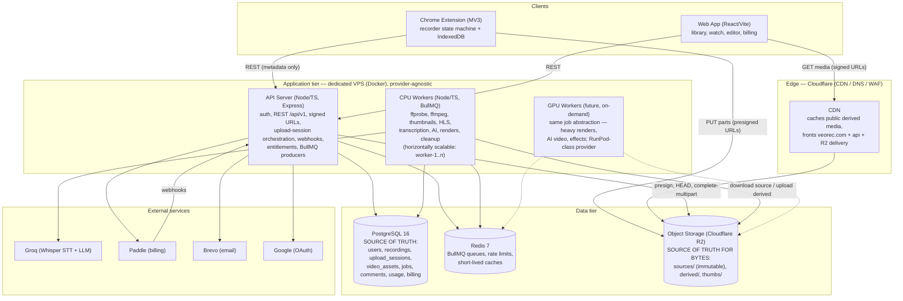
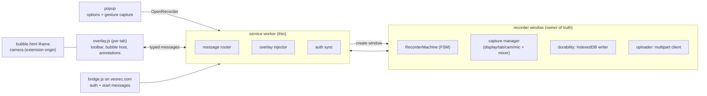

# 02 — Target Architecture

> The complete system architecture for the rebuilt VeoRec platform. Non-negotiable invariants are listed in §11 and repeated in `26-CLAUDE-CODE-IMPLEMENTATION-RULES.md`.

---

## 1. High-level architecture



**The two axioms that shape everything:**

1. **PostgreSQL owns application state.** If a fact matters (does this recording exist, who owns it, is it processed, has this upload finished, is this user entitled), it is a row in Postgres. Object storage, Redis, and external services are never queried to answer application questions.
2. **The API never carries video bytes.** Upload is client → R2 via presigned multipart URLs. Playback is client → CDN/R2 via signed URLs. The API only orchestrates (creates sessions, signs URLs, records completion). Workers stream bytes from/to R2 only for processing.

## 2. Component responsibilities and boundaries

### 2.1 API server (`apps/api`)

- Owns: authentication/sessions, all REST endpoints (`08-API-SPECIFICATION.md`), authorization (`12`), entitlement enforcement (ported `permissions.service`), upload-session orchestration (`06`), signed playback URL minting, webhook ingestion (Paddle), enqueueing jobs.
- Must NOT: run FFmpeg/FFprobe, hold long-running work in request handlers (hard cap: any handler doing >2s of compute or third-party fan-out becomes a job), receive file uploads other than small images (custom thumbnails ≤ 5MB).
- Stateless: no in-process cron, no in-memory rate limiting (Redis), no local files. Horizontally scalable.

### 2.2 Workers (`apps/worker`)

- One deployable running BullMQ processors for every queue in `10-JOBS-AND-QUEUES.md`. Contains FFmpeg/FFprobe binaries (Docker image) and the transcription/AI logic relocated from `server/transcription.js` / `server/ai.js`.
- Every processor is **idempotent** (safe to run twice) and **crash-safe** (BullMQ stalled-job recovery re-runs it). Progress and results are written to Postgres (`processing_jobs`, `video_assets`, `transcripts`), never only to queue state.
- Scheduled/repeatable jobs (usage reconciliation, subscription sync, upload-session expiry, orphan cleanup) replace `server/cron.js`.
- **CPU-first; GPU as a worker variant, not an architecture change.** All ordinary Loom-style operations (probe, transcode, HLS, thumbnails, trim/cut/compose, audio extraction) run on CPU FFmpeg workers, horizontally scaled (`worker-1..n`). If/when a workload genuinely benefits from GPU (GPU encoding, heavy compositing, AI video, background removal, high-res exports), it becomes a separate BullMQ queue (`render-gpu`) consumed by an on-demand GPU worker (RunPod-class) implementing the **same job contract** — the API that enqueues exports never knows or cares which fleet renders (`10` §2). No permanent GPU server; no RunPod-specific logic in core code.

### 2.3 Extension (`apps/extension`)

- Recorder window hosts the **recording state machine** (`03`) and the **local durability layer** (`05`): every MediaRecorder chunk goes to IndexedDB before anything else.
- Upload runs from the recorder window (and can be resumed by a later recorder window after a crash) using the multipart protocol (`06`).
- Service worker stays thin: overlay injection, auth sync, message routing (`04`). It must assume it can be killed at any moment; nothing critical lives in SW memory.

### 2.4 Web app (`apps/web`)

- Same React app, incrementally TypeScript. Talks only to `/api/v1`. The watch page renders explicit processing states from `recordings.status` + `video_assets` instead of guessing (`11`).
- The web "Record" button keeps delegating to the extension via `bridge.js` messaging.

### 2.5 PostgreSQL

Schema in `07-DATABASE-DESIGN.md`. Key structural decisions:

- `recordings` (logical entity, with `status`: `recording → uploading → uploaded → processing → ready | failed`) is separate from `video_assets` (physical files: `source`, `mp4_1080`, `hls_master`, `thumbnail`, `poster`, `audio`, `render_output`…). One recording has many assets. Source assets are immutable.
- `upload_sessions` + `upload_parts` make uploads resumable and idempotent server-side.
- `processing_jobs` mirrors queue jobs for status/audit; the queue is transport, Postgres is truth.
- All engagement (comments, reactions, view_sessions, analytics_events) and transcripts move out of `meta.json` into rows.

### 2.6 Redis

- BullMQ queues + repeatable schedules.
- Rate limiting (sliding window per key) for auth, comments/reactions, uploads, watch-view endpoints.
- Optional short-TTL caches (entitlement summaries, watch payloads). Redis is disposable: full loss must cost at most in-flight job latency, never data.

### 2.7 Object storage (R2) layout

```
veorec-media/
  sources/{recordingId}/source.webm        # immutable original (or .mp4 for uploads)
  derived/{recordingId}/{assetId}/video.mp4
  derived/{recordingId}/{assetId}/hls/master.m3u8, seg_*.ts|.m4s
  derived/{recordingId}/{assetId}/poster.jpg, thumb.jpg, preview.gif
  audio/{recordingId}/audio.m4a            # extraction for STT
  renders/{editSessionId}/{renderJobId}.mp4
```

- Bucket is **private**. All reads go through signed URLs (CDN-compatible token or R2 presigned GET). Public videos may use long-TTL signatures + CDN cache; private videos short-TTL (≤ 10 min) signatures.

#### Storage roles and the Cloudinary decommissioning path

| System | Role | Status |
|---|---|---|
| **PostgreSQL** | Sole source of application truth: identity, ownership, recording lifecycle, upload sessions, quota ledger, processing state, engagement, billing. Stores **no media bytes**. | Schema live as of **T-102** |
| **Cloudflare R2** | Target object storage for all media bytes — sources, MP4/HLS, thumbnails, posters, audio, exports — addressed by the provider-neutral `video_assets.storage_key` and reached only through `StorageProvider`. **Not an application database.** | Arrives **T-201/T-202**; new uploads mirrored **T-203**; existing media backfilled **T-204** |
| **MinIO** | Local development substitute for R2 (S3-compatible). Never a production dependency. | Available since T-101 |
| **Cloudinary** | **LEGACY ONLY.** Still serving the pre-migration application. Not part of the target architecture: no new features may depend on it, it is never the target of `StorageProvider`, and no PostgreSQL column models it. | Frozen; media backfilled out in **T-204**; code and account removed in **T-1402/T-1403** (Phase 14) |

The end state contains PostgreSQL + R2 + Redis/BullMQ + FFmpeg workers and **no Cloudinary dependency**. Legacy Cloudinary identifiers required to locate existing media during the T-204 backfill live in an isolated, migration-only mapping table introduced by T-104 and dropped at Phase 14 — never as columns on `recordings`/`video_assets` (`07` §13).
- Lifecycle rules: `uploads-tmp/` (incomplete multipart) aborted after 48h; orphan scan job reconciles storage against `video_assets` weekly.

### 2.7.1 `StorageProvider` — the storage abstraction (delivered by T-201)

`@veorec/storage` is the **only** way application code reaches object bytes.
Package: `storage/` (the plan's `apps/api/src/storage/` path is aspirational —
that app does not exist yet, the same deviation T-104 recorded).

**Responsibility.** A `StorageProvider` owns object bytes and nothing else. It
never learns about users, ownership, quota, or lifecycle:

| Owns | System |
|---|---|
| recording, owner, status, `size_bytes`, duration, upload/processing state, quota ledger | **PostgreSQL** |
| source media, derived MP4/HLS, thumbnails, posters, audio, exports | **R2** |

There is deliberately no `provider.deleteRecording(userId, …)`. Ownership is
resolved by a repository *before* a key is built; authorization never happens in
the storage layer. R2 is **not** an application database and is never listed to
answer a user-facing query — `listObjects` exists for maintenance and
reconciliation only.

**Interface.** `putObject` · `getObject` · `getObjectBuffer` · `headObject` ·
`objectExists` · `deleteObject` · `deleteObjects` · `listObjects` ·
`getSignedDownloadUrl` · `getSignedUploadUrl` · `createMultipartUpload` ·
`getSignedPartUrl` · `listParts` · `completeMultipartUpload` ·
`abortMultipartUpload`.

**One implementation, two configurations.** R2 and MinIO both speak S3, so there
is a single `S3StorageProvider` and no code path branches on which one is in
use — `STORAGE_PROVIDER` selects a *configuration flavour*, never behaviour. A
second code path would mean the thing tested locally is not the thing that runs
in production, which is precisely the failure this abstraction exists to prevent.
The AWS SDK is confined to `src/s3-provider.js`; a test asserts no other file
imports it, which is what keeps R2 swappable for B2/Wasabi/S3 without touching
business logic (§11 provider-abstraction rule).

**Configuration** comes entirely from the environment (`.env.example`). Nothing
is hardcoded — no account ids, keys, buckets, or endpoints. `staging` and
`production` have **no defaults** and fail fast rather than silently falling back
to the local MinIO; deployed endpoints must be `https://`. The bucket is server
configuration and is never taken from user input. Credentials never appear in
`describe()`, `JSON.stringify(config)`, `util.inspect(config)`, or any thrown
message.

**Object keys** follow §2.7 and are built only by `keys.*`. Identifiers are
validated against a strict charset *before* interpolation — there is no escaping
step; anything outside the charset is rejected — and every key is re-validated
inside the provider as defence in depth. A client filename is never used as, or
inside, a key; the extension comes from a server-side allow-list. Keys are
deterministic (a retried copy overwrites rather than duplicating) and carry
opaque ids only, no personal data. Traversal, absolute paths, backslashes,
percent-encoding, control characters and empty/dot segments are all rejected.

**Signed URLs.** The bucket is private; every read is a time-limited signed URL
scoped to one object and one method. The signature covers method, bucket, key
and expiry, so a URL for one recording cannot be edited into a URL for another,
and a GET URL cannot be used to write. TTL is capped by configuration
(`STORAGE_MAX_SIGNED_URL_TTL`); a request above the ceiling is **refused rather
than silently shortened**, so the mistake surfaces. Defaults: 10 min GET
(`12` §6), 1 h PUT. A signed URL is a bearer credential — never logged, never
stored. **No object is ever made permanently public.**

**Byte ceiling.** `getSignedUploadUrl`/`getSignedPartUrl` accept a
`contentLength` which is included in the **signed headers**, so the provider
itself rejects a body of any other size. This is the enforceable ceiling the
quota work depends on: an actual storage-layer constraint rather than a
client-side promise, and the reason the free-plan limit need not rest on a
guessed MediaRecorder bitrate. T-201 supplies the primitive only — it invents no
limit of its own, and the reservation algorithm remains T-306.

**Multipart lifecycle.** `create → presign part URLs → (client PUTs parts) →
complete | abort`. The API signs and orchestrates; **bytes go browser → R2
directly**. The upload id is returned to the caller to persist in PostgreSQL —
R2 does not hold that state — so an upload survives an API restart. An
in-progress upload is **not** a visible object: the object appears atomically at
completion, so a crashed upload can never be mistaken for a finished recording.
Completion is keyed by `(key, uploadId)`, so a retry after a lost response either
re-completes the same upload or reports it gone — never a duplicate object.
Abort and delete are safely repeatable; an already-gone target resolves rather
than throwing, because cleanup paths run more than once.

**Error model.** `object_not_found` · `permission_denied` · `conflict` ·
`invalid_request` · `upload_not_found` · `multipart_failed` ·
`provider_unavailable` · `timeout` · `unknown_storage_error` ·
`storage_config_error`. Every error carries `retryable`, distinguishing "retry
this part" from "this upload is dead" for the future queue. An explicit S3 code
beats the HTTP status (a 404 means *no such key* for GET but *no such upload* for
a part). No raw SDK error escapes — its message and `$metadata` can carry the
bucket, endpoint host and request ids — and **no HTTP status is attached**: the
provider stays transport-agnostic and the HTTP layer maps codes per `18` §2.

**Why the VPS filesystem is not permanent video storage.** Local disk is bound to
one machine, so it cannot be read by a second API instance or a worker fleet,
defeats the multi-instance rule in §7, and makes the box's disk the capacity
ceiling. It also puts bytes behind the API, forcing byte proxying and losing
Cloudflare's edge cache and R2's zero egress. VPS disk is scratch space for
in-flight FFmpeg work only; the durable copy is always in R2.

**Why the API does not proxy video bytes.** Proxying multiplies bandwidth,
occupies a Node process for the duration of every upload and playback, makes
restarts destructive to in-flight transfers, and scales with viewers rather than
with requests. Presigned URLs move the bytes browser ⇄ Cloudflare ⇄ R2 while the
API keeps the only thing it must own: the authorization decision about who gets a
signed URL, and for how long (§1.2).

**Cloudinary isolation.** Cloudinary is legacy migration infrastructure. It is
never a `StorageProvider` target, never a fallback for R2, and never referenced
by this package — asserted by a test over the source files and the manifest.

**Deliberately NOT delivered by T-201:** bucket provisioning, lifecycle rules and
CORS (T-202) · mirroring new uploads (T-203) · backfill (T-204) · the
browser-facing upload-session API (T-301) · quota reservation (T-306) ·
processing (Phase 5) · **no application code calls this package yet**, and no
legacy behaviour changed.

### 2.7.2 Bucket policy — private, lifecycle, CORS (delivered by T-202)

Bucket administration is the **control plane**. It is deliberately separate from
`StorageProvider`, which owns object bytes: `PutBucketCors` and
`PutBucketLifecycleConfiguration` have no application-level meaning, and giving
the provider a `putBucketCors()` would let any caller holding a provider
reconfigure the bucket. So the SDK appears in exactly two files —
`s3-provider.js` (data plane, used by application code) and `provisioner.js`
(control plane, operator tooling) — and provisioning is **not exported from the
application-facing surface**. A test asserts both halves.

Policy is declared provider-neutrally in `storage/src/bucket-config.js` and
applied by `storage/src/cli/provision-storage.js`:

```bash
cd storage
npm run storage:provision              # CHECK — read-only (default)
npm run storage:provision -- --apply   # write CORS + lifecycle
```

Check is the default, for the same reason `db:reconcile` reports by default:
one of these rules deletes objects on a timer, so it is never applied as a side
effect of inspecting a bucket. The tool **never creates a bucket** — creating
production storage implicitly, with defaults nobody reviewed, is not a tool's
decision — and never deletes an object.

**Private bucket.** Verified via `GetBucketPolicyStatus`; a publicly-readable
bucket is a hard failure, since every recording would be world-readable. All
reads go through signed URLs (§2.7.1).

**Lifecycle — two rules, and the split is the safety property.**

| Rule | Scope | Effect |
|---|---|---|
| `veorec-abort-incomplete-multipart` | bucket-wide | abort incomplete multipart uploads after **48h** (2 days) |
| `veorec-expire-uploads-tmp` | `uploads-tmp/` only | delete objects after 48h |

The abort rule is bucket-wide **deliberately**: `AbortIncompleteMultipartUpload`
acts only on uploads that were never completed and cannot touch a finished
object, so it needs no prefix guard — and scoping it to `uploads-tmp/` would
miss the uploads that matter, because §11 of `06` writes sources via multipart
directly to `sources/`.

Object **expiration** is confined to `uploads-tmp/`. `assertNoDurableExpiry()`
refuses any configuration — generated or already on the bucket — whose expiring
rule is bucket-wide or touches `sources/`, `derived/`, `audio/` or `renders/`.
This matters because a lifecycle rule deletes user data on a timer with no
application involvement and no undo; a misplaced prefix would destroy recordings
weeks later with nothing reporting it.

Lifecycle is a **backstop, not the mechanism**. The authoritative cleanup is the
hourly expiry job (`06` §8), which also releases the quota reservation —
something a lifecycle rule cannot do. Lifecycle is never a substitute for
application-level deletion or quota accounting.

**CORS.** The browser PUTs parts straight to R2 and GETs media straight from it,
so the bucket carries its own policy. This is distinct from the API's CORS
allowlist (`17` §4) — that governs calls to our endpoints, which is why `17` can
call presigned PUTs "outside CORS concerns" without contradicting this section.

| Field | Value | Why |
|---|---|---|
| `AllowedOrigins` | `STORAGE_CORS_ORIGINS`, explicit | **wildcards are refused** — a `*` origin on a private media bucket would let any page drive a presigned URL that leaked into it |
| `AllowedMethods` | `GET`, `HEAD`, `PUT` | no `DELETE`/`POST` from a browser origin |
| `AllowedHeaders` | `content-type`, `x-amz-checksum-crc32c` | `06` §9 integrity check |
| `ExposeHeaders` | `ETag`, `x-amz-checksum-crc32c` | **not optional** — script reads each part's ETag to build the complete manifest (`06` §7); without it every browser-direct multipart upload fails at completion |
| `MaxAgeSeconds` | `STORAGE_CORS_MAX_AGE` (3600) | preflight cache |

`Content-Length` is deliberately **absent** from `AllowedHeaders`: it is a
forbidden header name the browser sets itself, so listing it would mislead. The
byte ceiling is enforced by the **signature** (§2.7.1), not by CORS. Deployed
origins must be `https://` (or `chrome-extension://`), and staging/production
have **no default origins** — `veorec.com` is never invented as a fallback.

**Verification status.** The provisioner reports three-valued results — ok /
mismatch / **unsupported** / failed — so a backend that cannot answer is never
recorded as a pass. Two backends answer differently:

| Capability | MinIO (RELEASE.2025-09-07) | Cloudflare R2 |
|---|---|---|
| `PutBucketCors` | `NotImplemented` | supported, but needs an **Admin** token |
| `AbortIncompleteMultipartUpload` | `InvalidArgument` (any payload) | supported, but needs an **Admin** token |
| Lifecycle `Expiration` | supported | needs an **Admin** token |
| `GetBucketPolicyStatus` | supported | **`NotImplemented`** |

- **Verified against real R2 staging (2026-09-04):** unauthorized GET refused,
  presigned GET/PUT, signed Content-Length enforcement, the full multipart
  lifecycle, isolation, error mapping — contract suite 59/59.
- **Verified locally (MinIO):** the same 59, plus the `uploads-tmp/` expiry rule
  accepted and read back, and the durable-prefix guard.
- **Verified against real R2 staging (2026-09-04):** the 48h incomplete-multipart
  abort rule and the CORS policy, both applied and read back. Browser CORS was
  verified with an actual browser — a cross-origin `PUT` from
  `http://localhost:5173` preflighted and succeeded with the `ETag` readable
  from script, while the same page on `http://localhost:5174` was blocked at the
  preflight. Applying bucket configuration needs an R2 **Admin Read & Write**
  token; an Object Read & Write token returns `AccessDenied` for
  `PutBucketCors` and `PutBucketLifecycleConfiguration`.

**Plaintext origin policy.** `https://` and `chrome-extension://` are always
allowed. `http://` is allowed **only on a loopback host** and **only outside
production** — browsers treat `http://localhost` as a secure context because the
traffic never crosses the network, and it is what makes a real browser preflight
against staging testable. Production refuses every plaintext origin, loopback
included, so a developer's local page can never be an allowed origin there;
non-loopback http is refused in every environment. This resolves the
inconsistency with `config.js`, which already permitted `http` for a loopback
endpoint.

### 2.7.3 Upload mirror — new uploads copied to R2 (delivered by T-203)

The first code path where application traffic reaches R2. Behind
`R2_MIRROR_UPLOADS` (default **OFF**; only the literal `true` enables it —
when off the storage package is never loaded and the upload handler behaves
exactly as before, so disabling and restarting is a complete rollback).

**Legacy remains authoritative.** Cloudinary (or the local disk store) still
serves every read. The mirror runs *after* the response has been sent, never
throws into the request, and is asserted to leave an upload succeeding even when
object storage is unreachable. A mirror that can break an upload is worse than
no mirror.

**Order, and why it is not arbitrary.** Bytes go to storage first, the
`video_assets` row second:

- a failed upload writes **no row**, so a row never claims an object that does
  not exist;
- a failed row leaves an **orphan object** — wasteful and detectable, whereas a
  dangling row would make the database lie about the bucket.

Between the two, the object is `HEAD`ed and its size compared against the bytes
received, so a truncated copy is never recorded as a good source.

**The row goes on T-105's FIFO lane.** `video_assets` has a foreign key to
`recordings`, and that parent is itself only a mirror. Writing the asset on any
other path would race its parent and fail the FK — exactly the defect concurrent
mirrors already caused once — so it is enqueued through
`dualwrite.recordingAsset()` and therefore always follows its recording.
With dual-write off there is no parent to attach to: the bytes still mirror and
reconciliation reports the missing row.

**Temp-file ownership.** In the Cloudinary branch the mirror takes ownership of
multer's temp file so the bytes survive long enough to stream, and removes it on
every path including failure. In the local-disk branch it does **not** delete —
that file is the permanent legacy store, and removing it would destroy the
recording the legacy app still serves.

**Idempotent.** The storage key is deterministic, and
`assets.upsertSourceSystem()` resolves `ON CONFLICT (storage_key)`, so a
replayed mirror converges on the same row instead of violating the unique index.
The conflict target is the key rather than the id because "two rows describing
one object" is the state that must be impossible, and an upsert can never
re-point an existing object at a different recording — that would attribute one
user's bytes to another.

Failures are contained by bounded concurrency, queue shedding, and a durable
journal (`r2-mirror-failures.jsonl`, identifiers only — no credentials, tokens
or bodies). `kpi_snapshot.r2Mirror.mirroredRatePct` is exactly the acceptance
number for "100% of new uploads mirrored".

**Verified** against real MinIO + PostgreSQL end-to-end through the real server,
and end-to-end against real Cloudflare R2 staging. **Not delivered here:**
backfill of existing recordings (T-204), any read served from R2, the
upload-session API (T-301), quota enforcement (T-306).

### 2.7.4 `/api/v1/uploads` — upload session endpoints (delivered by T-301)

The server side of the direct-to-storage protocol (`06`). **The application
server never receives video bytes**: it creates the multipart upload, hands out
presigned part URLs, records what the client reports, and finalises.

Package `api/` (`@veorec/api`). Mounted on the legacy server behind
`V1_UPLOAD_API` (default **OFF** — when off none of the new packages load and
the legacy app is byte-identical, so disabling is a complete rollback). The
router receives its dependencies and knows nothing about its host, so moving it
to a standalone `apps/api` later is a deployment change, not a rewrite.

| Method & path | Behaviour |
|---|---|
| `POST /uploads` | create session; `Idempotency-Key` required; replay returns the same session |
| `GET /uploads/:id` | status + parts, merged with live `ListParts` — the resume source of truth |
| `POST /uploads/:id/parts` | presign ≤ 20 parts; repeatable; enforces the byte ceiling |
| `PUT /uploads/:id/parts/:n` | record a part; upsert, naturally idempotent |
| `POST /uploads/:id/complete` | finalise; idempotent; writes the outbox probe row |
| `DELETE /uploads/:id` | abort; idempotent |

**Layering.** The router holds validation, authorization, orchestration and the
wire shape. All PostgreSQL goes through T-103 repositories; all object
operations through T-201 `StorageProvider`. Tests assert the router contains no
SQL, no storage SDK and no Cloudinary reference — a handler needing any of them
would mean the boundary had failed.

**Ownership.** Every lookup is a *scoped* repository call, so knowing a valid
session id is never enough. Another user's session returns **404, not 403**:
distinguishing "not yours" from "not there" would confirm the id to an attacker.
Presigned URLs are only minted after that scoped lookup succeeds.

**State machine.** `pending → active → completed | aborted | expired`. The first
presign moves `pending → active`. A completed session cannot be presigned
against or aborted; an aborted or expired one cannot be completed.

**Byte ceiling.** Enforced twice: the server refuses to *mint* URLs whose
cumulative declared bytes would exceed the ceiling, and each URL is signed with
its exact `Content-Length` so storage itself rejects a larger body. A hostile
client holding valid URLs still cannot exceed its ceiling.

**Completion, and why the transaction is where it is.** `06` §7 describes one
transaction around steps 3–5. The implementation runs
`CompleteMultipartUpload` + `HEAD` **outside** it and keeps a short transaction
for the state change, because a transaction held across a network call pins a
connection for its duration. This is safe precisely because the spec's own step
3 makes a crash there recoverable: a retry finds the upload gone but the object
present and treats that as success. That path is tested by injecting exactly
that crash.

Inside the one transaction: session `completed`, recording `uploaded` with the
**real** stored size, the `video_assets` source row, and the
`processing_jobs` outbox row. All four commit together, so the database can
never claim a completed recording whose asset or probe job is missing — asserted
by injecting a failure at the last step and checking that none of it survived.

**Idempotency.** A repeated completion replays the canonical result and creates
no second asset and no second probe job. Two *simultaneous* completions produce
exactly one of each. Part recording is an upsert on `(session, partNumber)`.
Session creation is keyed by `Idempotency-Key`, and a second session for the
same recording returns the live one rather than opening a second multipart
upload against the same key.

**Resume.** `GET` merges our `upload_parts` rows with live `ListParts`, and
**storage wins**: our row is a client's report, the object store is what
actually holds the bytes.

**Errors.** The nested `/api/v1` contract from `08` §2 —
`{ error: { code, message, upgradeRequired?, requestId } }` — never the flat
legacy shape. Repository and storage errors are mapped to codes; a raw
PostgreSQL error (table, column, sometimes values) or storage error (bucket,
endpoint, request id) is logged server-side and never sent.

**Entitlement at completion.** Re-checked with the real stored size. On
rejection the recording becomes `rejected_limit` and the response is 403 with
`upgradeRequired` — and **the uploaded bytes are not deleted**, so an upgrade
can still rescue them.

**Deliberately not T-301:** no quota ledger and no atomic reservation. `06` §3
and `08` §5 place a reservation in session creation, while `24` places the
ledger in **T-306**; this task takes the endpoints and leaves the ledger, so
`byteCeiling` comes from the plan rather than reserved quota and entitlement is
a pluggable check T-306 replaces. Also not here: the client uploader, the
expiry job, the probe relay and workers (T-601), any legacy route change, and
any read cutover. The legacy `POST /api/upload` is untouched.

### 2.7.5 `/api/v1/recordings` — recordings CRUD (delivered by T-302)

The dashboard's read path, served from PostgreSQL. Today the library page needs
a JSON-store read **plus** a Cloudinary listing to render; `GET /recordings`
here is **one indexed query** — that is what "list from DB!" in the plan is
about, and it removes the dual fetch entirely.

Same package and same flag as T-301 (`V1_UPLOAD_API`, default **OFF**). The
legacy `/api/recordings` routes are untouched and remain what every current
client uses.

| Method & path | Behaviour |
|---|---|
| `POST /recordings` | create; `Idempotency-Key` supported; entitlement advisory only |
| `GET /recordings` | scoped list with cursor pagination, folder/archived filters |
| `GET /recordings/:id` | detail: assets summary, capability flags, signed playback URL |
| `PATCH /recordings/:id` | title, 1–200 after trim |
| `PATCH /recordings/:id/meta` | the documented metadata set; Pro fields are paywalls |
| `DELETE /recordings/:id` | soft delete + usage ledger, one transaction, idempotent |

**Ownership.** Every call is a *scoped* repository call, so knowing a recording
id is never sufficient. A recording belonging to someone else is reported
**404 — identical to one that does not exist**, because distinguishing them
would confirm the id to an attacker. `DELETE` answers 200 for both "already
deleted" and "not visible to you", which keeps it idempotent without leaking
existence either.

**Create idempotency without a new column.** The id is *derived* from
`sha256(userId : Idempotency-Key)`, so a replayed create collides on the primary
key and returns the same row. The user id is inside the hash, so two users'
identical keys can never collide, and a guessed id still fails the scoped read.

**Soft delete is a ledger transaction.** In one transaction the usage row is
locked **first** with `getForUpdate` (which refuses to run outside a
transaction, so it cannot be bypassed), the recording is re-read *inside* the
lock, soft-deleted, and the ledger adjusted: retained bytes down, pending-
deletion bytes up, active video count and recorded seconds down. Quota is freed
immediately and the bytes sit in pending-deletion until the 30-day purge drains
them (`16`, Q15).

Three properties make that safe, and each is tested:

- **Re-read inside the lock.** Two concurrent deletes of one recording would
  otherwise both see it live and both decrement — corrupting the user's quota
  permanently. Three simultaneous deletes decrement exactly once.
- **Clamped deltas.** A ledger that was never incremented (a recording predating
  it) cannot be driven negative into the non-negative CHECK constraints.
- **All or nothing.** An injected ledger failure rolls the soft delete back with
  it; the recording stays intact rather than vanishing with its quota unreturned.

This is ledger **maintenance on delete**, not quota enforcement: the atomic
reservation that gates uploads is **T-306** and is deliberately absent here.

**Pro-gated fields are paywalls, not silent drops.** `password` and
`removeBranding` answer `403 feature_locked` with `upgradeRequired` when the
feature is off. Silently ignoring the field would tell a user their password was
set when it was not. Passwords are hashed before storage and never echoed back;
the response reports `passwordProtected`, never the hash.

**No storage key ever leaves the API.** Detail returns a short-lived signed
playback URL minted *after* the scoped read proved ownership, and the assets
summary carries ids and sizes only.

**Deliberately not T-302:** `POST /:id/duplicate` (enqueues a server-side copy
job — needs the T-601 worker pipeline) and `POST /:id/thumbnail` (a Pro image
upload) are neither CRUD nor buildable yet. No quota ledger or reservation
(T-306), no legacy route change, no client change, no read cutover — the
dashboard *can* render from v1 behind the flag, but nothing points at it yet.

### 2.7.6 Legacy → PostgreSQL identity bridge (prerequisite for T-304)

The legacy JWT carries the **legacy** user id. Every PostgreSQL row the T-104
importer and the T-105 dual-write produced is keyed **`usr_<legacyId>`**. The v1
routers were building their ownership scope from the raw legacy id, so every
scoped query looked for a user that does not exist in PostgreSQL: a create
failed on the `users` foreign key, and a scoped read simply found nothing.

`api/src/identity.js` translates **once**, at the v1 router boundary:

```
requireAuth            → req.userId      (raw legacy id — UNCHANGED)
createIdentityBridge   → req.legacyUserId = req.userId
                         req.pgUserId    = idFor('usr', req.userId)
scopeOf(req)           → { userId: req.pgUserId }
```

**Why not inside `requireAuth`.** That is the *same function instance* used by
**59 legacy routes**, which read `req.userId` as the legacy id to reach the JSON
stores and Cloudinary. Translating there would silently repoint all of them at
ids the legacy system has never heard of. `req.userId` is therefore left exactly
as it was, and the translated value lands on a separate property that only v1
code reads.

**Why a lookup, not just a string.** Deriving an id is not the same as the
account existing. A user who signed up before dual-write was enabled has no
PostgreSQL row at all; without the check, their first v1 call surfaces as a
foreign-key violation — a `422` that reads like the client sent something wrong
when in fact the server has not finished migrating them. The bridge answers
**`503 account_not_migrated`** instead: the caller is legitimately authenticated
and has done nothing wrong, and the condition is temporary by definition. During
the staged rollout, "how many flagged users have no mirror yet" is exactly the
number an operator needs, so it is logged.

**The mapping is not invented here.** `idFor` is imported from
`db/src/legacy-ids.js` — the same canonical function the importer, the dual-write
mirror and the reconciler use. A test asserts the bridge holds *that exact
function*, not a copy, so the two can never drift.

**One place, enforced.** `scopeOf(req)` is the only way a v1 ownership scope is
constructed, and it **throws** on an untranslated request rather than falling
back to the legacy id — a silent fallback would reintroduce the very bug this
exists to fix, invisibly. Tests assert no router performs its own translation
and none scopes by `req.userId`.

**Ownership is unchanged by the translation**: cross-user reads and writes are
still 404, an unmirrored caller cannot distinguish a real recording from a
missing one, and the derived identity is never disclosed in a response.

**Deliberately not done:** no user is created or seeded at runtime, no additional
dual-write record, no change to PostgreSQL user ids, and no change to the
importer, reconciler or dual-write mapping. This bridge is a **compatibility
shim for the migration window** — it disappears when T-1302 makes PostgreSQL the
authentication source of truth and the ids become native.

### 2.8 CDN

Cloudflare in front of R2 for derived media. Cache key includes the asset path, not the signature (use signed cookies or edge-verified tokens for public assets; for MVP, R2 presigned GETs with `Cache-Control` on public assets are acceptable — documented tradeoff in `12` §6).

### 2.9 FFmpeg/FFprobe

Only in workers. Uses: probe/verify every uploaded source (`09` §2 — client metadata is never trusted), normalize/transcode to MP4 (faststart) and HLS, thumbnails/posters/preview clips, audio extraction for STT, edit renders (trim/splice/silence-cut), silence detection (replacing transcript-gap heuristics where audio-based VAD is better).

### 2.10 Transcription & AI

Jobs on the queue (`10` §jobs: `transcribe`, `translate`, `ai_title`, `ai_summary`, `ai_chapters`). Keep the Groq VAD-chunking pipeline. **Invariant: AI failure never blocks or degrades video availability** — `recordings.status=ready` is set by media processing alone; AI columns have their own statuses.

### 2.11 Authentication & billing

- Central auth: `sessions` table (opaque token → session row, revocable), 30-day rolling expiry; JWT retained only as transport if needed. Extension and web share the same session token via `bridge.js`. Details: `17-SECURITY.md`.
- Paddle: webhook events land in `billing_events` (unique on Paddle event id → idempotent), processed transactionally into `subscriptions`; failures return 5xx so Paddle retries. `16-BILLING-USAGE-ENTITLEMENTS.md`.

### 2.12 Observability

pino structured logs with `request_id`, `user_id`, `recording_id`, `upload_id`, `job_id` propagated end-to-end; metrics + alerts per `19-OBSERVABILITY.md`.

## 3. The recording pipeline (target, end-to-end)

```mermaid
sequenceDiagram
    participant R as Recorder (state machine)
    participant IDB as IndexedDB
    participant API as API
    participant R2 as R2
    participant Q as BullMQ
    participant W as Worker
    participant PG as Postgres

    R->>API: POST /recordings (draft) → recordingId
    R->>API: POST /uploads (recordingId) → uploadSessionId, partSize
    Note over R: MediaRecorder.start(1000)
    loop every chunk
        R->>IDB: persist chunk (seq, bytes)
        R->>R: buffer → when ≥ partSize: seal part
        R->>API: GET part URL (or from prefetched batch)
        R->>R2: PUT part (retry w/ backoff)
        R->>API: PUT /uploads/:id/parts/:n {etag, size, crc32c}
        API->>PG: upsert upload_parts
    end
    R->>R: stop → flush final part
    R->>API: POST /uploads/:id/complete {parts manifest}
    API->>R2: CompleteMultipartUpload
    API->>PG: recording.status=uploaded (tx) + enqueue
    API->>Q: probe job
    W->>R2: download source
    W->>W: ffprobe verify (duration, streams, size)
    W->>PG: recordings.duration=verified; assets(source)
    W->>Q: fan-out: transcode-mp4, thumbnail, poster, (hls), transcribe
    W->>R2: upload derived assets
    W->>PG: video_assets rows; recording.status=ready (when mp4+poster done)
    R->>IDB: delete session (only after complete 200)
```

## 4. Frontend architecture

- `apps/web/src/api/` — typed API client (one module per resource) replacing ad-hoc `fetch` calls scattered in components.
- Watch page decomposition (`11`): `WatchPage` (data) → `ProcessingState`, `Player`, `Sidebar` (`ActivityTab`, `TranscriptTab`, `EditTab`, `SettingsTab`), `ShareMenu`.
- Player states are explicit: `processing | ready(mp4) | ready(hls) | blocked(privacy) | error(code)`, driven by API data, not by `readyState` timeouts.

## 5. Extension architecture (summary — full doc `04`)



## 6. Environments, hosting & configuration

**Hosting model (approved direction):**

| Component | Where | Notes |
|---|---|---|
| Web app (React/Vite) | **The same VPS**, served as static assets behind Cloudflare | built to static files and served by the VPS (nginx/Caddy or the API's static handler); independently deployable from the API. **No Vercel** — the platform is deliberately single-provider for compute, and static hosting behind Cloudflare needs nothing more |
| API server | **Dedicated VPS** (initial: Hostinger-class, ~4–8 vCPU / 16–32 GB RAM / NVMe / Ubuntu), Docker-deployed | runs API, webhooks, upload-session coordination, entitlements, BullMQ producers, observability. **Never permanent video storage; never the video delivery layer** |
| PostgreSQL + Redis | co-located on the VPS via Docker Compose initially (nightly dumps + WAL archiving to R2); documented upgrade path to managed offerings | Postgres = truth; Redis = queues/limits only |
| CPU workers | same VPS initially; horizontally scalable to additional VPSes (`worker-1..n` all consuming BullMQ) | all ordinary Loom-style processing is CPU FFmpeg — **no GPU required** for the core product |
| GPU workers (future) | on-demand/independently scalable provider (RunPod-class), only where GPU gives real benefit (heavy compositing, AI video, high-res exports) | same job abstraction — a GPU worker is just another BullMQ consumer; the user-facing export API never changes (§2.2) |
| Media storage & delivery | **Cloudflare R2** behind Cloudflare CDN/DNS/WAF | browser ⇄ CDN ⇄ R2 directly; §10.1 |

**Provider-abstraction rule:** application/business code never references Hostinger, Vercel, Cloudflare, R2, or RunPod directly. The realistic replacement boundaries get adapters — `StorageProvider` (R2 ⇄ B2/Wasabi/S3), the `JobQueue` interface (`10` §2), and worker implementations (CPU vs GPU behind identical job contracts). Deployment must be movable to Hetzner/AWS/GCP/another VPS without touching business logic. Do **not** invent abstractions beyond these — provider swap must be realistic and useful, not ceremonial.

**Environments:**
- `development`: docker-compose with Postgres, Redis, MinIO (S3-compatible, so the storage abstraction is exercised locally), mailhog. `ffmpeg` local. **Implemented in T-101** — root `docker-compose.yml` (non-default host ports 5433/6380/9100/1025 to avoid collisions with locally installed services) + `.env.example`; database operations documented in `07` §14.
- `staging`: separate VPS/containers + separate R2 bucket + separate Paddle sandbox; config entirely disjoint from production.
- `production`: as the table above. **Production credentials never appear in development/staging configuration** (separate env files/secret stores; enforced by the boot-time env schema refusing known-prod markers in dev).
- All config via env, validated at boot with a schema (zod); the server refuses to start with missing critical vars (extends the existing `JWT_SECRET` boot check pattern from `server/auth.js:6-12`).
- API is versioned at `/api/v1`. The legacy unversioned routes remain during migration (see `23`).

**Cost-optimization principles (ranked):** 1 low storage cost, 2 low video egress cost, 3 low processing cost, 4 predictable Free-plan consumption (quota model, `16`), 5 horizontal scalability, 6 reliability, 7 simple operations. Explicitly forbidden "optimizations": storing videos on the API VPS, proxying media through Node, synchronous rendering, keeping failed temp files, trusting client-reported storage, removing redundancy that reliability requires, or allowing arbitrary file uploads on Free accounts (abuse controls: `17` §13).

## 7. Concurrency & consistency rules

- Every multi-row mutation is a Postgres transaction (upload completion, recording deletion, billing event application, usage adjustments).
- Idempotency: mutation endpoints that clients retry accept an `Idempotency-Key` header (or have natural idempotency, e.g. `PUT parts/:n`); details per endpoint in `08`.
- Usage counters (`usage` table) are updated in the same transaction as the causing event and re-derived by a nightly reconciliation job (keeping the good idea from `usage.service.js` but transactional).
- Quota enforcement (free plan: 50 active videos AND 5 GB retained storage — whichever first) is an **atomic check-and-reserve** on the user's `usage` row at upload-session/render creation, reconciled to server-observed sizes at completion (`16` §4). Concurrent uploads can never double-spend quota; the client is never trusted for sizes or counts.
- Workers use `processing_jobs.dedupe_key` (unique) so the same logical job is never active twice.

## 8. Failure-domain map

| Component dies | Blast radius | Recovery |
|---|---|---|
| API instance | In-flight requests fail; uploads to R2 continue unaffected | Client retry; LB restarts |
| Worker | In-flight jobs stall | BullMQ stalled-detection re-queues; idempotent processors |
| Redis | New jobs delayed; rate limits open-fail (configurable) | Jobs re-enqueued from `processing_jobs` reconciler on recovery |
| Postgres | Full outage (by design — it is the truth) | Managed HA/backups; app returns 503 |
| R2 | Uploads/playback fail; API still serves metadata | Client retry with backoff; status page |
| Recorder window crash | Chunks up to last IndexedDB write survive | Recovery flow (`05` §6) |
| Extension SW killed | Nothing critical lost (thin SW) | Chrome restarts on next event |

## 9. What is explicitly out of scope for v1 of the rebuild

Workspaces/teams (schema included in `07` so it is not a rewrite later, but UI/permissions ship post-migration), SSO, custom domains, native desktop capture, live streaming, comments threading UI beyond replies.

## 10. Technology decisions (Phase-6 comparisons)

### 10.1 Object storage

| Option | Pros | Cons | Cost notes |
|---|---|---|---|
| **Cloudflare R2 (recommended)** | S3 API; **zero egress fees** (video delivery is egress-dominated); pairs with Cloudflare CDN; multipart supported | No storage lifecycle tiering as rich as S3; presigned URL semantics slightly differ | $0.015/GB-mo storage; free egress |
| AWS S3 | Gold-standard API, event notifications, tiering | Egress $0.09/GB kills video margins | Highest |
| Backblaze B2 | Cheap storage ($0.006/GB-mo), free egress via Cloudflare (Bandwidth Alliance) | S3-compat gaps; smaller ecosystem | Cheapest storage |
| Cloudinary (status quo) | Managed transcoding + delivery | Being used **as a database**; per-credit pricing explodes with scale; 100MB/file free-tier cap already loses recordings | Binding constraint today |

**Decision: R2**, behind a `StorageProvider` interface (`put/get/presignPut/presignGet/createMultipart/uploadPartUrl/completeMultipart/abortMultipart/head/delete/list`) so B2/S3 remain drop-ins. Cloudinary is retired to nothing (transcoding moves to FFmpeg workers).

### 10.2 Database

PostgreSQL vs alternatives: relational integrity (recordings↔assets↔jobs FK graph), transactional billing, JSONB where flexibility is needed (job payloads, audience settings). SQLite rejected (multi-process API+workers), MySQL offers no advantage, MongoDB rejected (transactionality + this schema is relational). **Decision: PostgreSQL 16.**

### 10.3 ORM

| | Prisma | **Drizzle (recommended)** |
|---|---|---|
| Type safety | Excellent | Excellent |
| Raw SQL ergonomics | Awkward escape hatch | First-class — needed for analytics rollups, `FOR UPDATE`, partial indexes |
| Runtime | Query engine binary, heavier cold start | Thin, plain SQL |
| Migrations | prisma migrate | drizzle-kit (SQL files, reviewable) |

**Decision: Drizzle.** Migration SQL is checked in and hand-auditable, which matters for the strangler migration.

### 10.4 Queue

BullMQ (Redis) vs pg-boss (Postgres) vs SQS: BullMQ chosen for rate limiting per queue (Groq 20 RPM maps directly), delayed/repeatable jobs, flows (parent-child fan-out matches probe→transcode fan-out), and maturity. pg-boss is the fallback if operating Redis proves burdensome — the `JobQueue` interface in `10` §2 keeps that swappable.

### 10.5 Video delivery

MP4 (H.264/AAC, `+faststart`) always produced — universal, simple, seekable. HLS additionally for recordings > 5 min or > 1080p (adaptive bitrate, faster start, better seeking on long content). WebM sources are never served to viewers post-migration (Safari compatibility + no-duration/seek issues that `fix-webm-duration` currently patches). Rationale detail: `09` §5, `11` §3.

### 10.6 API hosting

| Option | Pros | Cons |
|---|---|---|
| **Dedicated VPS (recommended initial: Hostinger-class 4–8 vCPU / 16–32 GB / NVMe)** | Fixed, low monthly cost; co-locates API + Postgres + Redis + CPU workers on one box early; NVMe scratch is ideal for FFmpeg; Docker keeps it provider-portable (Hetzner/OVH/AWS EC2 are drop-in moves) | Self-managed OS/backups/security; single-node until workers split out |
| PaaS (Railway/Fly — the earlier draft default) | Zero ops | Metered compute makes FFmpeg workers and always-on queues expensive; less control over scratch disk |
| Hyperscaler (AWS/GCP/Azure) | Managed everything, infinite scale | Cost and complexity far above this stage; egress pricing hostile to video |

**Decision: dedicated VPS via Docker Compose (API, workers, Postgres, Redis as services), provider-agnostic.** Nothing application-level may assume the provider (no Hostinger API calls in code; deployment scripts isolated under `infra/`). Scale path: split workers to a second VPS → managed Postgres → multi-node, all without code changes. The web app is built to static assets and served from the same VPS behind Cloudflare — **no Vercel, and no PaaS**; the earlier "Railway (or Fly)" and Vercel notes in drafts of this doc are superseded.

### 10.7 Recorder container format

Keep `MediaRecorder` → WebM (VP9/Opus, VP8 fallback) at record time — it is the only realistic browser option — but treat it strictly as a **source** format that workers normalize. Continue applying `fixWebmDuration` client-side only for the local-download fallback.

## 11. Non-negotiable invariants

These are binding on every future change (violations are bugs even if "it works"):

1. PostgreSQL is the source of truth for application state.
2. Object storage is the source of truth for media bytes — and only bytes.
3. Never query Cloudinary/storage search as the application's database.
4. Never use JSON files as production primary persistence.
5. Never upload large videos through the application server when direct object-storage upload is possible.
6. Never rely solely on in-memory MediaRecorder chunks — every chunk is persisted to IndexedDB before it counts.
7. Recorder state is an explicit state machine; no new ad-hoc booleans representing lifecycle.
8. Critical asynchronous processing goes through the durable queue with a `processing_jobs` row.
9. Processing workers are idempotent (safe to run ≥ 1 times).
10. Upload completion is idempotent (same session completed twice → same canonical result).
11. Client-reported duration/size/mime are hints, never authoritative.
12. FFprobe verifies every uploaded media object before it is playable.
13. Source video is immutable; edits produce new derived assets.
14. AI failures must not make the video unavailable.
15. Billing failures must not corrupt recording state (separate transactions, separate tables).
16. Every event listener/timer/stream has deterministic cleanup (see `03` §10).
17. Every major failure has a documented recovery path (`18`).
18. Every production feature has failure-path tests (`20`).
