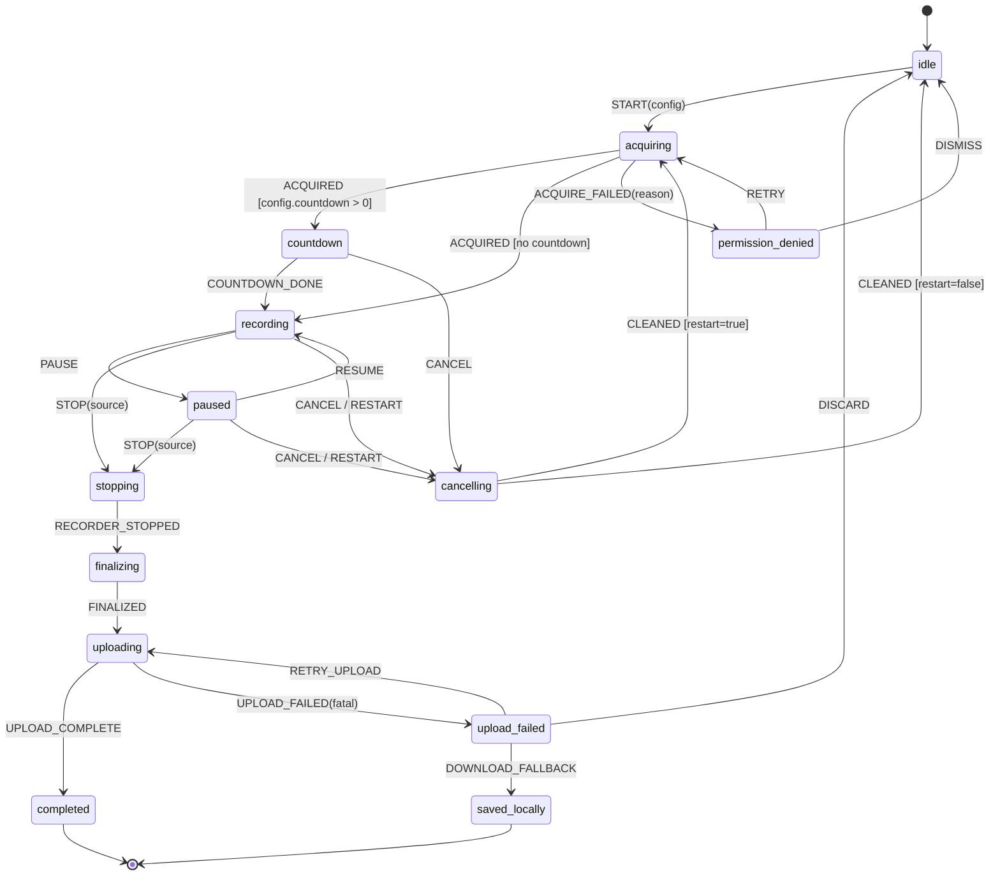

# 03 — Recording Engine Specification

> The definitive specification of the recorder. It replaces the implicit boolean soup documented in `01` §3 with one explicit state machine that owns all recording lifecycle. Local durability details are in `05`; upload protocol in `06`; extension plumbing in `04`.

**Placement:** the engine runs in the **recorder window** (`recorder.html`), the only long-lived extension context. The service worker never owns recording state (MV3 can kill it at any time).

---

## 1. Design rules

1. **One machine, one owner.** `RecorderMachine` is the only writer of recording lifecycle state. UI (recorder window, overlay, popup) renders projections of it; commands are events sent to it. No component may keep its own `isRecording` boolean.
2. **State is persisted on every transition** to `chrome.storage.local` (`recSession` projection for overlays) and to IndexedDB (`sessions` row — the durable record used for crash recovery, `05` §3).
3. **Every side effect is owned by a state** (entry/exit actions) so cleanup is deterministic: whoever creates a stream/timer/listener registers its disposer in the machine's disposer registry, and exit runs them (see §10).
4. **Events are the only way in.** All external inputs — user clicks, overlay messages, `track.ended`, `devicechange`, MediaRecorder callbacks, upload progress — become typed events.

## 2. The state machine



Notes:

- `stopping` and `cancelling` are real states, not function calls — they exist because `MediaRecorder.stop()` is asynchronous (`onstop` + final `dataavailable` arrive later) and the current code's biggest race is treating stop as synchronous (`recorder.js:403-416` stops tracks and closes the AudioContext before the recorder flushed).
- `uploading` runs concurrently with recording in steady state (parts upload while recording continues — `06` §5); the machine models the **post-stop** upload tail: entering `uploading` means "recording is finalized; only the remaining parts + completion are left."
- Transitions not listed are ignored and logged (`warn: event X ignored in state Y`) — never throw, never partially apply.

### 2.1 As implemented (T-501)

`extension/machine.js` — plain UMD (`VeoRecMachine.createMachine({ effects, now, log, onTransition })`), **pure**: no DOM, no `chrome.*`, no MediaRecorder, no network. States, events and transitions are exactly §2 (plus the internal `finalizing`, `STOP_TIMEOUT` for the §3.6 guard, `CHUNK`/`TICK` for the §7–§8 pipeline, `TRACK_ENDED`/`MIC_LOST`/`WARNING` for §9, `UPLOAD_PROGRESS`). Every side effect is a named **effect** the host injects (`acquire`, `startCountdown`, `createSession`, `createUploadSession`, `startRecorder`, `pauseRecorder`/`resumeRecorder`, `stopRecorder`, `stopTracks`, `finalize`, `startUpload`, `complete`, `download`, `discard`, `cleanup`, `wakeLock`, `setTimer`, `publish`, `persist`, `clearProjection`, `warn`, `chunk`); effects are never awaited — they send events back; a missing effect is simply not requested; a throwing effect is logged and never breaks a transition. **Entry order of `recording`** is §3.4's: session row → upload session → recorder → clock → wake lock → projection; resume from `paused` does not re-run it. **Elapsed** is computed in exactly one place (`elapsedMs`, §3.5 formula) and the projection carries `startedAt`/`pausedTotal`/`pauseStartedAt`. **`stopping`** calls `stopRecorder` and nothing else, with a 10 s guard that forces `finalizing` if `onstop` never arrives; `finalizing` stops the tracks and releases the wake lock. **Limits (§8)**: duration and bytes enforced from the chunk clock with a re-arming backstop timer, a once-only 30 s / 90 % warning, `STOP(source:'limit'|'byte_limit')`, `clientDuration` clamped to the limit. **Disposer registry (§10)**: `register(id, ownerState, dispose)` returns an unregister closure; the owning state's exit disposes its own; `idle`/`cancelling`/terminal states `disposeAll()`; `leaks()` is the dev assertion. **Projection (§11)** on every transition with the legacy keys (`recording`, `recState`, `startTime`) mirrored. **Dispatch**: one event at a time on a queue, so an effect that sends synchronously is processed after the current transition; unknown or invalid-in-state events are ignored and logged, never thrown. `cancelling` sets `discarding` and its own `CHUNK` handler drops the pipeline — the `onstop=null` trick is gone. Tests: `tests/machine.test.js` (428 assertions — every state × every event, entry order, elapsed, limits, interruptions, disposers, projection, re-entrancy) with **100 % block coverage** measured by V8 precise coverage (`tests/coverage-machine.js`, both load paths). The recorder window does not use it yet: T-502 supplies the capture effects, T-503 rewires the UI.

## 3. States — invariants, entry/exit actions

### 3.0 Quota pre-flight (before `START` is accepted)
At window load the recorder fetches `GET /me/usage` alongside entitlements (`§8`):
- **Blocked** (available storage < `plan.min_start_bytes`, or `videos.count ≥ max`): the Start button is replaced by the exact block message from `16` §4.6 (“You've reached your 5 GB free storage limit…” / “You've reached your 50-video free limit…”) with *Manage videos* and *Upgrade* actions. This is UX only — the authoritative gate is the server's atomic reservation at upload-session creation.
- **Near limit** (available storage < `plan.max_upload_bytes` — a full-length maximum-quality take may not fit, so the warning states the estimated minutes that DO fit — or ≥ 45/50 videos): show the pre-recording warning banner (`16` §4.6) but allow recording; the take will be byte-capped at the reservation (§8).
- Usage fetch failure: proceed (do not block recording on a metadata fetch); the server reservation still enforces.
- **Implemented by T-307** (`extension/quotaPreflight.js`, wired in `recorder.js` after the T-403 recovery scan): blocked / warn (with the minutes-that-fit estimate per quality) / ok / unknown exactly as above; the finalize quota path offers Save to device / Delete a video & retry / Upgrade. Details `16` §4.8.
- If upload-session creation later returns `storage_limit`/`video_limit` (race with another tab/device), the machine treats it like the offline case: recording proceeds with `uploadSession:null` durability-only **if capture already started**, and at finalize the user gets the block message with *Save to device / Delete a video & retry / Upgrade* — a take in progress is never discarded by a quota verdict.

### 3.1 `idle`
No streams, no recorder, no timers, no wake lock. Entry: run all disposers; clear `recSession` projection. The recovery check (`05` §6) runs before first entering `idle` on window load: if an unfinished session exists in IndexedDB, the UI offers *Resume upload / Download / Discard* before anything else.

### 3.2 `acquiring`
Entry: create `CaptureManager.acquire(config)` (§4). All `getUserMedia`/`getDisplayMedia` calls happen here and only here.
- Success → `ACQUIRED {tracks, warnings[]}`. Warnings (e.g. `no_mic`, `no_system_audio`, `tab_audio_missing`) carry the same audience-facing texts already written in `recorder.js:304-315` — keep those strings.
- Failure → `ACQUIRE_FAILED {code}` with codes from `18` §4 (`permission_dismissed`, `permission_denied`, `no_device`, `tab_capture_failed`, `constraint_failed`).
- **Mic denial policy (changed from current):** if `config.audio=true` and mic acquisition fails, do NOT silently continue. Emit `ACQUIRE_FAILED(mic_denied)` with a choice UI: *Record without mic / Fix permission / Cancel*. "Record without mic" re-enters `acquiring` with `audio:false`. (Current behavior silently records mic-less — `recorder.js:179-184` — the #1 "my video has no sound" complaint generator.)

### 3.3 `countdown`
Entry: start countdown timer (N seconds from config; values 3/5/0). Streams are live but MediaRecorder has NOT started. Exit: dispose timer. `CANCEL` here goes to `cancelling` (streams must be released).

### 3.4 `recording`
Entry (in order):
1. Create IndexedDB session row (`status:'recording'`) — **before** starting the recorder, so a crash 1s in is recoverable.
2. Create upload session via `POST /api/v1/uploads` (see `06` §3) — this is where the server **atomically reserves quota** (storage bytes + video slot, `16` §4.3). If the API is unreachable, recording still starts (`uploadSession:null`) — durability comes from IndexedDB; the uploader retries session creation in the background. This is the "record first, network later" rule. A quota rejection here follows §3.0's in-progress policy (never discards a running take).
3. Build `MediaRecorder` (§6) and `start(1000)`.
4. Start wall-clock: `recordingStartedAt = Date.now()`; `pausedTotal = 0`.
5. Acquire `navigator.wakeLock.request('screen')` if available (release on exit).
6. Publish projection `{state:'recording', startedAt, pausedTotal}` to `chrome.storage.local.recSession` for overlays.

During: every `dataavailable` → §7 chunk pipeline; limit enforcement → §8.

### 3.5 `paused`
Entry: `mediaRecorder.pause()`; `pauseStartedAt = Date.now()`; persist. Exit (to recording): `mediaRecorder.resume()`; `pausedTotal += now - pauseStartedAt`. The projection carries `pausedTotal`/`pauseStartedAt` so overlays compute elapsed identically (formula: `elapsed = now - startedAt - pausedTotal - (paused ? now - pauseStartedAt : 0)` — same math as `recorder.js:60-63`, but computed in exactly one place and mirrored).

### 3.6 `stopping`
Entry: `mediaRecorder.stop()` and **nothing else**. Do not stop tracks yet. Guard timer: if `RECORDER_STOPPED` (i.e. `onstop`) hasn't arrived in 10s, force-transition with whatever chunks exist (Chromium bugs can swallow `onstop` when tracks died abnormally).
On `RECORDER_STOPPED`: now stop all tracks, close AudioContext, release wake lock → `finalizing`.

### 3.7 `finalizing`
- Flush the remaining buffered bytes as the final part to IndexedDB (`05` §4).
- Compute `clientDuration = elapsed` (hint only — server FFprobes the truth, invariant #11).
- Mark IndexedDB session `status:'stopped'`, store `clientDuration`, `totalBytes`, `chunkCount`.
- → `FINALIZED`.

### 3.8 `uploading`
Entry: uploader drains remaining parts → completes the multipart session (`06` §7). Progress events update UI (`uploadedBytes/totalBytes`). The window shows progress and warns on `beforeunload` while parts remain.
- `UPLOAD_COMPLETE {recordingId, watchUrl}` → `completed`.
- Fatal failure (auth expired and unrecoverable, plan rejection, session expired server-side) → `upload_failed {code, retryable}`.
Transient network failures do NOT surface here — the uploader retries internally with backoff (`06` §8) and only gives up after its policy is exhausted.

### 3.9 `upload_failed`
UI offers: **Retry** (→ `uploading`, resumes from recorded parts), **Save to device** (assemble blob from IndexedDB chunks + `fixWebmDuration` → download → `saved_locally`), **Discard** (delete session → `idle`). The IndexedDB data is kept unless the user discards; a later recorder launch re-offers recovery (`05` §6).

### 3.10 `completed`
Persist `lastRecording` for the popup card; delete the IndexedDB session **only after** server `complete` returned 200 (invariant: local data outlives every failure mode); open watch page; close window after 1.2s (keep current UX).

### 3.11 `cancelling`
Suppress the chunk pipeline (`discarding=true` context flag — replaces the `onstop=null` trick at `recorder.js:421`, which loses the final flush of a *wanted* recording if misused). Stop recorder, stop tracks, delete IndexedDB session, abort server upload session (`DELETE /uploads/:id`, best-effort), then `CLEANED`.

## 4. Capture initialization (`CaptureManager`)

Modes (unchanged product-wise): `screen`, `window`, `tab`, `camera-only`; camera bubble (`bubble`) is a DOM overlay, not a compositing concern.

| Mode | Video | Audio sources |
|---|---|---|
| `tab` | `getUserMedia` with `mandatory:{chromeMediaSource:'tab', chromeMediaSourceId}` (legacy shape is REQUIRED — keep the comment from `recorder.js:154-162`) | tab audio (same call) + optional mic |
| `screen` | `getDisplayMedia({video:{displaySurface:'monitor', frameRate:{ideal:30}, width/height ideal per quality}, audio:true, systemAudio:'include'})` | system audio if user ticked share-audio + optional mic |
| `window` | same with `displaySurface:'window'` | **no system audio possible** (Chrome limitation) + optional mic |
| `camera-only` | `getUserMedia({video:{width:1280,height:720}})` | mic only |

Quality → constraints/bitrate: `high` 1920×1080 @ 4 Mbps, `medium` 1280×720 @ 2.5 Mbps, `low` 854×480 @ 1 Mbps (as today, `recorder.js:96-100, 264`).

Ordering rule: `tabCapture.getMediaStreamId` must be called in the **popup click gesture** and passed via `recOptions` (as today, `popup.js:222-233`); the stream id is single-use — a restart in tab mode must fall back to `screen` mode with a notice, or message the SW to re-acquire (it cannot: no gesture) → **restart in tab mode re-uses the picker-less flow only if Chrome permits; otherwise downgrade to screen picker with an explanatory status.**

## 5. Audio mixing

One `AudioContext` mixes display/tab audio + mic into a single track via `MediaStreamAudioDestinationNode` (keep the working design from `recorder.js:213-227`):

- Tab mode: also connect tab source → `audioCtx.destination` (tabCapture mutes the tab locally).
- **Suspended-context safeguard** (records pure silence otherwise): await `resume()` before `MediaRecorder.start`, with the 1.5s statechange wait; keep an `onstatechange` re-resume. Additionally (new): if the context is still not `running` at start time, surface warning `audio_context_suspended` in the UI rather than proceeding silently.
- Gain nodes per source (mic +0dB default; future volume controls hang here).
- The AudioContext is registered as a disposer owned by `recording` (closed only after `RECORDER_STOPPED`).
- If **no** audio track ends up in the mix while the user wanted audio, that is the `no_audio_at_all` warning (existing text) — shown prominently, recording continues (screen-only capture is still valid).

## 6. MediaRecorder configuration

- Container: `video/webm;codecs=vp9,opus` if `isTypeSupported`, else `video/webm;codecs=vp8,opus`, else `video/webm`. (H.264-in-MP4 MediaRecorder is not reliable in Chrome; normalization to MP4 happens server-side — `09`.)
- `videoBitsPerSecond` per quality (§4); `audioBitsPerSecond: 128_000` — **explicitly set** (the legacy recorder left audio at browser default, `recorder.js:266`). Both values are encoder *targets*, not guarantees — VBR output can transiently overshoot — which is why size control is the enforced byte ceiling (§8), never bitrate arithmetic.
- `start(1000)` — 1s timeslice. Rationale: bounded memory between persists, ~1s max data loss on crash, and the encoder-clock limit enforcement (§8) needs regular callbacks.
- Handlers registered before `start`: `dataavailable`, `stop`, `error` (→ event `RECORDER_ERROR {error}` → treat as `STOP(source:'recorder_error')` — salvage what exists rather than discarding), `pause`, `resume` (assert-only).

## 7. Chunk pipeline (`dataavailable`)

```
dataavailable(e) [discarding? drop]:
  seq += 1
  IndexedDB.put(chunks, {sessionId, seq, bytes: e.data, size, at: Date.now()})   // ALWAYS first
  uploader.feed(e.data)      // appends to current part buffer; uploads when ≥ partSize (06 §5)
  enforceLimit()             // §8
```

- The IndexedDB write is fire-and-ordered (writes queue per session; failure → event `PERSIST_FAILED` once, UI banner "recovery protection unavailable", recording continues — better to record un-protected than to stop).
- Memory rule: chunks are NOT accumulated into a `chunks[]` array anymore. The uploader holds at most `partSize` (8–16MB) plus in-flight parts; assembly of a full blob happens only for the local-download fallback, streamed from IndexedDB.

## 8. Recording limit enforcement — duration AND bytes

Two independent caps, both enforced by the same encoder-clock pattern (which exists because background windows get timer-throttled — comments at `recorder.js:269-296`):

**Duration cap** (`plan.max_recording_duration_seconds`):
1. Primary: check `elapsed >= limit` inside `dataavailable` (encoder clock, fires even when throttled).
2. Backstop: single re-arming `setTimeout` at `limit - elapsed + 500ms`.
3. UI: 30s warning.
On trip → `STOP(source:'limit')`; `clientDuration` reported clamped to the limit; server still verifies with FFprobe and applies the +30s grace (`permissions.canRecord` semantics preserved).

**Byte cap** (`byteCeiling` from the upload session = the atomic quota reservation, `16` §4.3a):
1. Primary: cumulative recorded bytes checked inside `dataavailable` (the chunk pipeline already sums sizes).
2. Warn at 90% of the ceiling ("running out of storage — about N min left at this rate", rate estimated from the last 30s of chunks).
3. On reaching `ceiling − 16 MiB` safety margin → `STOP(source:'byte_limit')` — normal finalize + upload; the take is preserved, never rejected.
4. Pre-flight disclosure: when the ceiling is below the plan's full-length worst case (low remaining quota), the recorder says so **before** capture starts (§3.0). If no upload session exists yet (offline start), the byte cap defaults to `plan.max_upload_bytes` from cached entitlements, and the server re-enforces at presign/complete regardless.

The byte ceiling — not encoder bitrate settings — is the authoritative size control: MediaRecorder bitrates are targets and cannot be trusted as an upper bound (§6). Server-side enforcement (presign refusal + completion check, `06` §4/§7) holds even if the client is hostile. Limit source: `GET /api/v1/me/entitlements` at window load; **fallback when the fetch fails is the cached last-known entitlement (from `chrome.storage`), then free-plan limit** — fixes the current bug where a failed fetch caps Pro users at 10 min (`recorder.js:34-53`).

## 9. External interruption events

| Event | Source | Handling |
|---|---|---|
| Screen-share ended (browser "Stop sharing" bar, window closed, monitor unplugged) | `videoTrack.ended` | `STOP(source:'track_ended')` — normal finalize+upload (as today, `recorder.js:187-191`) |
| Mic track ended (device unplugged) | `micTrack.ended` | Keep recording; remove mic from mix; warning banner `mic_lost`; log event into session row |
| Tab-audio track ended | `ended` | Keep recording; warning `tab_audio_lost` |
| `navigator.mediaDevices.devicechange` | device list changed | If the active mic disappeared → as `mic_lost`. Do NOT auto-switch devices mid-recording (glitches + user surprise); offer switch only in `paused` |
| Camera failure in camera-only | `ended` | `STOP(source:'track_ended')` (there is no video without it) |
| AudioContext `statechange` to non-running | interruption | auto-`resume()` retry; warning if it stays suspended > 3s |
| Recorder window `beforeunload` while active | user closing | `preventDefault` + browser confirm; on actual unload the IndexedDB data survives → recovery on next launch |
| Extension update/reload mid-recording | runtime | Uncontrollable — recording dies; IndexedDB survives; recovery offers upload of what was captured |

## 10. Deterministic cleanup (disposer registry)

```ts
interface Disposer { id: string; ownerState: State; dispose(): void }
```
Everything allocable registers one: media tracks, AudioContext, MediaRecorder handlers, countdown/limit/UI timers, wake lock, `devicechange`/`ended` listeners, storage `onChanged` listeners, upload abort controllers. `idle` entry and `cancelling` run `disposeAll()`; state exits run their own. A leak check in dev asserts the registry is empty in `idle`. This codifies (and extends) `cleanupStreams()` (`recorder.js:376-382`) so nothing can be forgotten when new features add resources.

## 11. Projection contract for overlays (`chrome.storage.local.recSession`)

```ts
{ state: 'idle'|'countdown'|'recording'|'paused'|'stopping'|'uploading'|'completed'|'failed',
  startedAt: number|null, pausedTotal: number, pauseStartedAt: number|null,
  warning: string|null, uploadedPct: number|null, sessionId: string }
```
Written on every transition + at most 1/s during recording. Overlays are read-only consumers (they keep their local 500ms tick for smooth timers, as today). All legacy keys (`recording`, `recState`, `startTime`) are written in parallel during migration and deleted in `23` Phase 14.

## 12. Commands (events accepted from outside)

`START(config)`, `PAUSE`, `RESUME`, `STOP(source)`, `CANCEL`, `RESTART`, `RETRY_UPLOAD`, `DOWNLOAD_FALLBACK`, `DISCARD` — carried over the typed message protocol in `04` §6 (`SR_*` messages map 1:1). Unknown/invalid-in-state commands are ignored+logged, never crash.

## 13. Explicitly rejected designs

- **Recording in the service worker / offscreen document**: offscreen documents can host MediaRecorder but complicate picker UX, debugging, and the existing recovery model; revisit only if the popup-window UX becomes a product problem.
- **Canvas compositing of camera over screen**: rejected previously in this codebase for good reasons (throttling of hidden canvases kills recordings — comment `recorder.js:149-152`); the DOM-bubble approach stays.
- **Storing chunks in `chrome.storage.local`**: quota + serialization make it unfit; IndexedDB holds Blobs natively.

## 14. Acceptance tests for this spec

The engine ships only with the matrix in `20-TESTING-STRATEGY.md` §9 green, including: kill the window at 10s → relaunch → recover → uploaded file playable; deny mic → explicit choice UI; stop-sharing bar → complete upload; pause 30s → duration excludes pause (±1s); network cut during recording → recording completes, upload resumes when back; plan limit → auto-stop and upload accepted.
