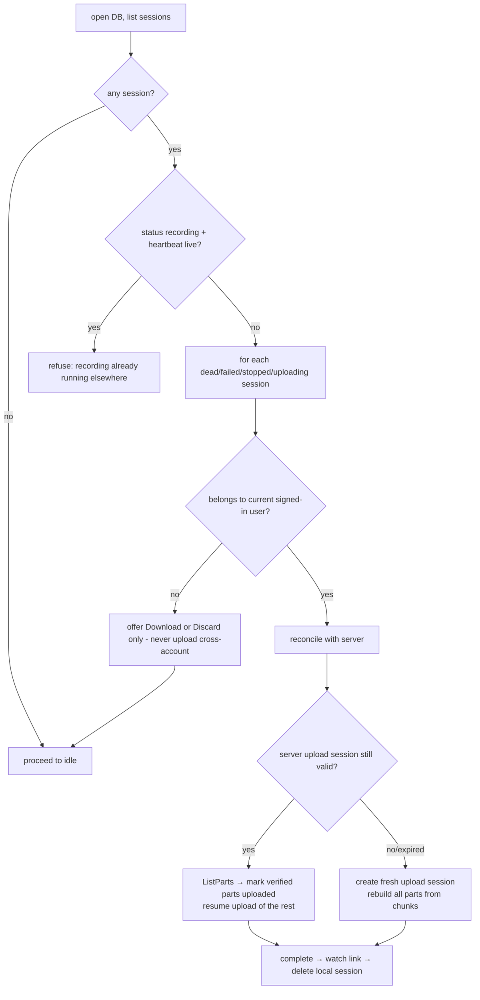

# 05 — Local Recovery (IndexedDB)

> The local durability layer that guarantees: **once a chunk left MediaRecorder, the recording survives any client-side failure** (window close, renderer crash, browser crash, extension reload, network loss). Today nothing survives (`01` §3.4 — chunks live in a JS array).

Scope: runs inside the recorder window (extension origin). The web app does not record, so it has no equivalent layer.

---

## 1. Guarantees and non-guarantees

**Guaranteed:**
- At most ~1 second of media is lost on a hard crash (the un-flushed MediaRecorder timeslice).
- A recording interrupted at any point can be: resumed (upload), downloaded locally, or discarded — explicitly, by the user.
- Upload state (which parts are durably in R2) survives restarts, so resume never re-uploads completed parts.

**Not guaranteed:**
- Survival of extension **uninstall** (Chrome wipes extension-origin storage).
- Survival of the user clearing browsing data for extensions.
- Unlimited retention: recovered-but-ignored sessions are garbage-collected after 7 days (§7).

## 2. Database

`veorec-recorder` (version 1), extension origin. Request `navigator.storage.persist()` at first open (best-effort; log the grant result). Object stores:

```
sessions   keyPath: id
chunks     keyPath: [sessionId, seq]
parts      keyPath: [sessionId, partNumber]
```

## 3. `sessions` store

```ts
interface LocalSession {
  id: string;                    // uuid, created at recording start
  createdAt: number;
  updatedAt: number;             // heartbeat — bumped ≥ every 5s while recording
  status: 'recording'|'stopped'|'uploading'|'uploaded'|'failed';
  // capture facts
  mimeType: string;              // actual MediaRecorder.mimeType
  config: RecOptions;            // what was recorded (04 §6)
  clientDuration: number|null;   // seconds, set at finalize (hint only)
  chunkCount: number;            // last seq written + 1
  totalBytes: number;
  // server linkage (set as soon as known; null while offline)
  recordingId: string|null;      // server recording row
  uploadSessionId: string|null;  // server upload session
  storageUploadId: string|null;  // S3 multipart UploadId (from server)
  partSize: number|null;
  title: string;
  userId: string|null;           // owner at record time — recovery must not upload under a different account
}
```

Transitions mirror the machine (`03`): created with `status:'recording'` in `recording` entry; `'stopped'` at finalize; `'uploading'` when the post-stop drain starts; **deleted** (not marked) after server `complete` returns 200; `'failed'` when the uploader gives up (kept for recovery).

The `updatedAt` heartbeat distinguishes a *live* concurrent recording from a *dead* one: a second recorder window treats `status:'recording' && updatedAt > now-15s` as "another recording is running" (refuse), and `updatedAt ≤ now-15s` as a crashed session (offer recovery).

## 4. `chunks` store

```ts
interface LocalChunk { sessionId: string; seq: number; bytes: Blob; size: number; at: number }
```

- One row per `dataavailable` (~1/s, so a 10-min recording ≈ 600 rows; a 2h Pro recording ≈ 7,200 rows — fine for IndexedDB).
- Writes are queued per session and executed in order (a simple promise chain); a failed write retries once, then emits `PERSIST_FAILED` (machine shows a banner; recording continues — `03` §7).
- Chunks are the **source for the local download fallback** (stream-assemble → `fixWebmDuration` → save) and for rebuilding parts that were never uploaded.

**Space accounting:** before starting, check `navigator.storage.estimate()`; if `quota - usage < 2 GB`… warn; if `< 500 MB` → refuse to start with `insufficient_disk` (better than dying mid-recording). During recording, a QuotaExceededError on write → treat as `PERSIST_FAILED` (banner), and if the uploader is alive, aggressively prune chunks already covered by **verified** parts (§6.1) to reclaim space.

## 5. `parts` store — upload bookkeeping

```ts
interface LocalPart {
  sessionId: string; partNumber: number;         // 1-based (S3 semantics)
  firstSeq: number; lastSeq: number;             // which chunks compose it
  size: number;
  status: 'pending'|'inflight'|'uploaded';
  etag: string|null;                             // set on 'uploaded' (needed for CompleteMultipartUpload)
  crc32c: string|null;                           // checksum computed before upload (06 §9)
  attempts: number; lastError: string|null;
}
```

The uploader (`06`) seals a part when buffered bytes ≥ `partSize` (or at finalize): writes the `parts` row (`pending`) **before** the PUT; marks `inflight` on start; on success stores `etag` → `uploaded`. This ordering means a crash between PUT-success and etag-write is resolved at recovery by `ListParts` against the server (§6.1) — the etag is recoverable from S3, so nothing re-uploads unnecessarily.

**Chunk pruning:** once a part is `uploaded` AND its etag is recorded, its chunk rows *may* be deleted to bound disk usage — but only when space pressure exists (default: keep everything until session deletion, so local download always has full fidelity).

## 6. Recovery process

Runs at recorder-window launch, before `idle` (`03` §3.1):



### 6.1 Server reconciliation detail

1. If `uploadSessionId` exists: `GET /api/v1/uploads/:id` → server returns `{status, parts: [{partNumber, etag, size}]}` (server queried R2 `ListParts` or its own `upload_parts` rows). Local `parts` rows are corrected to match (server view wins for uploaded-ness).
2. If the server session is `completed` (crash happened after complete succeeded but before local delete): the recording is fine — show "already saved" with the watch link, delete local data. **This is the idempotency of completion paying off** (`06` §7).
3. If `expired`/`aborted` or `uploadSessionId===null` (recorded offline): start a new session (`06` §3) for the same `recordingId` (or create the recording row too if `recordingId===null`), rebuild parts from chunks, upload all. The new session goes through the normal atomic quota reservation — if quota is now exhausted (`storage_limit`/`video_limit`), the recovery card keeps offering **Download / Delete-a-video-and-retry / Upgrade**; the local data is never discarded by a quota verdict.
4. Auth failure (401) during recovery: keep data, show sign-in prompt; retry after auth (sessions survive, §1).

### 6.2 Recovery UI

A card listing each recoverable session: title, recorded-at, duration estimate (`chunkCount` seconds), size, upload progress (`uploadedParts/totalParts`), with actions **Resume upload** / **Download** / **Discard**. Multiple sessions listed newest-first. This UI is also reachable from the popup ("recovered recordings" badge) so a user who never reopens the recorder still finds their take.

## 7. Cleanup

- On `completed`: delete session + chunks + parts in one transaction (only after server 200 — `03` §3.10).
- On explicit Discard: same, plus best-effort `DELETE /api/v1/uploads/:id` (server aborts the S3 multipart).
- GC job at every recorder launch: sessions with `updatedAt < now - 7 days` are deleted (with a console notice). R2-side incomplete multiparts are lifecycle-aborted at 48h server-side (`06` §11) — a local session older than that will always take the "fresh session" path §6.1.3.
- On sign-out (`SR_AUTH_CLEAR`): sessions are **kept** (they may be mid-upload for the signed-out user) but recovery for them offers Download/Discard only until that user signs back in (§6 user check).

## 8. Browser/extension restart matrix

| Scenario | What survives | Outcome |
|---|---|---|
| Recorder window closed mid-recording | chunks to last second, session `recording` w/ stale heartbeat | recovery card → resume upload of captured portion |
| Chrome crash mid-recording | same | same |
| OS crash | same (IndexedDB is durable; last txn may be lost) | same, minus ≤1s |
| Crash during post-stop upload | all chunks + parts w/ etags | resume: only missing parts upload |
| Crash between server-complete and local delete | server has recording | "already saved" + link (idempotent complete) |
| Extension updated/reloaded | all data (same extension id/origin) | recovery on next launch |
| Extension uninstalled | nothing | lost (documented) |
| Network offline for entire session | chunks; `recordingId=null` | recovery creates recording + uploads when online |

## 9. Implementation notes

- All DB access behind `RecorderStore` (one module, promise API, no raw IDB calls elsewhere) — unit-testable with `fake-indexeddb` (`20` §4).
- Blob storage in IDB is efficient in Chromium (blobs stored as files internally); do not base64 anything.
- Never hold more than one open cursor over `chunks` during assembly; stream with `getAll(range, batch)` in 50-row batches to bound memory when building the download blob.
- Version upgrades: additive only; `onupgradeneeded` must migrate without dropping stores.
