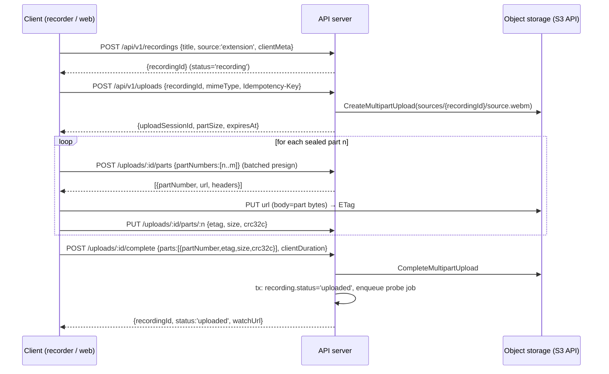

# 06 — Upload Protocol

> Resumable, retryable, idempotent multipart upload, direct from the client to object storage. Replaces the single monolithic `POST /api/upload` multipart-through-the-server (`01` §3.4–3.5). **The application server never receives video bytes.**

---

## 1. Overview



Uploads run **while recording is still in progress** (streaming upload): the client seals and uploads parts as soon as `partSize` bytes have accumulated. By the time the user hits Stop, typically only the final part + completion remain.

## 2. Server state

Tables (full definitions in `07`): `upload_sessions` (id, recording_id, user_id, storage_key, storage_upload_id, part_size, status `pending|active|completed|aborted|expired`, expires_at, idempotency_key unique-per-user, client_mime, created/updated) and `upload_parts` (session_id, part_number, size, etag, crc32c, status, uploaded_at; PK (session_id, part_number)).

Rules:
- One `active` upload session per recording (unique partial index). Creating a second while one is active returns the existing one (idempotent by `recordingId`).
- A session binds to `sources/{recordingId}/source.{ext}` — the immutable source key.

## 3. Initialization

`POST /api/v1/uploads`
- Auth: required. Body: `{recordingId, mimeType, estimatedBytes?}`. Header: `Idempotency-Key` (client-generated uuid; retried request returns the same session).
- Validation: recording exists, is owned by caller, `status ∈ {recording, uploading, upload_failed}`; mimeType ∈ allowlist (`video/webm`, `video/mp4`, `video/quicktime`).
- **Atomic quota reservation (authoritative — `16` §4.3):** in the same transaction that inserts the session, a single guarded UPDATE on the user's `usage` row reserves `plan.upload_reservation_bytes` + 1 video slot, and a `storage_reservations` row is created. Guard failure ⇒ `403 {code:'storage_limit'|'video_limit', upgradeRequired:true, meta}` and **no session is created**. `estimatedBytes` is a hint only — the reservation amount is always server-computed; the client is never trusted for sizes or counts. Two concurrent sessions (two tabs, two devices) serialize on the `usage` row: quota can never be double-spent.
- Response `201 {uploadSessionId, partSize, minPartSize, maxParts, expiresAt}`.
- `partSize`: server-chosen, default **8 MiB** (S3 minimum is 5 MiB for all but the last part; 8 MiB ≈ 30–60s of video at recorder bitrates → steady upload cadence). `maxParts` 10,000 (S3 limit) → 80 GB ceiling, far above any plan.
- `expiresAt`: now + 48h (recording + upload must finish within; recovery after that rebuilds a fresh session, `05` §6.1).

## 4. Part presigning

`POST /api/v1/uploads/:id/parts` body `{partNumbers: number[]}` (≤ 20 per call) → `[{partNumber, url, expiresAt}]`.
- Presigned S3 `UploadPart` URLs, TTL 1h. Clients prefetch the next 2–3 part URLs to avoid a round trip between parts, and re-request on expiry (URL minting is free and repeatable).
- Authorization: session owner only; session must be `active` (a `pending` session becomes `active` on first presign).

## 5. Client uploader behavior

- Buffer chunks (from `dataavailable`) into the current part; **seal** at ≥ `partSize` or at finalize (last part may be any size ≥ 1 byte).
- Write the `parts` row locally before PUT (`05` §5), compute `crc32c` of the part, PUT with `Content-Length` (streams a Blob slice; no full-file assembly ever).
- Concurrency: max **2** parallel part PUTs while recording (leave bandwidth for the meeting being recorded), **4** after stop.
- After a successful PUT, immediately `PUT /uploads/:id/parts/:n {etag, size, crc32c}` to record it server-side. This call is idempotent (upsert on PK); if it fails transiently, retry with the part-PUT backoff policy; the truth is recoverable from S3 `ListParts` anyway.
- Progress = `uploadedBytes / (totalBytes so far)`; during recording show "backing up ✓/⏳" rather than a percentage (total is unknown).

## 6. Retry strategy

Per part PUT:
- Retry on: network error, timeout (per-attempt timeout = `max(60s, size/50KBps)`), HTTP 5xx, 429.
- Backoff: exponential with full jitter — `delay = rand(0, min(60s, 1s·2^attempt))`; attempts per part: 8. 429 honors `Retry-After`.
- On presign-expired (403 with expired signature): re-request the URL (does not count as a data attempt).
- After 8 failures of the same part: uploader state `stalled`; keep the session, surface a non-fatal "connection lost — will retry" banner, and retry the whole drain every 60s while the recorder window lives. Only a *fatal* server verdict (plan rejection at complete, session expired + rebuild also failing, 401 unrecoverable) produces `UPLOAD_FAILED` in the machine (`03` §3.8).
- All retries are byte-identical PUTs to the same partNumber — S3 multipart makes re-PUT of a part inherently idempotent (last write wins, same content → same outcome).

## 7. Completion — idempotent by construction

`POST /api/v1/uploads/:id/complete` body `{parts:[{partNumber, etag, size, crc32c}], clientDuration?}`.

Server algorithm (single Postgres transaction around steps 3–5):
1. Load session `FOR UPDATE`. If `status='completed'` → **return the existing canonical result** (`200 {recordingId, status, watchUrl}`) — never create another asset. (This is the spec's canonical idempotency example.)
2. Validate the manifest: contiguous partNumbers from 1, every part known in `upload_parts` (or verifiable via `ListParts`), sizes ≥ minPartSize except last.
3. Call S3 `CompleteMultipartUpload` with the etag manifest. If S3 says the upload id is already completed (`NoSuchUpload` but object exists with expected size) → treat as success (crash-between-steps recovery).
4. `HEAD` the object; record `total_size`. Sanity check: `total_size == Σ part sizes`, else fail with `upload_size_mismatch` (500-class, retryable — do not delete anything).
5. Update: session `completed`; recording `status='uploaded'`, `size_bytes`; create `video_assets` row (`kind='source'`, immutable, `counts_toward_quota=true`); **reservation reconciliation** (`16` §4.4): `retained += total_size`, `reserved −= reservation`, `reserved_slots −= 1`, `active_video_count += 1`, reservation `reconciled` — all in this same transaction. Guards: `total_size` must be ≤ `reserved_bytes × 1.05` (else `422 upload_manifest_invalid` — a client cannot upload past its reservation), and the plan is re-checked with the real size for the residual downgrade-race case — on rejection: recording `status='rejected_limit'`, reservation released, respond `403 {code:'video_limit'|'storage_limit', upgradeRequired:true}`, schedule source deletion after 7 days (grace so an upgrade can rescue it — user content is never silently deleted).
6. Enqueue `probe` job (outside the tx, after commit; a transactional-outbox row `processing_jobs(status='queued')` is written inside the tx and a relay enqueues — see `10` §3).
7. Respond `200 {recordingId, status:'uploaded', watchUrl}`.

Duration policy: `clientDuration` is stored as `client_duration_hint`. `recordings.duration` is written **only** by the probe worker from FFprobe (invariants #11/#12). Plan length enforcement happens post-probe (`09` §2) with the same grace semantics as today's `canRecord` (+30s).

## 8. Abort & expiry

- `DELETE /api/v1/uploads/:id` → S3 `AbortMultipartUpload`, session `aborted`, **quota reservation released** in the same transaction (`reserved −= reservation`, `reserved_slots −= 1`). Called on user Discard. Idempotent (aborting an aborted/absent upload → 200; release applies at most once via the reservation status).
- Expiry job (repeatable, hourly): sessions past `expiresAt` and not `completed` → abort in S3, mark `expired`, **release the reservation**. This is also the healing path for abandoned tabs, browser crashes, and server restarts that left reservations held. R2 bucket lifecycle rule additionally aborts incomplete multiparts at 48h as a backstop.
- An expired session does not doom the recording: local recovery creates a new session (`05` §6.1.3).

## 9. Checksums

- Client computes CRC32C per part (fast, streaming) and sends it in the part-record call and the complete manifest; server passes `x-amz-checksum-crc32c` on presign so **storage verifies integrity on PUT** (S3/R2 reject corrupted bodies). ETag equality between client-seen and server-listed parts is verified at complete.
- End-to-end: FFprobe in the worker is the final integrity arbiter (a corrupt-but-checksum-valid file — e.g. truncated recording — fails probe → `status='failed'` with `probe_invalid`, and the client-side chunks still exist for re-try/download until the user confirms).

## 10. Resume semantics (exact)

Resume = `GET /api/v1/uploads/:id` → `{status, partSize, parts:[{partNumber, size, etag}]}` (server merges its `upload_parts` with live `ListParts` when they disagree; storage wins). Client diffs against local parts:
- server-has & local-missing-etag → adopt server record (crash after PUT);
- local-has & server-missing → re-record via `PUT parts/:n` (metadata loss only) or re-PUT if `ListParts` lacks it;
- neither → upload.
Then complete as normal. **Missing-part detection is therefore server-authoritative**, and no completed byte is ever re-sent.

## 11. Storage keys & lifecycle

- Source: `sources/{recordingId}/source.{webm|mp4|mov}` — written exactly once via multipart; bucket denies overwrite of completed sources at the app layer (assets table `immutable=true`; no code path issues a PUT to an existing source key).
- Lifecycle: incomplete multiparts auto-abort at 48h; `rejected_limit` sources deleted by cleanup job after the 7-day grace.

## 12. Small-file path (web uploads, editor "add clip")

Files ≤ 32 MiB may use a single presigned `PUT` (`POST /api/v1/uploads` with `mode:'single'` → one URL; complete is the same endpoint with `parts:[]`, server HEADs the object). Same session bookkeeping, same idempotency, same atomic quota reservation (reservation = 33,554,432 bytes for single mode). The editor's current 500MB memory-multer `replace` path (`index.js:61`, `1023-1086`) is **deleted** — renders happen server-side from source assets (`14`), and user file uploads use this protocol.

## 13. API examples

```http
POST /api/v1/uploads
Authorization: Bearer <token>
Idempotency-Key: 1c9f7e0a-...
{"recordingId":"rec_9f2...","mimeType":"video/webm","estimatedBytes":52428800}

201 {"uploadSessionId":"up_31a...","partSize":8388608,"maxParts":10000,
     "expiresAt":"2026-09-03T12:00:00Z"}
```
```http
POST /api/v1/uploads/up_31a/parts
{"partNumbers":[3,4,5]}
200 [{"partNumber":3,"url":"https://...r2...&X-Amz-Signature=...","expiresAt":"..."}, ...]
```
```http
PUT /api/v1/uploads/up_31a/parts/3
{"etag":"\"9b2cf53...\"","size":8388608,"crc32c":"yZRlqg=="}
200 {"recorded":true}
```
```http
POST /api/v1/uploads/up_31a/complete
{"parts":[{"partNumber":1,"etag":"...","size":8388608,"crc32c":"..."}, ...],
 "clientDuration":184}
200 {"recordingId":"rec_9f2...","status":"uploaded","watchUrl":"https://veorec.com/watch/rec_9f2..."}
```

Errors follow the global contract (`08` §2 / `18`): e.g. `409 upload_session_conflict`, `410 upload_session_expired`, `403 video_limit`, `422 upload_manifest_invalid`.

## 14. Why not tus / Uppy / Cloudinary chunked?

tus needs a byte-serving server (violates "no video bytes through the API") or a tus-capable storage frontend; S3 multipart is native to R2/S3/B2, requires zero server bandwidth, and its part model maps 1:1 onto the IndexedDB part bookkeeping. Uppy could be adopted client-side later purely as an implementation detail of this same wire protocol.
