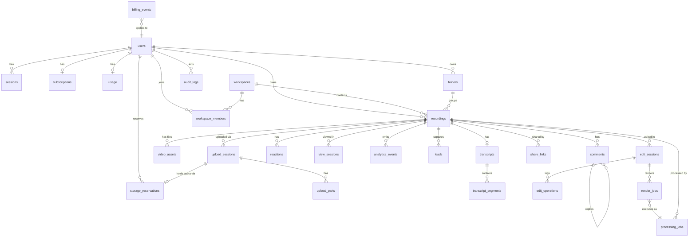

# 07 — Database Design (PostgreSQL)

> The complete schema. PostgreSQL 16, Drizzle ORM, SQL migrations in `db/migrations/`. Conventions first, then every table, then the ER diagram.

---

## 1. Conventions

- **IDs**: `text` primary keys with typed prefixes (`usr_`, `rec_`, `ast_`, `up_`, `job_`, `cmt_`, …), generated app-side (uuidv7 base — sortable). Existing UUIDs migrate as-is (prefixed).
- **Timestamps**: `created_at timestamptz not null default now()`, `updated_at timestamptz not null default now()` (trigger-updated) on every table. Domain times are explicit columns.
- **Soft delete**: only where the product needs undelete/audit — `users`, `recordings` (`deleted_at timestamptz null`). Everything else hard-deletes via FK cascade. All queries on soft-deleted tables filter `deleted_at is null` through the repository layer.
- **Enums**: Postgres `text` + `CHECK` constraints (cheaper to migrate than native enums).
- **Money**: integer cents. **Bytes**: `bigint`. **Durations**: `numeric(10,3)` seconds.
- **JSONB** only for genuinely open-shaped data (job payloads, audience settings, event props) — never for anything queried relationally.

## 2. Identity & workspaces

### `users`
| column | type | notes |
|---|---|---|
| id | text PK | `usr_` |
| email | citext NOT NULL UNIQUE (partial: where deleted_at is null) | |
| name | text NOT NULL | |
| password_hash | text NULL | null for Google-only accounts |
| google_id | text NULL UNIQUE | |
| is_admin | boolean NOT NULL default false | replaces `ADMIN_EMAILS` env allowlist (env seeds it) |
| manual_plan | text NULL, manual_plan_expires timestamptz NULL | admin comp (kept from current model) |
| slack_webhook | text NULL | |
| paddle_customer_id | text NULL | |
| reset_token_hash | text NULL, reset_expires timestamptz NULL | store **hash** of reset token (today plaintext in users.json) |
| deleted_at | timestamptz NULL | soft delete; cascade policies below |
Indexes: `(email)`, `(google_id)`, `(paddle_customer_id)`.

### `sessions` (auth)
| id (`ses_`) PK | user_id FK→users ON DELETE CASCADE | token_hash text NOT NULL UNIQUE (sha256 of opaque token) | client text CHECK in ('web','extension') | user_agent text | ip inet | last_used_at | expires_at NOT NULL | revoked_at NULL |
Index: `(user_id)`, `(expires_at)`. Cleanup job purges expired.

### `workspaces`, `workspace_members` (schema now, product later — `02` §9)
`workspaces`: id (`ws_`), name, owner_user_id FK, created/updated. Every user gets a personal workspace at migration.
`workspace_members`: PK (workspace_id, user_id), role CHECK in ('owner','admin','member','viewer'), invited_by, joined_at.
`recordings.workspace_id` is nullable now; backfilled to the personal workspace.

## 3. Recordings & media

### `recordings` — the logical entity
| column | type | notes |
|---|---|---|
| id | text PK `rec_` | |
| user_id | FK→users ON DELETE CASCADE | owner |
| workspace_id | FK→workspaces NULL | |
| title | text NOT NULL default 'Untitled Recording' | ≤200 chars app-enforced |
| description | text NOT NULL default '' | AI summary lands here |
| status | text CHECK in ('recording','uploading','uploaded','processing','ready','failed','rejected_limit') NOT NULL | lifecycle, `22` diagrams |
| failure_code | text NULL | from `18` taxonomy when status='failed' |
| duration | numeric(10,3) NULL | **FFprobe-verified only** (invariant #11) |
| client_duration_hint | numeric(10,3) NULL | what the client claimed |
| size_bytes | bigint NULL | source size after complete |
| width, height | int NULL | from probe |
| source_kind | text CHECK in ('extension','web_upload','render','duplicate') NOT NULL | |
| privacy | text CHECK in ('public','unlisted','workspace','login','password') NOT NULL default 'unlisted' | see `12` (current default 'public' migrates as 'public') |
| password_hash | text NULL | for privacy='password' |
| folder_id | FK→folders NULL ON DELETE SET NULL | |
| trim_start, trim_end | numeric(10,3) NULL | virtual trim (player-side) |
| segments | jsonb NULL | virtual keep-ranges `[{start,end}]` ≤200 |
| chapters | jsonb NULL | `[{t,title}]` |
| tags | text[] NOT NULL default '{}' | ≤20 |
| audience | jsonb NOT NULL default '{}' | {comments,reactions,download,transcript,requireEmail} |
| cta | jsonb NULL | {label,url} |
| recommended_speed | numeric(3,2) NULL | 0.25–4 |
| animated_thumbnail | boolean NOT NULL default true | |
| archived | boolean NOT NULL default false | |
| remove_branding | boolean NOT NULL default false | |
| ai_status | text CHECK in ('none','queued','running','done','failed') NOT NULL default 'none' | AI never gates `status` (invariant #14) |
| deleted_at | timestamptz NULL | soft delete; cleanup job hard-deletes + purges storage after 30 days |
Indexes: `(user_id, created_at desc) where deleted_at is null`, `(user_id, folder_id)`, `(status)`, `(workspace_id)`, GIN `(tags)`.

### `video_assets` — physical files (source immutable; derived separate — invariant #13)
| column | type | notes |
|---|---|---|
| id | text PK `ast_` | |
| recording_id | FK→recordings ON DELETE CASCADE | |
| kind | text CHECK in ('source','mp4','hls','poster','thumbnail','preview_gif','audio','captions_vtt','render_output') NOT NULL | |
| storage_key | text NOT NULL UNIQUE | R2 key |
| status | text CHECK in ('pending','ready','failed') NOT NULL | |
| size_bytes | bigint NULL, width int, height int, duration numeric(10,3) | probed facts |
| codec_video, codec_audio, container | text NULL | |
| variant | text NULL | e.g. '1080p','720p', hls rendition tag |
| immutable | boolean NOT NULL default false | true for kind='source'; app refuses updates/overwrites |
| counts_toward_quota | boolean NOT NULL default false | true for the recording's **primary media** (kind='source'; kind='render_output' when it is a rendered recording's primary). Derived transcodes/HLS/posters/captions stay false — platform overhead never bills the user (`16` §4.1) |
| created_by_job_id | FK→processing_jobs NULL | provenance |
Unique partial: one `ready` asset per (recording_id, kind, variant). Index `(recording_id, kind)`.

### `upload_sessions`
| id `up_` PK | recording_id FK CASCADE | user_id FK | storage_key text NOT NULL | storage_upload_id text NULL (S3 UploadId) | mode CHECK ('multipart','single') | part_size int NOT NULL | client_mime text | status CHECK ('pending','active','completed','aborted','expired') | idempotency_key text NOT NULL | expires_at NOT NULL | completed_at NULL |
Unique: `(user_id, idempotency_key)`; partial unique `(recording_id) where status in ('pending','active')`. Index `(status, expires_at)` for the expiry job.

### `upload_parts`
PK `(upload_session_id, part_number)`; upload_session_id FK CASCADE; size bigint; etag text; crc32c text; status CHECK ('pending','uploaded'); uploaded_at.

### `folders`
id `fld_` PK | user_id FK CASCADE | name text NOT NULL (≤60) | created/updated. Unique `(user_id, lower(name))`. (`folder_items` not needed — a recording lives in ≤1 folder via `recordings.folder_id`; revisit if multi-folder ever ships.)

## 4. Sharing & access

### `share_links`
| id `shl_` PK | recording_id FK CASCADE | token_hash text UNIQUE NOT NULL | label text | password_hash text NULL | expires_at timestamptz NULL | max_views int NULL | view_count int NOT NULL default 0 | revoked_at timestamptz NULL | created_by FK→users |
The default watch URL uses the recording id (back-compat); share_links add expiring/revocable/password links on top (`12` §3). Index `(recording_id)`.

## 5. Engagement & analytics

### `comments`
| id `cmt_` PK | recording_id FK CASCADE | parent_id FK→comments NULL CASCADE (replies) | user_id FK NULL (anonymous allowed) | author_name text NOT NULL | body text NOT NULL (≤2000) | t numeric(10,3) NULL (timestamp in video) | deleted_at NULL (owner moderation) |
Index `(recording_id, created_at)`.

### `reactions`
| id `rct_` PK | recording_id FK CASCADE | user_id NULL | author_name text | emoji text NOT NULL (≤8) | t numeric(10,3) NULL |
Index `(recording_id)`. Legacy tally-object reactions (`index.js:744-751`) migrate to rows with `t=null`.

### `view_sessions` — replaces meta viewKeys/viewers/engagement
| id `vs_` PK | recording_id FK CASCADE | viewer_user_id FK NULL | visitor_id text NULL | ip_hash text NULL | viewer_key text NOT NULL (`u:<id>` / `v:<vid>` / `ip:<hash>` — same precedence as today, `index.js:691-695`) | started_at | last_seen_at | max_progress numeric(4,3) NOT NULL default 0 | completed boolean NOT NULL default false (progress ≥ .9) | is_owner boolean NOT NULL default false |
Unique `(recording_id, viewer_key)` → unique-view counting = `count(*) where not is_owner`. Progress beacons upsert `max_progress`. Index `(recording_id)`, `(viewer_user_id)`.

### `analytics_events` (append-only; monthly partitions when volume demands)
| id bigserial PK | recording_id FK NULL | user_id NULL | event text NOT NULL ('view','play','progress','reaction','comment','share','lead','paywall_hit','checkout_open', …) | props jsonb NOT NULL default '{}' | created_at |
Replaces `upgrade_events.json` (conversion tracking writes `paywall_hit` with the same trigger names from `conversion.js` TRIGGERS). Index `(event, created_at)`, `(recording_id, created_at)`.

### `leads`
| id `led_` PK | recording_id FK CASCADE | email citext NOT NULL | name text | created_at | UNIQUE (recording_id, email) |

## 6. Transcripts & AI

### `transcripts`
| id `trs_` PK | recording_id FK CASCADE UNIQUE (one current transcript) | status CHECK ('queued','running','done','failed') | language text | text text | source CHECK ('groq','whisper_cpp') | spoken_lang_override text NULL | error text NULL | created/updated |

### `transcript_segments`
| id bigserial PK | transcript_id FK CASCADE | idx int NOT NULL | start_s numeric(10,3) | end_s numeric(10,3) | text text NOT NULL | language text NULL |
Unique `(transcript_id, idx)`; index `(transcript_id)`. (Kept relational — powers captions/VTT, search, silence-removal ranges. Cached translations: `transcript_translations` (transcript_id, lang, segments jsonb, created_at, PK (transcript_id, lang)) — today translations are recomputed per request.)

## 7. Editing

### `edit_sessions`
| id `eds_` PK | recording_id FK CASCADE | user_id FK | status CHECK ('draft','rendering','applied','discarded') | timeline jsonb NOT NULL (ordered clips `[{recordingId, start, end}]`) | mode CHECK ('overwrite','copy') NULL | created/updated |

### `edit_operations` (undo/redo + audit)
| id bigserial PK | edit_session_id FK CASCADE | idx int | op jsonb NOT NULL ({type:'split'|'delete_range'|'reorder'|'add_clip'|'trim', …}) | created_at | UNIQUE (edit_session_id, idx) |

### `render_jobs`
| id `rnd_` PK | edit_session_id FK CASCADE | processing_job_id FK→processing_jobs | output_recording_id FK→recordings NULL (copy mode creates a new recording) | output_asset_id FK→video_assets NULL | status CHECK ('queued','running','done','failed') | error text |
Overwrite mode never touches the source asset: it produces a new `render_output` asset and repoints the recording's active derived assets (`14` §6).

## 8. Jobs

### `processing_jobs` — DB mirror of every queue job (truth for status; queue is transport)
| column | type |
|---|---|
| id text PK `job_` |
| queue | text NOT NULL ('probe','transcode','thumbnail','hls','transcribe','translate','ai_title','ai_summary','ai_chapters','render','cleanup','usage_sync','subscription_sync') |
| recording_id | FK NULL CASCADE |
| dedupe_key | text UNIQUE NOT NULL (e.g. `probe:rec_x`, `transcode:rec_x:mp4:1080`) |
| payload | jsonb NOT NULL |
| status | text CHECK ('queued','active','completed','failed','cancelled') |
| attempts int NOT NULL default 0 | max_attempts int NOT NULL |
| last_error text | result jsonb NULL |
| enqueued_at, started_at, finished_at | timestamptz |
Indexes: `(status)`, `(recording_id)`, `(queue, status)`. Written transactionally with the causing mutation (outbox pattern, `10` §3).

## 9. Billing & usage

### `subscriptions`
| id `sub_` PK | user_id FK UNIQUE CASCADE | paddle_subscription_id text UNIQUE | paddle_customer_id text | paddle_price_id text | plan_slug text NOT NULL | status CHECK ('active','trialing','past_due','paused','canceled') | billing_cycle CHECK ('monthly','yearly') | current_period_start, current_period_end timestamptz | cancel_at_period_end boolean default false |
Same semantics as `subscriptions.js` (entitled statuses: active/trialing/past_due).

### `billing_events` — idempotent webhook ledger (fixes `01` §5)
| id bigserial PK | paddle_event_id text UNIQUE NOT NULL | event_type text NOT NULL | user_id FK NULL | payload jsonb NOT NULL | status CHECK ('received','processed','failed','skipped') | error text | processed_at |
Webhook flow: insert (`ON CONFLICT DO NOTHING` — duplicate ⇒ 200 skip) → process in a tx → mark processed; processing failure ⇒ status 'failed' + HTTP 500 so Paddle retries.

### `usage` — the per-user quota ledger row (one row per user; acts as the quota lock)
| column | type | notes |
|---|---|---|
| user_id | PK FK CASCADE | |
| storage_retained_bytes | bigint NOT NULL default 0 CHECK (≥0) | sum of quota-counting `ready` assets on active recordings (`16` §4.1) |
| storage_reserved_bytes | bigint NOT NULL default 0 CHECK (≥0) | sum of open reservations |
| storage_pending_deletion_bytes | bigint NOT NULL default 0 CHECK (≥0) | informational: soft-deleted bytes awaiting purge (not counted against quota) |
| active_video_count | int NOT NULL default 0 CHECK (≥0) | recordings with status ∈ (recording,uploading,uploaded,processing,ready) and deleted_at NULL |
| reserved_video_slots | int NOT NULL default 0 CHECK (≥0) | slots held by open upload sessions / pending renders |
| recording_seconds | bigint NOT NULL default 0 | |
| monthly_uploads int, monthly_period text (YYYY-MM) | | rolling window as today |
| last_recalculated_at | timestamptz | |

Quota enforcement is a **single guarded UPDATE** on this row (check + reserve atomically — full SQL in `16` §4.3); all quota mutations happen in the same transaction as their causing event. Nightly `usage_sync` re-derives retained/count/pending from `recordings`/`video_assets` aggregates and logs drift (keeps the good heal-drift idea from `usage.service.js`, now against Postgres — a plain aggregate query).

### `storage_reservations`
| id `rsv_` PK | user_id FK CASCADE | upload_session_id FK→upload_sessions NULL UNIQUE | render_job_id FK→render_jobs NULL | reserved_bytes bigint NOT NULL | reserved_slots int NOT NULL default 1 | status CHECK ('held','reconciled','released','expired') NOT NULL | expires_at timestamptz NOT NULL | reconciled_bytes bigint NULL (actual size applied at completion) |
Index `(status, expires_at)` for the expiry sweep; exactly one open reservation per upload session. Lifecycle table in `16` §4.4 — created with the session, reconciled at complete (reserved→retained with the real size), released on abort/expiry.

### `plan_overrides`
| plan_slug text PK | overrides jsonb NOT NULL | updated_by FK→users | updated_at |
(Replaces `plan_overrides.json`; plan catalog itself stays in code as today — it is versioned logic, not data.)

## 10. Misc

### `contacts`
id `ctc_` PK | name, email, subject, message | user_id FK NULL | status CHECK ('new','read','replied','archived') | created_at.

### `notification_reads`
user_id PK FK CASCADE | last_read_at timestamptz NOT NULL. (Feed itself is derived from comments/reactions/view_sessions by query — no feed table.)

### `audit_logs`
| id bigserial PK | actor_user_id FK NULL | action text NOT NULL ('admin.plan_grant','admin.user_delete','recording.delete','billing.sync', …) | target_type text | target_id text | detail jsonb | ip inet | created_at |
Written for every admin mutation and every destructive user action.

## 11. Deletion behavior summary

| Entity deleted | Effect |
|---|---|
| user (soft) | sessions revoked; recordings soft-deleted; subscription kept (billing history); hard-purge job after 30 days cascades everything + storage objects |
| recording (soft) | hidden everywhere immediately; **quota released at deletion confirmation**: in the soft-delete tx, `active_video_count −1` and `storage_retained_bytes −quota_bytes`, with those bytes moved to `storage_pending_deletion_bytes`; hard delete after 30 days: cleanup job deletes R2 objects (keys collected from `video_assets` rows *before* row deletion) and decrements `pending_deletion` (no more search-then-guess as in `index.js:563-576`) |
| folder | recordings.folder_id → NULL |
| transcript regenerate | old transcript row replaced in one tx (delete + insert) |
| upload session abort | parts cascade; S3 abort |

## 12. ER diagram



## 13. Migration sources (JSON/Cloudinary → Postgres)

| Target | Source |
|---|---|
| users, sessions | `users.json` (reset tokens re-hashed or dropped) |
| recordings + source video_assets | Cloudinary Admin API listing per user folder + context (`rec_id`,`user_id`,`title`,`duration`,`created_at`) merged with `meta.json` (title authoritative from meta — mirrors today's read precedence `index.js:495`) |
| comments/reactions/view_sessions/leads/transcripts | `meta.json` fields |
| folders | `folders.json` |
| subscriptions | `subscriptions.json` |
| usage | `usage.json`, then immediately re-derived |
| analytics_events | `upgrade_events.json` |
| contacts, notification_reads, plan_overrides | respective files |
Importer is idempotent (natural keys), run repeatedly during the dual-write window (`23` Phase 1).

**Legacy provider identifiers are isolated, not modelled.** The application schema is storage-provider-neutral: media is addressed solely by `video_assets.storage_key` through `StorageProvider`. To locate existing media during the T-204 Cloudinary→R2 backfill, **T-104 adds a single migration-only table** — `legacy_media_map (recording_id PK → legacy_provider text, legacy_public_id text, legacy_url text, imported_at, backfilled_at)` — explicitly marked temporary. It is populated by the importer, consumed by the backfill copier, and **dropped in Phase 14 (T-1402)** together with the Cloudinary SDK. No `cloudinary_*` column ever appears on `recordings` or `video_assets`; a test asserts this (`tests/schema.test.js`, "provider neutrality").

## 14. Implementation & operations (delivered by T-101)

**Package:** `db/` (`@veorec/db`, CommonJS, standalone `package.json` — it becomes a workspace member when the monorepo layout lands). Consumers import from `db/src/index.js`, never from `pg`/`drizzle-orm` directly, so pooling, env resolution, and safety guards stay in one place.

**Roles.** PostgreSQL is the source of application truth. Drizzle is the query builder + migration runner: chosen (§`02` 10.3) because migrations are plain reviewable SQL and raw SQL stays first-class. `pg.Pool` is the only connection mechanism (timeouts, SSL, `application_name` set centrally in `db/src/pool.js`).

**Migration strategy — forward-only, tracked, deterministic.**
- Migrations are numbered SQL files in `db/migrations/`, applied in the order recorded in `meta/_journal.json`; Drizzle records applied migrations in `drizzle.__drizzle_migrations`.
- `npm run db:migrate` is the **only** mechanism used in every environment (local, CI, staging, production). It is idempotent — safe on every deploy.
- **Automatic schema sync (`drizzle-kit push`) is never used** against any environment: it is destructive and unreviewable. `db:generate` only *authors* a migration file for review.
- **There are no down-migrations.** Rationale: a generated down-migration against real user data is a data-loss instrument, and Drizzle does not track them. The rollback policy is a corrective **forward** migration, authored deliberately. The "down" path exists only for local/test as `db:reset` (drop everything → re-migrate), which is refused unless `APP_ENV` is local/test and **always** refused for production.
- Migration `0000_foundation` deliberately contains **no application tables** — only `citext` (email columns) and `set_updated_at()` (the `updated_at` trigger convention in §1), so T-102's migration is a pure table diff.

**Commands** (`cd db`): `db:migrate` · `db:status` (0 up-to-date / 1 unreachable / 2 pending — usable as a deploy gate) · `db:reset` (destructive, guarded) · `db:generate` · `npm test`.

**Environments.** `APP_ENV` ∈ local | test | staging | production. Local/test get documented defaults; **staging/production must supply `DATABASE_URL` explicitly** — no default, no fallback to a local database — and default to `DATABASE_SSL=require`. Tests use a separate `DATABASE_URL_TEST` database whose schema is dropped each run. Connection strings are redacted wherever printed.

**Local infrastructure.** `docker-compose.yml` at the repo root: Postgres 16, Redis 7, MinIO, MailHog, on non-default host ports (5433/6380/9100/1025) to avoid collisions. MinIO is a **local-only** S3 substitute — production storage is Cloudflare R2 via the StorageProvider abstraction (T-201); nothing may depend on MinIO. Compose is a development tool only, never the production deployment mechanism (§`02` 6). Developer guide + troubleshooting: `db/README.md`.

**Schema implementation (T-102).** All 30 tables in §2–§10 exist as of migration `0001_application_schema` (30 CREATE TABLEs, 46 foreign keys, 52 CHECK constraints, 58 indexes, plus `updated_at` triggers on the 19 tables that carry the column). Drizzle table definitions live in `db/src/schema/` (one module per domain, re-exported from `index.js`); the SQL was produced by `drizzle-kit generate` from those definitions, with the trigger statements appended by hand (drizzle-kit does not model triggers).

Practical notes discovered while implementing:
- **drizzle-kit will not accept a `.js` file path** for `schema` — it requires a glob (`./src/schema/*.js`) or TypeScript files. The config uses the glob; when `db/` moves to TypeScript this can revert to a direct path.
- Cross-module foreign keys use a lazy resolver (`_types.lazyRef`) so CommonJS modules can reference each other (`video_assets → processing_jobs → recordings`) without a require cycle.
- `NULL` variants would defeat a plain unique index, so "one READY asset per (recording, kind, variant)" is enforced with `coalesce(variant,'')` in a partial unique index.
- The `users` email uniqueness is partial (`WHERE deleted_at IS NULL`) so a soft-deleted account frees its address for re-registration — verified by test.

## 18. Reconciliation safety net (delivered by T-106)

> This is the mechanism that **proves** PostgreSQL stays convergent with the authoritative legacy system during the migration — and the gate that must be clean before authority ever moves. It is not merely a status report.

**Detection first.** `--report` is the default and performs **zero database writes**; it is what the nightly job runs. Repair is explicit (`--repair`), additive and idempotent — it re-applies the same `mirrors.js` mappers the importer and dual-write use. **No run ever hard-deletes PostgreSQL data.**

### What it detects

| Check | Meaning | Severity | Auto-repairable |
|---|---|---|---|
| `legacy_missing_in_pg` | a legacy record has no mirrored row | warning | ✅ upsert |
| `field_drift` | both sides exist but important columns differ (title, privacy, folder, duration, size, archived, email, name, plan, usage counters) | warning (**critical** for subscriptions — entitlement drift) | ✅ upsert |
| `stale_in_pg` | a PostgreSQL row whose legacy record is gone — i.e. an **unmirrored delete** | critical | ❌ never |
| `failed_dual_write` | journalled mirror failures still missing from PostgreSQL | warning | ✅ via import |
| `orphaned_child` | comment/reaction/view/lead/asset whose parent recording is missing | critical | ❌ reported |
| `mapping_inconsistency` | id not derivable from a legacy id, or ownership that disagrees with the legacy owner | critical | ❌ never |
| `unsafe` | needs human judgement (duplicate emails, unresolvable ownership, PG-soft-deleted-but-legacy-live) | critical/warning | ❌ never |

### Safety properties

- **Deletes are never automatic.** A `stale_in_pg` finding is reported for a human decision. The single opt-in that acts on them, `--repair --allow-stale-soft-delete`, only **soft-deletes** (sets `deleted_at`, fully reversible) and is refused outside repair mode. A hard delete is not implemented at all.
- **Ownership is never rewritten.** A recording whose PostgreSQL owner disagrees with the legacy owner is flagged critical and left untouched — the data may belong to a different user.
- **Delete detection is skipped, not guessed.** Recognising a deleted recording requires enumerating the legacy side, which needs the media listing. Without it the check is **skipped with a loud note** rather than run on incomplete input — otherwise every live production recording would be reported as stale, inviting an operator to destroy real data.
- **Ambiguity is surfaced, never merged.** Duplicate legacy emails and unresolvable owners are reported as `unsafe`; nothing is auto-merged.

### Usage

```bash
cd db
# nightly (read-only; exit 0 clean, 2 findings, 1 error)
npm run db:reconcile -- --data-dir=/path --media-listing=media.json --json

# repair the safe classes (missing rows, drift) — additive, idempotent
npm run db:reconcile -- --data-dir=/path --media-listing=media.json --repair

# only after a human has reviewed the stale list:
npm run db:reconcile -- --data-dir=/path --media-listing=media.json --repair --allow-stale-soft-delete
```

Schedule the report-only form from cron on the API host (**not** an in-process timer — the legacy server gains no new runtime behaviour), export the media listing first so delete detection is active, and alert on exit code 2. Once BullMQ exists (T-601) this becomes a repeatable job; the CLI contract stays the same.

### Migration gate

Before any read cutover, the report must be **clean on consecutive nightly runs**: no missing rows, no drift, no stale rows, no orphans, no mapping inconsistencies, and an empty dual-write journal. Until then PostgreSQL is a mirror and the legacy system remains authoritative.

**Known limitations at T-106.** Comparison loads both sides fully — fine at current scale (thousands of rows), but a future dataset will need keyset batching. Comment/reaction/view/lead rows are checked for orphaning and count parity but not field-by-field (they are append-only and immutable in the legacy system). The stale-user check reports any PostgreSQL user absent from `users.json`, which includes accounts created directly in PostgreSQL — expected to be none during the migration.

## 17. Dual-write mirror (delivered by T-105)

> **T-105 does NOT make PostgreSQL authoritative.** The legacy JSON/Cloudinary application remains the source of truth for every read and every decision. PostgreSQL is a *secondary mirror* that is written after a legacy write already succeeded, and nothing in the application reads from it.

```
legacy operation ──► JSON / Cloudinary   (authoritative — unchanged)
                 └─► PostgreSQL mirror   (secondary, best-effort, journaled)
```

### `PG_DUAL_WRITE`

| Value | Behaviour |
|---|---|
| absent (**default**) | Dual-write completely off. `server/dualwrite.js` loads no database code, opens no pool, creates no journal; every mirror call returns immediately. |
| `false` / anything else | Same as absent — only the exact string `true` enables it. |
| `true` | The legacy operation runs unchanged, then a mirror write is attempted. |

Tuning (all optional): `PG_DUAL_WRITE_TIMEOUT_MS` (5000), `PG_DUAL_WRITE_MAX_QUEUED` (500), `PG_DUAL_WRITE_CIRCUIT_THRESHOLD` (3), `PG_DUAL_WRITE_CIRCUIT_COOLDOWN_MS` (30000).

### Legacy-wins guarantee

A mirror failure can never change a legacy response. Mirrors are queued **after** the response is produced, all errors are contained inside `dualwrite.js`, and no mirror result is awaited by a request handler. This is asserted by tests that run the same flows against a server whose mirror database is unreachable and compare status codes, response bodies and the JSON stores byte-for-byte against a mirror-disabled run.

### Operations mirrored

Hooked at the legacy **store** choke-points (so no call site can be missed) or at the route where request context is needed:

| Legacy write | Hook | PostgreSQL effect | Idempotency key |
|---|---|---|---|
| user create/update (signup, Google, profile, password, reset, admin grant) | `users.js` create/update | upsert `users` | `usr_<legacyUuid>` |
| folder create/rename/delete | `meta.js` folders | upsert / delete `folders` | `fld_<legacyUuid>` |
| notification read | `meta.js` notifReads | upsert `notification_reads` | `user_id` |
| subscription change (Paddle webhook, sync, cancel) | `subscriptions.js` upsert | upsert `subscriptions` | `user_id` |
| usage counter change (upload, delete, render) | `usage.service.js` updateUsage | upsert `usage` **snapshot** | `user_id` |
| contact form | `contacts.js` create | insert `contacts` | `ctc_<legacyUuid>` |
| recording created (upload) | `index.js` both upload branches | insert `recordings` + `legacy.media_map` | `rec_<legacyUuid>` |
| recording metadata / rename | `index.js` meta + title routes | update owner-editable fields | `rec_<legacyUuid>` |
| comment / reaction / view / lead | `index.js` watch routes | insert `comments` / `reactions` / upsert `view_sessions` / `leads` | id or content-derived hash |

Ordering, failure behaviour and reconciliation are uniform across all of them (below). All writes reuse the **same** `db/src/migration/mirrors.js` mappers as the T-104 importer, so a mirrored row and an imported row are identical — which is what lets the importer repair a failed mirror instead of duplicating it.

### Ordering, bounding and the circuit breaker

Mirrors run through a **single FIFO lane**, preserving the causal order of the legacy writes — a user exists before their folder, a recording before its comments. (Running them concurrently raced foreign keys under ordinary request timing; that was a real defect found in testing.) The lane is bounded at `MAX_QUEUED`; overflow is journaled rather than queued, so memory cannot grow without limit and nothing is lost on restart. After `CIRCUIT_THRESHOLD` consecutive failures a **circuit breaker** opens: mirrors are journaled immediately instead of each waiting out a timeout, and it closes on the next success.

### Failure handling and reconciliation

Every failed, shed or circuit-skipped mirror is appended to **`dual-write-failures.jsonl`** in `DATA_DIR` — a durable file that works precisely when PostgreSQL is the thing that is down. Each line carries `at, op, entity, legacyId, pgId, requestId, errorCode, constraint, retryable, reason` — enough to reconcile without depending on log retention. Secrets, tokens, request bodies and connection strings never appear.

```
cd db
npm run db:reconcile -- --data-dir=/path/to/volume            # what is still missing?
npm run db:import    -- --data-dir=/path/to/volume --apply    # repair (idempotent)
npm run db:reconcile -- --data-dir=/path/to/volume --prune    # drop repaired entries
```

Reconciliation is verification-based: it checks whether each journaled record now exists in PostgreSQL, reports what is outstanding (exit 2), and only prunes entries it has confirmed. Repair deliberately reuses the T-104 importer rather than introducing a second write path.

### Observability

KPI counters `dualWriteAttempt / dualWriteSuccess / dualWriteFailure / dualWriteRetryable` feed the 15-minute snapshot as `dualWrite{attempts, successRatePct, failures, retryableFailures, reconciliationPending}`. Failures log at error level with the fields above.

### Rollout and rollback

| Stage | Action |
|---|---|
| 0 | `PG_DUAL_WRITE` unset in production (current state). |
| 1 | Enable in development/staging; run the flows; confirm mirrored rows. |
| 2 | Verify: `db:reconcile` reports nothing outstanding and `dualWrite.successRatePct` is ~100. |
| 3 | Enable in production during a low-traffic window; watch failures and latency. |
| 4 | Leave enabled; run `db:import --apply` periodically so any drift converges. |

**Rollback is immediate and total: set `PG_DUAL_WRITE=false` (or remove it) and restart.** The legacy path is untouched by the flag, so the application continues exactly as before; PostgreSQL simply stops receiving updates, and the importer can catch it up later. No data is lost by disabling it.

**Known limitations at T-105.** Mirrors are single-process: a multi-instance deployment mirrors from each instance independently (safe — all writes are idempotent — but ordering is only guaranteed within an instance).

> **⚠ Forward requirement — the FIFO lane is a migration bridge, not the end state.** With several API instances behind the VPS, each process keeps its own lane, so a child mutation handled by instance B can reach PostgreSQL before its parent handled by instance A:
> ```
> API instance A ──► FIFO A ─┐
> API instance B ──► FIFO B ─┴─► PostgreSQL   (no cross-instance ordering)
> ```
> This is tolerable *only* while PostgreSQL is a mirror and the T-106 reconciliation safety net is running, because reconciliation converges any out-of-order or dropped write. **Before PostgreSQL becomes authoritative, the per-process lane must be replaced by a durable distributed outbox** — the transactional-outbox rows already specified in `10` §2, drained by Redis/BullMQ workers (T-601), which gives cross-instance ordering and at-least-once delivery that survives process death. Treat this as a blocking prerequisite of the read cutover, not an optimisation. Recording **deletions** are not mirrored yet (the legacy delete path also removes Cloudinary assets; mirroring deletes belongs with the read cutover so a mirrored-but-not-deleted row cannot cause a false "missing" signal) — the importer reconciles this. `is_admin` still comes from `ADMIN_EMAILS`. Transcripts and AI output are not mirrored (they are rewritten wholesale by the pipeline in a later phase).

## 16. Legacy importer (delivered by T-104)

**Purpose.** Move existing application state out of the legacy JSON stores and into PostgreSQL, so the new stack has real data to run against. It is an **operator-run migration tool**: nothing in the application imports it — not startup, requests, cron or workers — and it changes no runtime behaviour. The legacy app keeps running on JSON/Cloudinary until a later cutover phase.

**Legacy sources** (all read-only): `users.json`, `meta.json`, `folders.json`, `subscriptions.json`, `usage.json`, `contacts.json`, `notif-reads.json`, `plan_overrides.json`, `upgrade_events.json`, `recordings.json` — plus a **media listing export** describing where recordings' bytes currently live.

**Cloudinary is a migration source, not architecture.** The importer contains no Cloudinary SDK, credentials or API calls: it reads a plain JSON listing. A single isolated script, `db/src/migration/export-legacy-media.js`, produces that listing by resolving the SDK from the **legacy server's** `node_modules` (via `createRequire`), so `db/` never declares a Cloudinary dependency. Phase 14 deletes that one file.

### Entity mapping

| Legacy source | PostgreSQL target | Notes |
|---|---|---|
| `users.json` | `users` | id `usr_<legacyUuid>`; password hashes carried over so sign-in keeps working; **reset tokens deliberately dropped** (legacy stored them in clear; the column stores hashes and they expire in 1h) |
| — | `sessions` | nothing to import — legacy auth was stateless JWT |
| `folders.json` | `folders` | `fld_<legacyUuid>` |
| `recordings.json` + media listing | `recordings` | ownership from the local store's `userId` or the listing's `screenrec/<userId>/<recId>` path; metadata merged from `meta.json`; imported as `status='ready'` |
| media listing | `legacy.media_map` | where the bytes are **today**; no `video_assets` row is created |
| `meta.json` → comments/reactions/viewKeys/leads/transcript | `comments`, `reactions`, `view_sessions`, `leads`, `transcripts` + `transcript_segments` | `viewKeys` map 1:1 to view sessions, preserving unique-view counts exactly; the legacy tally-style reactions object is expanded to rows |
| `meta.engagement` | `analytics_events` (`legacy_engagement_summary`) | legacy only stored an aggregate, so it is preserved as an event rather than fabricating per-viewer rows |
| `usage.json` | `usage` | minutes → seconds; re-derived authoritatively by the nightly `usage_sync` job after cutover |
| `subscriptions.json` | `subscriptions` | unknown statuses imported as `canceled` and reported |
| `upgrade_events.json` | `analytics_events` (`paywall_hit`) | canonical trigger names preserved |
| `contacts.json`, `notif-reads.json`, `plan_overrides.json` | `contacts`, `notification_reads`, `plan_overrides` | |
| — | `billing_events` | legacy webhooks were never persisted; the ledger starts empty |

### Idempotency, resumability and safety

- **Deterministic ids**: new ids are pure functions of legacy identifiers (`rec_<legacyUuid>`), so re-importing targets the same primary key. Records that never had an id (reactions, view sessions, leads) get a stable SHA-256-derived id. Every write is an `ON CONFLICT DO NOTHING`/`DO UPDATE`.
- **Append-only sources** (`upgrade_events.json`, engagement summaries) have no natural key, so they use `legacy.import_checkpoints` instead.
- **Resume = re-run.** Committed work is skipped as `alreadyImported`; a crash halfway through never requires starting over. Each applied run is recorded in `legacy.import_runs` with its report.
- **Read-only sources.** There is no write path to the legacy stores. The CLI SHA-256-fingerprints every source file before and after a run and **aborts with exit code 3** if any changed.
- **Ownership is never guessed.** A recording known only to `meta.json` (no ownership-bearing source) is quarantined as an orphan and reported, never assigned to a user.
- **Malformed JSON throws** rather than silently importing an empty dataset — the failure mode the legacy stores themselves have (`01` §2.2).

### Dry run and reconciliation

Dry run is the **default**; writing requires `--apply`. A dry run reads everything, resolves mappings, validates relationships and produces the full report while performing zero writes (asserted by test). The report gives per-entity `source / imported / alreadyImported / skipped / conflict / orphan / unmappedMedia / failed` counts plus an itemised problem list; `failed`, `orphan` and `conflict` are never folded into `imported`, and a run containing them exits **2**.

```
cd db
npm run db:import -- --data-dir=/path/to/volume --media-listing=media.json          # dry run
npm run db:import -- --data-dir=/path/to/volume --media-listing=media.json --apply  # writes
```

### The Cloudinary → R2 boundary

`unmappedMedia` counts recordings whose bytes are still outside R2. T-104 imports **no `video_assets` rows** for them: the absence of an asset row is the honest signal that no object exists in R2, and no storage key is invented for an object that isn't there. `legacy.media_map` records the current location with `backfilled_at IS NULL`. **T-201/T-202** build `StorageProvider` and the buckets; **T-204** copies each object into R2, creates the `video_assets` row with a real `storage_key`, and stamps `backfilled_at`. Once nothing is pending, **Phase 14 (T-1402/T-1403)** removes the Cloudinary code and `DROP SCHEMA legacy CASCADE` removes this tooling entirely.

**Known limitations at T-104.** Not run against production yet (this machine has neither the production JSON volume nor Cloudinary credentials — verified, recorded in `BASELINE.md`), so the reconciliation numbers below are from fixtures. Per-viewer watch progress cannot be recovered (legacy stored only an aggregate). `is_admin` is not imported — it derives from the `ADMIN_EMAILS` env allowlist and is set explicitly after cutover. Workspaces are not populated; recordings import with `workspace_id = NULL`.

## 15. Repository layer (delivered by T-103)

`db/src/repositories/` is the application's **only** data-access boundary. Everything above it (API handlers, services, workers) calls repositories; nothing above writes SQL, and nothing inside them knows about HTTP, storage providers, FFmpeg or the browser. Storage-provider work belongs to `StorageProvider` (T-201) — a repository never resolves a `storage_key` to bytes or a URL.

**Repositories** (18, bound by `createRepositories(db)`): `users`, `sessions`, `recordings`, `folders`, `assets`, `uploads`, `usage`, `shareLinks`, `comments`, `reactions`, `viewSessions`, `leads`, `analytics`, `transcripts`, `jobs`, `subscriptions`, `billingEvents`, `audit`.

### Scope / ownership rules

Every method touching user-owned data takes a **Scope** (`{ userId, workspaceId? }`) as its first argument and applies the ownership predicate itself — `user_id = scope.userId AND deleted_at IS NULL`, or an `INNER JOIN recordings` for child rows (assets, comments, jobs, transcripts). There is no unscoped entry point for owned data, so a caller cannot "forget the WHERE clause". Passing a missing or malformed scope raises `ScopeError` rather than widening the query.

Three deliberately-named exceptions carry the unscoped surface, chosen so they are obvious in review and greppable:
- `*ForPublicWatch` — public watch page; the caller must apply the privacy/share-link rules in `12` first.
- `*System` — background workers and maintenance jobs, which have no user; **requires a stated reason string** (`getSystem(id, 'probe worker')`) that appears in nothing but the call site, forcing the author to justify the unscoped access.
- `*AsAdmin` — admin tooling; also reason-required, and every mutation is expected to write an `audit_logs` row.

Field-level protection complements row-level scoping: owner updates are whitelisted, so `status`, FFprobe-verified facts (`duration`/`width`/`height`/`size_bytes`) and ownership columns cannot be set by a user — only by `*System` writers (invariant #11). `users.updateSelf` likewise cannot set `is_admin`.

### Transaction model

`createRepositories(db)` binds **one executor** — the pool client or a transaction — to every repository, so a unit of work cannot accidentally straddle both. `withTransaction(fn)` hands back a transaction-bound repo set; returning commits, throwing rolls back.

Mutual exclusion for the quota work lands via `usage.getForUpdate(scope)` (`SELECT … FOR UPDATE` on the user's ledger row), which **refuses to run outside a transaction** — a lock on a pooled connection would be released immediately and provide no isolation, silently. T-306's atomic check-and-reserve is therefore expressible as lock → read → decide → `applyDelta`/`createReservation` inside one `withTransaction`, with no need to bypass this layer. A concurrency test proves the pattern: two parallel 600-byte reservations against a 1000-byte budget yield exactly one grant.

### Error model

Repositories translate driver failures into a small stable set and never leak raw pg errors (whose `detail`/`constraint` can expose column values): `NotFoundError` (`not_found`), `ConflictError` (`conflict`, unique violation), `ConstraintViolationError` (`constraint_violation`: CHECK/FK/NOT NULL), `InvalidStateError` (`invalid_state`), `DatabaseError` (`database_error`, with `retryable` set for serialization/deadlock/connection failures). Callers branch on `error.code`; the HTTP layer maps those codes to the wire contract in `18` §2 — repositories contain no status codes or response shapes. Note drizzle wraps driver errors, so the mapper walks the `cause` chain to find the SQLSTATE.

### How services will consume repositories

```js
const { repositories, withTransaction } = require('@veorec/db');
const repos = repositories();                        // shared pool
const rec = await repos.recordings.get(scope, id);   // ownership enforced here

await withTransaction(async (tx) => {                // atomic unit
  await tx.usage.getForUpdate(scope);
  await tx.usage.applyDelta(scope, { storageReservedBytes: bytes });
  await tx.uploads.createReservation(scope, { ... });
});
```

Method sets are intentionally minimal — methods are added when a consuming task needs them, rather than speculatively.

**Known limitations at T-103.** The layer is complete but **unused**: no application code calls it yet (the legacy server still runs on JSON/Cloudinary), there is no dual-write (T-105), no importer (T-104), and no quota algorithm (T-306). Workspace scoping is accepted in the Scope type and stored on recordings, but no repository filters by it yet — that activates with the workspaces product surface. Keyset pagination is implemented on `recordings.list` only. `analytics` is the one repository expected to grow raw aggregate SQL (`07` §14 acceptance note).

**Known limitations at T-102.** The schema exists but **nothing writes to it yet**: no repositories (T-103), no importer (T-104), no dual-write (T-105), and no application code reads Postgres. `workspaces`/`workspace_members` are provisioned for the future product surface and stay empty. Quota *enforcement* logic (the guarded UPDATE of `16` §4.3) is T-306 — T-102 provides only the ledger columns and the CHECK constraints that make negative counters impossible. Partitioning of `analytics_events` is deferred until volume demands it.

**Known limitations at T-101.** No application tables yet (T-102); no dual-write and no reads from Postgres anywhere in the app (later phases per `23`); the API server still uses JSON/Cloudinary unchanged; no connection-pool tuning under real load; no automated backup/restore procedure yet (production runbook lands with the VPS deployment task); the zod boot-schema described in §`02` 6 belongs to the API server and is not part of this package.
