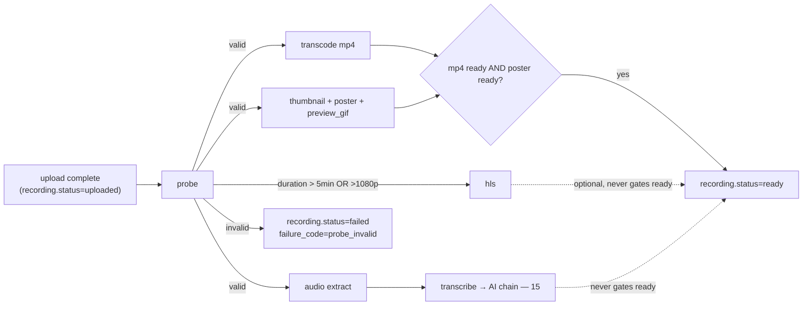

# 09 — Media Processing Pipeline

> FFprobe/FFmpeg workers that turn an uploaded source into playable, seekable, thumbnailed assets. Replaces Cloudinary transforms (`01` §3.6) and the fire-and-forget post-upload hook. Queue mechanics in `10`; job list there — this doc is the media logic.

---

## 1. Pipeline overview



`ready` requires exactly: a `ready` MP4 asset + a `ready` poster. HLS, preview gif, transcription, AI are enhancements that attach later (invariant #14 generalized: nothing optional gates availability).

## 2. Probe & verification (`probe` job)

The first worker to touch every source. **Client metadata is never trusted** — this job establishes the facts.

1. Download `sources/{recordingId}/…` to worker scratch (stream to disk, never RAM).
2. `ffprobe -v error -show_format -show_streams -of json`.
3. Validate:
   - container ∈ {webm, matroska, mp4, mov}; ≥1 video stream; video codec ∈ {vp8, vp9, av1, h264, hevc}; audio codec (if any) ∈ {opus, vorbis, aac, mp3, pcm_*};
   - `duration` finite and > 0.5s (WebM from MediaRecorder may report duration only in the container after fixWebmDuration, or not at all → fall back to `ffprobe -count_packets` / decode-to-end duration: `ffmpeg -i in -f null -` and read the last pts — slower path, only when format duration is missing);
   - dimensions sane (16 ≤ w,h ≤ 7680); size matches `upload_sessions` recorded size.
4. Write facts in one tx: `recordings.duration/width/height`, source `video_assets` row updated (`codec_*`, `container`, `duration`, `status='ready'`).
5. **Post-probe entitlement check** (the authoritative duration check): `canRecord(user, probedDuration)` with the +30s grace. Over limit → `recording.status='rejected_limit'`, `failure_code='recording_limit'`, notify client on next status poll; 7-day grace before source deletion (upgrade rescues it → `reprocess`).
6. Fan out the derived jobs (idempotent enqueue by dedupe key).

Failure (unreadable/corrupt): `status='failed'`, `failure_code='probe_invalid'`; the client's local chunks still exist (recovery UI keeps offering Download until the user discards — `05`).

## 3. Normalization & transcoding (`transcode` job)

Target: universal playback + instant seek. One MP4 rendition at source resolution capped at 1080p:

```
ffmpeg -y -i source.webm
  -c:v libx264 -preset veryfast -crf 23 -profile:v high -level 4.1
  -vf "scale='min(1920,iw)':'min(1080,ih)':force_original_aspect_ratio=decrease:force_divisible_by=2"
  -r 30 -pix_fmt yuv420p
  -c:a aac -b:a 128k -ar 48000 -ac 2
  -movflags +faststart
  derived/{recordingId}/{assetId}/video.mp4
```

- `+faststart` puts the moov atom first → the watch page seeks instantly (kills the Infinity-duration hack in `VideoPlayer.jsx:44-47`).
- Missing audio stream → produce video-only MP4 (do not synthesize silence).
- Variable-frame-rate WebM (MediaRecorder is VFR): `-r 30` + default `fps` filter behavior normalizes; A/V sync guard: `-async 1` not used (deprecated) — rely on `aresample=async=1:first_pts=0` if drift is detected in QA.
- Progress: parse `-progress pipe:1` → `processing_jobs.result.progress` (drives editor/watch progress UI).
- Output verified with a second ffprobe (duration within 2% of source; non-empty streams) before the asset row flips `ready` — a worker never publishes an unverified asset.

## 4. Thumbnails, posters, previews (`thumbnail` job)

- **Poster** (watch page, og:image): frame at `min(2s, 10% of duration)` — not frame 0 (black/blank first frames are common in screen recordings; Cloudinary `so_0` today produces those): `ffmpeg -ss <t> -i src -frames:v 1 -vf scale=1280:-2 poster.jpg` (q=2).
- **Thumbnail** (library grid): same frame at 640w → `thumb.jpg`.
- **Preview gif/webp** (hover animation, replaces `animatedThumbnail` behavior): 3 clips of 1s at 10/50/90% → `preview.webp` (animated webp, ~400KB budget), only for recordings ≥ 10s.
- Custom uploaded thumbnails (Pro) become a `thumbnail` asset with `variant='custom'`; presence overrides generated in reads.

## 5. HLS (`hls` job — recordings > 5 min or source > 1080p)

```
ffmpeg -i source -filter_complex [splits] \
  renditions: 1080p@5M (if source ≥1080), 720p@2.8M, 480p@1.2M
  -c:v h264 -c:a aac 128k -hls_time 4 -hls_playlist_type vod
  -hls_segment_type fmp4 -master_pl_name master.m3u8
```
Uploaded under `derived/{recordingId}/{assetId}/hls/`. The player prefers HLS when present (`11` §3). Asset `kind='hls'` with the master playlist as `storage_key`; segments are addressed relative to it (signing strategy for segments in `12` §5.2).

## 6. Audio extraction (`audio_extract` job)

`ffmpeg -i source -vn -c:a aac -b:a 96k audio/{recordingId}/audio.m4a` — the STT input (replaces the Cloudinary mp3-derivative URL). Also 16kHz mono WAV generated transiently inside the transcribe worker (as `transcription.js` does today).

## 7. Captions (`captions` job, post-transcription)

Generate WebVTT from `transcript_segments` → asset `kind='captions_vtt'`; the player attaches it as a real `<track>` (replacing the JS caption overlay when available). Re-generated whenever the transcript changes (dedupe key includes transcript updated_at).

## 8. Edit renders

Render jobs (trim/splice/silence-cut) are specified in `14` §5 — they run in the same worker fleet, consume **source or MP4 assets** (never mutate them), and publish `render_output` assets. Concat strategy: same-source segment cuts use stream-copy where cut points align with keyframes (`-ss/-to -c copy` per segment + concat demuxer) and re-encode otherwise; cross-video composition always re-encodes on a common canvas (letterbox pad — port the logic and MAX_EDGE lessons from `index.js:1204-1240`).

## 9. Worker architecture & resource rules

- Concurrency per worker process: transcode/hls/render = 1 (CPU-bound; scale by adding worker replicas); probe/thumbnail/audio = 4; transcribe = 1 with Groq rate-limit group (`10` §6).
- **CPU-first fleet**: every job in this document runs on CPU FFmpeg workers (`worker-1..n`, horizontally scaled) — no GPU is required for core product operations. GPU workers, when introduced for genuinely GPU-bound workloads (heavy compositing, AI video, high-res exports), consume a separate `render-gpu` queue under the identical job contract (`02` §2.2, `10` §2) — never a permanent monolithic render server.
- Scratch space: `/scratch/{jobId}/` — created at start, **always removed in `finally`**; startup sweep deletes orphans older than 24h. Disk guard: refuse jobs when free scratch < 2× source size (job → delayed retry). **Quota rule:** scratch files and any not-yet-promoted outputs are temporary processing storage — they never touch the user's quota ledger (`16` §4.1); only `ready` assets with `counts_toward_quota=true` (the recording's primary media) count, and platform-derived assets (MP4/HLS/posters/captions) are always `counts_toward_quota=false`.
- Timeouts: probe 5min; transcode/hls/render `max(10min, 3× duration)`; thumbnail 3min. On timeout the process tree is killed (`SIGKILL` after `SIGTERM` grace) — no zombie ffmpeg.
- Idempotency: outputs are written to asset-id-scoped keys; re-running a job overwrites its own outputs and re-upserts the same asset row (dedupe key prevents concurrent doubles; a retried job after partial upload simply re-uploads).
- Cost/priority: `priorityProcessingEnabled` (Pro) → higher BullMQ priority, not separate infrastructure.

## 10. Storage lifecycle & cleanup (`cleanup` jobs)

- Soft-deleted recordings: hard purge after 30 days — delete R2 objects listed from `video_assets`, then rows.
- `rejected_limit` sources: purge after 7-day grace.
- Orphan scan (weekly): list R2 prefixes vs `video_assets`; objects with no row and age > 7d → delete (report first run, delete after manual confirmation during migration).
- Scratch + incomplete multiparts as in `06` §11.

## 11. What Cloudinary did that we must not forget to replace

| Cloudinary feature in current code | Replacement |
|---|---|
| `so_0` jpg thumbnail URL rewriting (`index.js:498`) | poster/thumb assets |
| `fl_attachment` download URLs (`Watch.jsx:652-654`) | signed GET with `response-content-disposition=attachment` |
| mp3 derivative for STT (`index.js:347`) | `audio_extract` job |
| splice transforms for trim/compose/stitch | render jobs (`14`) |
| Gmail play-button composite image (`gmail.js:15-20`) | pre-rendered `poster_play.jpg` variant produced by the thumbnail job (poster + ▶ overlay via ffmpeg drawtext/overlay), so email HTML keeps working |
| eventual-consistency workarounds | gone — Postgres reads |
