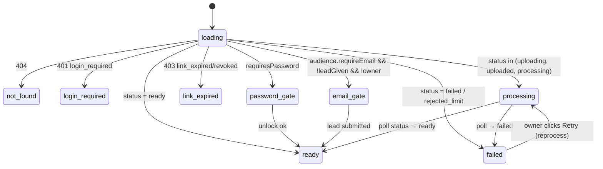

# 11 — Watch Page & Player

> Target architecture for `/watch/:id` and the player. Keeps the current feature set (`Watch.jsx`, `VideoPlayer.jsx` — audited in `01` §6) but replaces guess-based readiness with explicit states and splits the 1,353-line god component.

---

## 1. Page states (driven by API, never by timeouts)



- `processing` shows the real pipeline: "Uploading… / Processing your video… (transcoding 64%)" from `GET /recordings/:id/status` polled at 2s→5s backoff. **This replaces**: the 6×1.5s 404 retry loop (`Watch.jsx:494-509`) and the blind 12s `videoReady` timeout (`Watch.jsx:528-541`) — those exist only because Cloudinary's index lags; with Postgres the id resolves instantly and readiness is a fact.
- `failed` (owner view): failure explanation from `failure_code` (`18` taxonomy) + Retry button (`POST /recordings/:id/reprocess`). Viewer view: "This video isn't available yet."
- Viewers on `processing`: friendly waiting state with poster if available; auto-transitions when ready.

## 2. Media resolution

`GET /watch/:id/media` → `{status, mp4Url, hlsUrl, posterUrl, captionsUrl, expiresAt, ttlSeconds, download}` (signed URLs, `12` §5; null for what does not exist yet). *(T-801: delivered; gated recordings receive an `hlsUrl` that already carries its playlist token, so the player passes it to hls.js unchanged; the unlock/lead **access token** from `/unlock` or `/lead` must be sent as `X-Watch-Access` on every later call and kept in `sessionStorage` per recording.)* The player:

- Prefers **HLS** when `hlsUrl` present (hls.js; Safari native). Falls back to MP4 on HLS fatal errors (see §5).
- MP4 has `+faststart` → native seeking works; **delete** the Infinity-duration workaround (`VideoPlayer.jsx:44-47`) once all legacy WebM assets are re-transcoded (keep it guarded behind `src.endsWith('.webm')` during migration).
- URL refresh: re-request `/media` when `expiresAt - now < 60s` (timer) and on player `error` with a 403-shaped failure; seamless `src` swap preserving `currentTime`.
- Download button (if `audience.download`): `/media?disposition=attachment` variant → signed URL with `response-content-disposition` (replaces Cloudinary `fl_attachment`, `Watch.jsx:652-654`).

## 3. Player component (kept + hardened)

Keep `VideoPlayer.jsx`'s custom controls, and:

| Feature | Spec |
|---|---|
| Virtual trim/segments | unchanged skip logic (segments keep-ranges; trimStart/trimEnd) — runs on top of MP4/HLS identically |
| Timeline markers | comments/reactions at `t`; click → seek (unchanged) |
| Captions | prefer native `<track src=captionsUrl kind=captions>`; fall back to the JS overlay for segment data without a VTT asset |
| Chapters | chapter list + progress-bar tick marks (data: `recordings.chapters`) |
| Speed | 0.5–2×, `recommendedSpeed` applied on load (unchanged) |
| Keyboard | Space/K play-pause, ←/→ ±5s, J/L ±10s, ↑/↓ volume, M mute, F fullscreen, C captions, 0–9 percent-seek, Shift+</> speed. Bound on the player container, ignored when typing in inputs |
| Buffering | `waiting`/`stalled` events → spinner ≥ 500ms debounce; `progress` drives a buffered-ranges bar |
| Errors | `error` event → map `MediaError.code` (see §5) |
| Watermark | `branding` flag as today |
| Responsive | player column collapses above sidebar < 1024px; controls touch-targets ≥ 40px; fullscreen uses native API |

## 4. Watch page decomposition

```
WatchPage (data orchestration: watch payload, status polling, media urls)
├── ProcessingPanel | FailedPanel | Gates (login/password/email/link-expired)
├── PlayerSection (VideoPlayer + reactions bar + CTA)
└── Sidebar
    ├── ActivityTab (comments list/form, reactions feed)   — viewers' default
    ├── TranscriptTab (search, follow-along highlight, translate dropdown)
    ├── EditTab (owner: rename, AI title/summary/chapters, remove silences, combine, open editor)
    └── SettingsTab (owner: privacy, audience toggles, speed, thumbnail, archive, folder, share links)
```
Each tab loads its own data lazily (transcript already lazy today — keep). Owner detection: `GET /recordings/:id` 200 (as today) but returned as an explicit `isOwner` field on the watch payload when authed, saving a request.

## 5. Playback error handling

| Condition | Detection | Response |
|---|---|---|
| Expired signed URL | 403 on segment/mp4 fetch → hls.js network fatal / MediaError network | refresh `/media`, resume at `currentTime`; 1 automatic retry, then error UI |
| Network loss | repeated network errors | "Connection lost — retrying…" banner; auto-retry with backoff; resume position |
| Decode error | MediaError.MEDIA_ERR_DECODE / hls.js media fatal | HLS→MP4 fallback once; else error UI + report to error tracking with recordingId/assetId |
| 404 asset (deleted mid-watch) | fetch 404 | "This video was removed" state |
| Autoplay blocked | `play()` rejection | show big-play button (muted-autoplay attempt first) |

## 6. Engagement & analytics behavior (server contracts in `08` §7,9)

- View counted once per viewer-key via `view_sessions` upsert; owner never counted (`is_owner`) — semantics preserved from `index.js:691-714` but by user id, not display name.
- Progress: `timeupdate` tracks `maxFrac`; report via `sendBeacon` on `visibilitychange:hidden` + `pagehide` + unmount (keep `Watch.jsx:550-565` logic), now upserting `view_sessions.max_progress` (idempotent, monotonic max on server).
- Reactions/comments optimistic-update with rollback on error; forms disabled when `audience.*` is false.

## 7. Embed (`/embed/:id`)

Same media/state machinery, chrome-less player, no sidebar; `postMessage` resize events optional. Embed respects privacy exactly like watch (an unlisted/public video embeds; login/password-protected shows the gate message with a link out).

## 8. SEO/meta

Watch pages render `og:title`, `og:video`, `og:image` (poster URL — public/unlisted only). Private videos emit no media meta tags.
