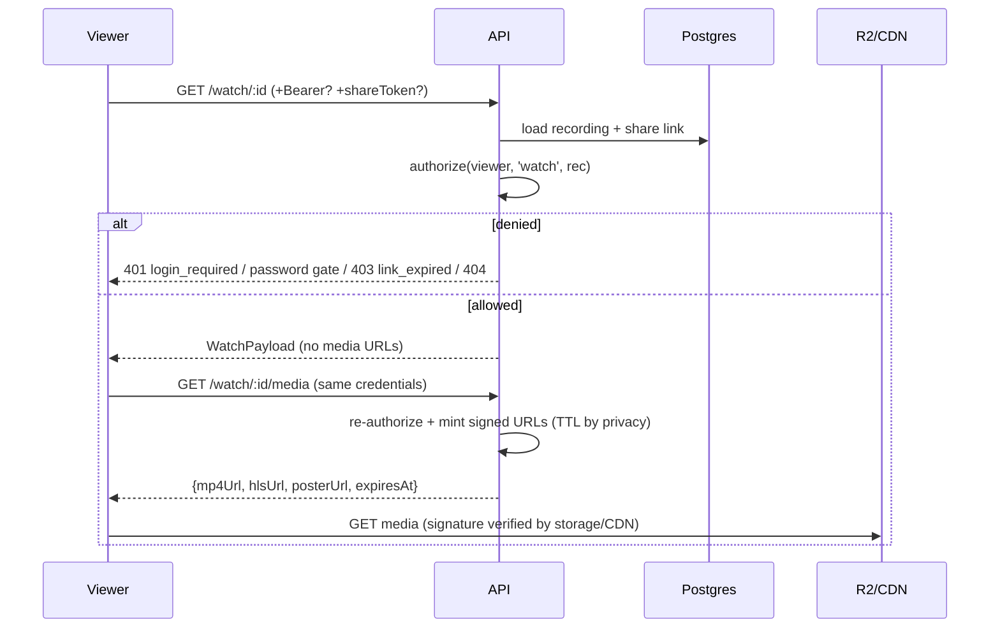

# 12 — Sharing, Privacy & Authorization

> Access control for recordings and media. Fixes the current model's core hole: privacy is checked on the metadata endpoint while **the media URL itself is public Cloudinary** (`01` §4) — anyone with the file URL bypasses everything.

---

## 1. Privacy levels (recordings.privacy)

| Level | Who can watch | Notes |
|---|---|---|
| `public` | anyone; indexable; og-tags emitted | |
| `unlisted` | anyone **with the link**; `noindex` | **new default** for fresh recordings (today everything defaults `public` — `meta.js:27`; existing rows migrate keeping `public`) |
| `workspace` | members of the recording's workspace | activates with workspaces UI |
| `login` | any signed-in VeoRec user | kept from current product |
| `password` | anyone with link + password (bcrypt, per-recording) | Pro-gated as today |

Orthogonal flags: `archived` (hidden from library, still watchable by link), `audience.requireEmail` (lead gate, Pro), share links (§3).

## 2. Roles & permission matrix

Principals: `owner` (recording.user_id), `admin` (users.is_admin), `viewer` (anyone satisfying privacy), workspace roles (owner/admin/member/viewer — future UI, enforced now if workspace_id set).

| Action | owner | ws admin | ws member | viewer | anonymous |
|---|---|---|---|---|---|
| watch (per privacy) | ✓ | ✓ | ✓ | ✓ | per privacy |
| comment/react | ✓ | ✓ | ✓ | if audience allows | if audience allows |
| download | ✓ | ✓ | if audience allows | if audience allows | if audience allows |
| edit meta/trim/delete/share-links | ✓ | ✓ | – | – | – |
| view analytics/leads | ✓ (Pro) | ✓ (Pro) | – | – | – |
| transcribe/AI actions | ✓ (plan-gated) | ✓ | – | – | – |
| admin endpoints | – | – | – | – | – (admins only, audited) |

Enforcement is centralized: `authorize(actor, action, resource)` in one module (`apps/api/src/authz.ts`); route handlers call it — no inline ownership checks scattered per route (today `userOwns()` is a Cloudinary query called ad hoc in ~20 routes). *(T-801: `api/src/authz.js` — `resolveWatchAccess({recording, viewer, shareLink, shareTokenPresented, access, workspaceRole})` is the pure, unit-tested matrix for the `watch` action (owner → admin → presented share link → privacy level); `workspace` is enforced now through `workspace_members` (a signed-in non-member gets 404). The owner-side actions still use the scoped repositories (T-302); the full `authorize(actor, action, resource)` facade grows around this resolver as Phases 9–10 add actions.)*

## 3. Share links (`share_links` table)

- Default sharing stays the recording URL `/watch/:recId` gated by `privacy`.
- Managed links add: per-link **password**, **expiry** (`expires_at`), **max views** (`max_views` vs `view_count`), **revocation** (`revoked_at`), labels ("sent to client X" — free-text).
- URL: `/watch/:recId?s=<token>` (token: 128-bit random, base64url; **hash stored**, plaintext shown once at creation).
- Resolution order on watch: valid share token satisfies privacy (even for `login`/`password`-level recordings if the link itself has no password); expired/revoked/over-max → `403 link_expired` regardless of recording privacy (a dead link never falls back to a more permissive default). *(T-901 ✅: the owner side — `api/src/sharing.router.js` creates and revokes links (`08` §8) and the watch Settings tab of a v1 recording manages them (`client/src/pages/watch/ShareLinks.jsx`: label, expiry, view cap, Pro password, revoke; the URL is shown once and copied from the panel). Resolution itself has been in `authz.resolveWatchAccess` since T-801, so the gate is exercised end-to-end here: a fresh link opens a login-only recording anonymously, the view count moves, a link password unlocks, the cap and revocation make the link `link_expired`.)*

## 4. Authorization flow

## 5. Signed playback URLs

### 5.1 Policy
- **Private-ish** (unlisted/workspace/login/password/share-link): R2 presigned GET, TTL **10 min**; player auto-refreshes (`11` §2). URLs bind to the exact object key; no wildcard.
- **Public**: presigned GET TTL **24h** + `Cache-Control: public, max-age=3600` so the CDN caches; acceptable because public means public. (Later optimization: CDN token auth at the edge; the API contract — `/media` returns URLs with `expiresAt` — doesn't change.)
- Poster/thumbnail for library/notifications: same mechanism, TTL 24h, minted in list responses.
- Never expose raw bucket URLs; bucket is private (invariant: leaked URL ≤ TTL exposure, vs. today's forever-public Cloudinary URL).

### 5.2 HLS specifics
Master playlist is fetched via presigned URL; variant playlists/segments: the API rewrites playlists at request time (`/watch/:id/hls/*` proxy for playlists **only** — tiny text files, not media bytes) embedding presigned segment URLs; segments go direct to R2. *(T-705: every playlist references siblings by bare file name — `720p_index.m3u8`, `720p_init.mp4`, `720p_seg_00001.m4s` — all under the asset's `hls/` prefix, so the rewrite is a one-level name → presigned-URL substitution; the worker stores them with their content types. The proxy/rewrite itself is T-801 — ✅ delivered as `GET /api/v1/watch/:id/hls/:file`: the master's variant lines become absolute proxy URLs (the playlist token propagated), variant playlists' `#EXT-X-MAP` init and segment lines become presigned storage URLs with the media TTL; playlists only, `no-store`; a name outside the key contract is refused; gated recordings authorise with the `hls` grant `/media` mints or, without one, with the full resolver.)* Alternative (preferred when adopted): CDN edge token covering the `derived/{recordingId}/…/hls/` prefix. Decision recorded per deployment in ops docs; both satisfy "API serves no video bytes".

### 5.3 Download
`GET /watch/:id/media?disposition=attachment` → presigned GET with `response-content-disposition: attachment; filename="<safe-title>.mp4"`; allowed only when `audience.download` or owner.

## 6. Threat considerations

| Threat | Mitigation |
|---|---|
| Media URL sharing/leak | TTL-bound signatures (10 min private); revocation = stop minting (existing URLs die ≤ TTL) |
| Recording id enumeration | uuidv7 ids are unguessable; 404-for-unauthorized hides existence |
| Share-token brute force | 128-bit tokens; hashed at rest; rate-limit `/watch/*` per IP |
| Password gate brute force | bcrypt + 10/15min·IP limiter on `/unlock` (today unlimited — `index.js:673-686`) |
| Privacy downgrade via cached CDN | private assets never get long-cache signatures; CDN caches only public paths |
| Owner-spoofed engagement | actor identity from session, not client `name` field; anonymous names are display-only and flagged `unverified` in owner analytics |
| Lead-gate bypass | gate enforced server-side in `/media` (email session token required when `requireEmail`), not just client-side (today it is client-only — `Watch.jsx:544-546` sessionStorage) *(T-801: `403 email_required` until `POST /watch/:id/lead` returns a token with the `lead` grant; the playlist proxy is gated the same way)* |
| IDOR on owner endpoints | central `authorize()`; tests enumerate every route × non-owner (matrix in `20` §6) |
| Deleted-video access | soft delete blocks watch/media immediately (checked before minting) |
