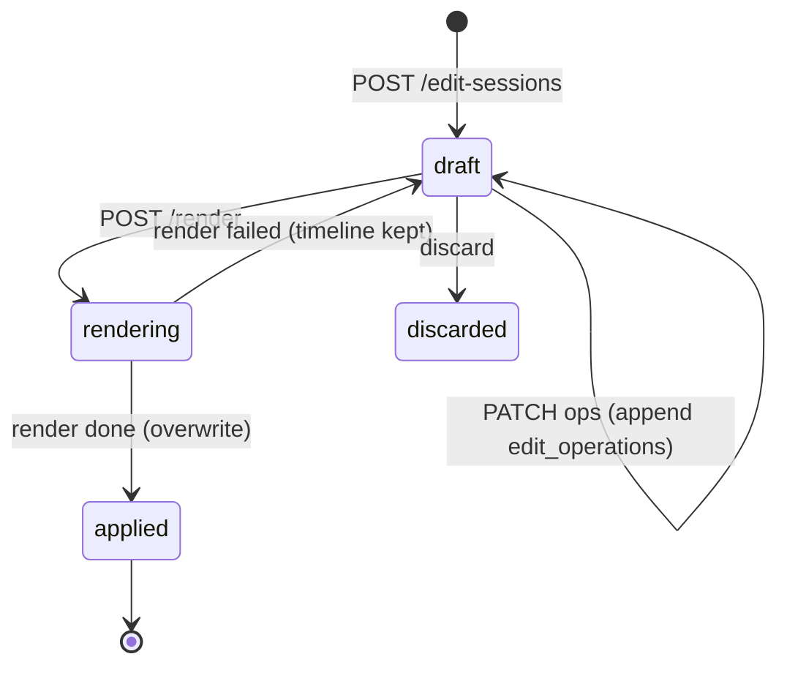

# 14 — Video Editor

> Editing system: trim, split, delete-range, reorder, multi-clip stitching, silence removal. Keeps the existing timeline UX (`Editor.jsx`, audited `01` §6) and replaces the synchronous Cloudinary splice backend with edit sessions + render jobs. Source immutability is absolute (invariant #13).

---

## 1. Concepts

- **Virtual edit** — `trim_start/trim_end/segments` on the recording; the player skips gaps client-side. Instant, free, reversible. Unchanged from today.
- **Edit session** (`edit_sessions`) — a draft timeline: ordered clips `[{recordingId, start, end}]`, possibly spanning multiple owned recordings. This is the **edit decision list (EDL)**: edits are structured operations over an immutable source, previewed client-side instantly (virtual skip in the player/editor) — the expensive server render happens **only** on explicit export/save, never on every timeline change.
- **Render job** — bakes a timeline into a real file via FFmpeg (worker), producing a `render_output` asset. `mode: 'overwrite'` (result becomes the recording's active video) or `'copy'` (result becomes a new recording).
- **Immutability**: the `source` asset is never modified or deleted by editing. "Overwrite" re-points which derived asset the player serves — the original bytes remain until the recording itself is deleted. This converts today's scary rename-over-original (`index.js:1150-1167`) into a reversible pointer swap.

## 2. Editor operations

| Op | Timeline effect | Persisted as |
|---|---|---|
| trim | clip.in/out change | op `{type:'trim', clipIdx, in, out}` |
| split at playhead | clip → two clips at offset | `{type:'split', clipIdx, at}` |
| delete range / delete clip | remove clip | `{type:'delete', clipIdx}` |
| reorder (drag) | move clip | `{type:'reorder', from, to}` |
| add clip (gallery/upload) | append `{recordingId,0,dur}` | `{type:'add_clip', recordingId}` — uploads go through the standard upload protocol (`06` §12), then processing, then become addable |
| remove silences | replace base clips with keep-ranges | `{type:'apply_ranges', ranges}` (ranges from the silence job, §7) |

Constraints: ≤ 40 clips (as `index.js:1196`); clip bounds validated against the **probed** duration of each referenced recording; every referenced recording must be owned (`authorize` per clip) and `status='ready'`.

## 3. Edit session lifecycle & undo/redo

- Undo/redo is client-side over the op list; each PATCH stores the op (`edit_operations`) so a session reopens exactly where it was left and the history is auditable. Server keeps the **current** timeline materialized on the session row (ops are the log, timeline is the state — no replay needed to read).
- Only one `rendering` session per recording at a time (409 otherwise).
- Multi-clip timelines (any clip ≠ base recording) require Pro `clipStitchEnabled` — checked at render, matching today's gate.
- Output-duration entitlement: `canRecord(user, timelineDuration)` at render enqueue (as today at `index.js:1104-1105`).

## 4. Saving semantics

- **Pure virtual save** (single-recording timeline, no renders wanted): PATCH `/recordings/:id/meta {segments|trimStart|trimEnd}` — unchanged instant path. Full-length timeline clears virtual edits (as `Editor.jsx:226-231`).
- **Render — copy**: new recording row (`source_kind='render'`, status `processing`), render job output registered as its primary asset (`counts_toward_quota=true`). **Quota**: a copy render takes the same atomic reservation as an upload at render enqueue (`16` §4.3, via `storage_reservations.render_job_id`) — 403 `storage_limit`/`video_limit` before any rendering happens; reconciled to the real output size in the completion tx. Title: `"<base title> (edited)"`.
- **Render — overwrite**: render output becomes the recording's active `mp4` asset (old derived assets kept 7 days then cleaned); virtual edits cleared; `duration/size_bytes` updated from the render's probe; usage delta = new − old active. Transcript/chapters are marked stale (`transcripts.status` unchanged but a `stale=true` flag surfaces "re-transcribe?" in the UI — cheaper and more honest than silently keeping timestamps that no longer align).

## 5. Render job (FFmpeg — worker; job contract in `10` §3)

1. Resolve each clip to its recording's best asset (prefer normalized MP4; source if MP4 missing).
2. Plan:
   - **Single-source, cuts only**: try keyframe-aligned stream copy (`-ss/-to -c copy` per segment → concat demuxer). If cut points aren't within 250ms of keyframes, re-encode that segment only (mixed concat), else full re-encode fallback. This makes the common trim fast and lossless.
   - **Multi-source**: full re-encode on a common canvas — target = base recording's dimensions, capped 1920 long edge, even-snapped; every input letterbox-padded (`scale=…:force_original_aspect_ratio=decrease,pad=…`) — porting the hard-won canvas rules from `index.js:1204-1240`. Audio: resample all to 48kHz stereo AAC; missing-audio clips get silent audio (`anullsrc`) so concat A/V stays aligned.
3. `-progress` → job progress (editor progress bar becomes real; today it is indeterminate).
4. Verify output (ffprobe: duration ≈ Σ clip lengths ±2%), upload to `renders/…`, register asset, apply mode semantics (§4) in one tx.

Failure: `render_jobs.failed` + error surfaced in the editor; timeline intact; sources untouched. Retryable.

## 6. Timeline UI notes (kept from `Editor.jsx`)

Multi-clip horizontal timeline; drag-reorder; split/delete; add via gallery picker or upload; per-clip preview by swapping the single `<video>` src with the stale-load guard (`Editor.jsx:87-98` — keep that guard). New: op-based undo/redo buttons; render progress %; "virtual vs rendered" indicator so users understand instant-save vs bake.

## 7. Silence removal

Becomes a job (`08` §11): prefer **audio-based** silence detection in the worker (`ffmpeg silencedetect` on the extracted audio — reusing `transcription.js:125-139` parsing) with transcript-gap fallback, padding/min-gap parameters as today (`index.js:1280-1295`: pad 0.2s, minGap 0.8s). Result = keep-ranges applied as a **virtual** edit (instant, reversible), with "bake permanently" going through a render. Matches current UX promise (`Watch.jsx:289-300`).

## 8. Render failure taxonomy (→ `18`)

`render_source_missing`, `render_ffmpeg_failed` (stderr tail captured), `render_verify_failed`, `render_timeout`, `render_disk_full` (worker refuses/delays), `render_forbidden_clip` (ownership/status). All leave the draft session intact.

## 9. As implemented (T-1201 – T-1204)

- **Repositories** (`db/src/repositories/editing.repo.js`): `editSessions` (create with the whole-video default, timeline update only while `draft`, op log, status transitions, one `rendering` session per recording) and `renderJobs` (joined with the session and the processing job's progress). `assets.repointSystem` / `assets.deleteSystem` (mutable rows only) serve the overwrite render; `uploads.findReservationByRenderJob` the copy's quota reservation. Migration `0004_editing_jobs` adds `silence_detect` to the `processing_jobs.queue` CHECK.
- **API** — `08` §11 (`api/src/editing.router.js`). Saving semantics (§4) hold exactly: the editor's "Save instantly" is `PATCH /recordings/:id/meta {segments}`; a full-length timeline clears the virtual edit; overwrite/copy are renders. Multi-clip renders are Pro at render time (`clipStitchEnabled`, paywall recorded as `clipstitch_attempted`); the output duration is checked by the plan at enqueue; a copy render takes the upload's atomic reservation (`storage_reservations.render_job_id`) and pre-creates the output recording in the same transaction.
- **Worker** — `10` §3 `render` and `silence_detect`; `worker/src/media/render.js` (`planCanvas`, `planStrategy`, `buildEncodeArgs`, the verified stream-copy → encode fallback, `keepRangesFromSilences`, `keepRangesFromTranscript`). The §5 plan's "re-encode only the misaligned segment" refinement is NOT implemented: a copy that misses tolerance re-encodes the whole (short) timeline, which is simpler and always correct.
- **Overwrite** re-points the `mp4/main` asset (a pointer swap, §1) and drops stale derived rows; transcript staleness (§4) is not flagged yet — the transcript keeps its timestamps (a later pass can add `stale`).
- **Client** — `client/src/lib/editorApi.mjs` is the ONE module that knows which editing API is in use (`editor.path` on the authed client-config, `V1_EDITOR`): detail (the ACTIVE media via `mediaUrl`), gallery, virtual save, edit session → render → polled progress, silence removal (202 + poll), stitch; legacy = the untouched Cloudinary routes. `Editor.jsx`: the same timeline UX with undo/redo (`commit()` history), the stale-load guard kept, a "Save instantly / Overwrite / Save as copy" chooser (the instant option only for single-source timelines), the render overlay driven by the job's real progress with "continue in background", paywalls as prompts, `alert()` gone; a "Remove silences" action that applies the keep-ranges to the timeline (undoable). `Watch.jsx`: silence removal and Combine work for v1 recordings through the same layer.
- **Tests:** `tests/editing-api.test.js` (44, real PostgreSQL), `tests/render.test.js` (59: pure planning, real ffmpeg copy/encode/abort/verify, the processors on PostgreSQL + MinIO + Redis incl. the source untouched byte-for-byte, the reservation reconciled and released, the probe fan-out to ready, a render through the real worker app, silence detection on a fixture with a muted gap and the transcript fallback), `tests/editor-page.test.js` (56: the gate, the data layer on both paths, source wiring, a spawned server).
