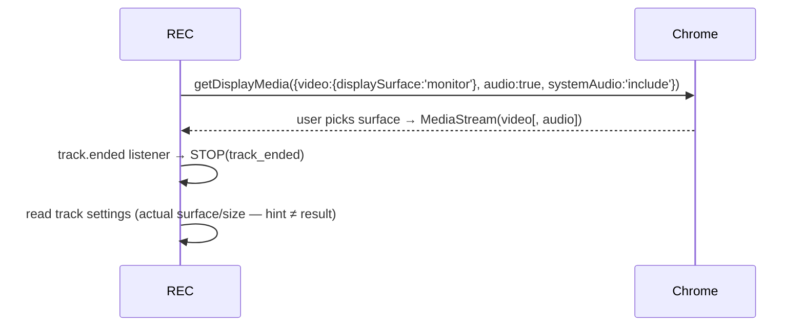
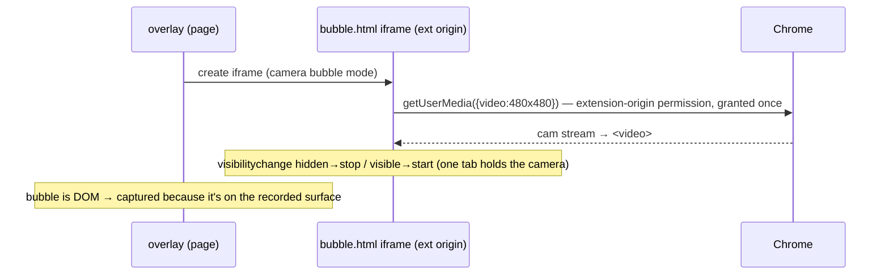
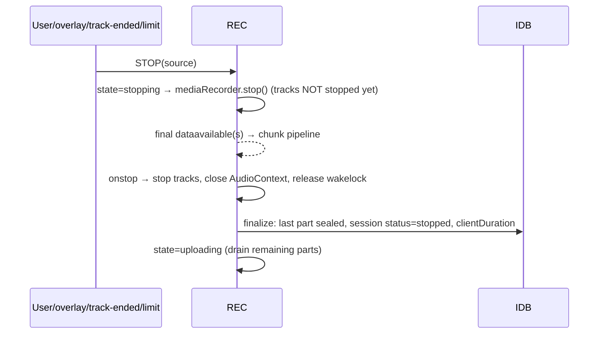
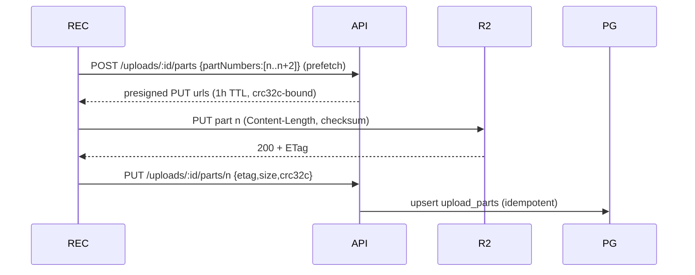
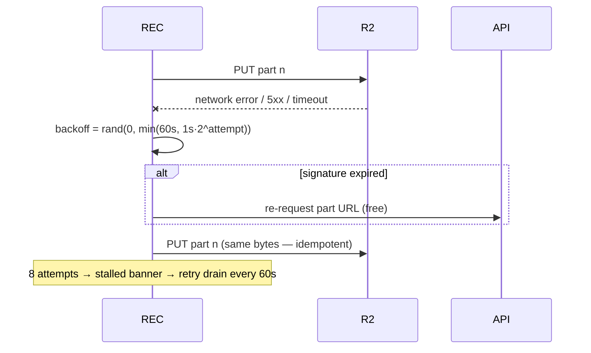
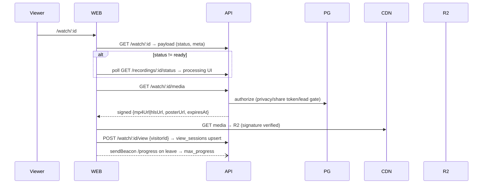
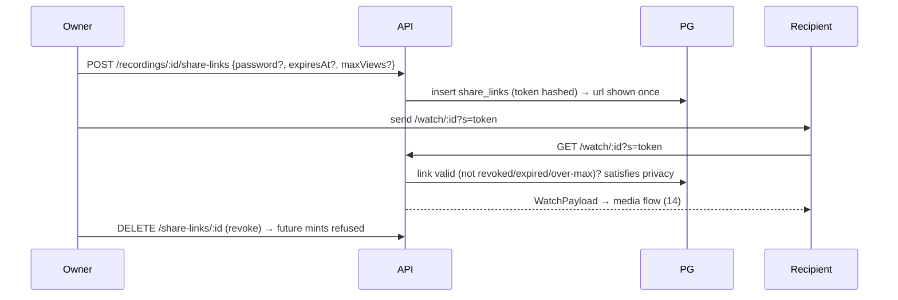
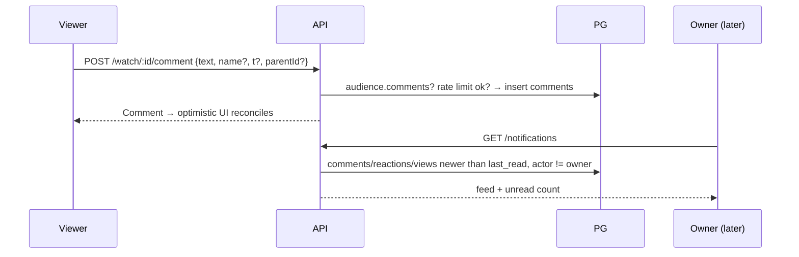

# 22 — Data Flows (Sequence Diagrams)

> Canonical sequence diagrams for the target architecture. Participants: `POP` popup, `REC` recorder window (state machine), `OV` overlay, `IDB` IndexedDB, `API`, `PG` Postgres, `R2` object storage, `Q` queue, `W` worker, `WEB` web app, `CDN`.

## 1. Starting a recording

```mermaid
sequenceDiagram
    participant U as User
    participant POP
    participant SW as service worker
    participant REC
    participant IDB
    participant API
    U->>POP: choose options, click Start
    POP->>POP: tab mode? getMediaStreamId (gesture)
    POP->>SW: recOptions → storage; inject overlay
    POP->>REC: open recorder window
    REC->>API: GET /me/entitlements (limit; cached fallback)
    REC->>REC: START(config) → acquiring
    REC->>REC: acquire display/tab/cam/mic + mix audio
    REC->>IDB: create session row (status recording)
    REC->>API: POST /recordings → recordingId
    REC->>API: POST /uploads → uploadSessionId, partSize
    REC->>REC: countdown → MediaRecorder.start(1000)
```

## 2. Screen capture



## 3. Camera capture



## 4. Audio mixing

```mermaid
sequenceDiagram
    participant REC
    participant AC as AudioContext
    REC->>AC: create; sources: displayAudio?, mic?
    REC->>AC: sources → MediaStreamDestination (mixed track)
    alt tab mode
        REC->>AC: tabSource → destination (speakers) — tabCapture mutes tab locally
    end
    REC->>AC: await resume(); onstatechange → re-resume
    REC->>REC: finalStream = [videoTrack, mixedAudioTrack]
```

## 5. Pausing

```mermaid
sequenceDiagram
    participant OV
    participant REC
    OV->>REC: SR_PAUSE
    REC->>REC: PAUSE → mediaRecorder.pause(); pauseStartedAt=now
    REC->>REC: persist recSession {paused:true} → storage + IDB heartbeat
    OV->>OV: reads projection → timer frozen, icon=play
```

## 6. Resuming

```mermaid
sequenceDiagram
    participant OV
    participant REC
    OV->>REC: SR_PAUSE (toggle)
    REC->>REC: RESUME → mediaRecorder.resume(); pausedTotal += now-pauseStartedAt
    REC->>REC: persist projection {paused:false}
```

## 7. Stopping



## 8. Local persistence (during recording)

```mermaid
sequenceDiagram
    participant MR as MediaRecorder
    participant REC
    participant IDB
    participant R2
    loop every 1s timeslice
        MR->>REC: dataavailable(blob)
        REC->>IDB: put chunks{sessionId, seq, bytes}  (always first)
        REC->>REC: buffer += blob; if ≥ partSize → seal part
        REC->>IDB: put parts{n, pending}
        REC->>R2: PUT part (2 concurrent max while recording)
        REC->>IDB: parts{n, uploaded, etag}
    end
```

## 9. Upload initialization

```mermaid
sequenceDiagram
    participant REC
    participant API
    participant PG
    participant R2
    REC->>API: POST /uploads {recordingId, mimeType} + Idempotency-Key
    API->>PG: advisory entitlement checks; existing active session? → return it
    API->>R2: CreateMultipartUpload(sources/{recId}/source.webm)
    API->>PG: insert upload_sessions(active)
    API-->>REC: {uploadSessionId, partSize:8MiB, expiresAt:+48h}
```

## 10. Multipart upload (part flow)



## 11. Upload retry



## 12. Upload completion

```mermaid
sequenceDiagram
    participant REC
    participant API
    participant R2
    participant PG
    participant Q
    REC->>API: POST /uploads/:id/complete {parts manifest, clientDuration}
    API->>PG: BEGIN; session FOR UPDATE
    alt already completed
        API-->>REC: 200 canonical result (idempotent replay)
    else
        API->>R2: CompleteMultipartUpload; HEAD size check
        API->>PG: session=completed; recording=uploaded; asset(source);\nentitlement check (count/storage); usage tx; outbox probe job; COMMIT
        API-->>REC: 200 {recordingId, watchUrl}
    end
    Q-->>Q: relay enqueues probe
    REC->>REC: delete IDB session (only after 200)
```

## 13. Processing

```mermaid
sequenceDiagram
    participant Q
    participant W
    participant R2
    participant PG
    Q->>W: probe{recordingId}
    W->>R2: download source → ffprobe verify
    W->>PG: duration/dims; source asset ready; post-probe limit check
    W->>Q: fan-out transcode, thumbnail, (hls), audio_extract
    par
        Q->>W: transcode → mp4 (+faststart) → R2 → asset ready
    and
        Q->>W: thumbnail → poster/thumb/preview → R2 → assets
    and
        Q->>W: audio_extract → stt.transcribe → ai.* chain
    end
    W->>PG: maybe_mark_ready (mp4+poster) → recordings.status=ready
```

## 14. Playback



## 15. Sharing



## 16. Comments



## 17. Transcription

```mermaid
sequenceDiagram
    participant O as Owner (or auto-chain)
    participant API
    participant Q
    participant W
    participant GROQ as Groq
    participant PG
    O->>API: POST /recordings/:id/transcribe → 202 {jobId}
    API->>PG: transcripts.status=queued (outbox job)
    Q->>W: stt.transcribe
    W->>W: audio → wav → VAD chunks
    loop per chunk (paced ≤20 RPM)
        W->>GROQ: whisper verbose_json (auto-detect)
    end
    W->>GROQ: pass 2 — force dominant language on spurious chunks
    W->>PG: transcripts=done + segments; chain captions/ai jobs
    O->>API: poll transcript → done
```

## 18. Editing (render)

```mermaid
sequenceDiagram
    participant O as Owner (Editor UI)
    participant API
    participant PG
    participant Q
    participant W
    participant R2
    O->>API: POST /recordings/:id/edit-sessions {timeline}
    O->>API: PATCH ops (split/reorder/…) → edit_operations
    O->>API: POST /edit-sessions/:id/render {mode}
    API->>PG: render_jobs + outbox; 202 {renderJobId}
    Q->>W: render.render_edit
    W->>R2: fetch clip assets → ffmpeg cut/concat (sources untouched)
    W->>R2: upload render output; verify probe
    W->>PG: asset render_output; overwrite→repoint active mp4 / copy→new recording; usage tx
    O->>API: poll render job → done → navigate
```

## 19. Deletion

```mermaid
sequenceDiagram
    participant O as Owner
    participant API
    participant PG
    participant Q
    participant W
    participant R2
    O->>API: DELETE /recordings/:id
    API->>PG: tx: deleted_at=now; usage −(size,count,duration); audit log
    API-->>O: {ok} (idempotent)
    Note over PG: watch/media immediately 404
    Q->>W: maintenance.cleanup (daily)
    W->>PG: recordings deleted >30d → collect asset keys
    W->>R2: delete objects
    W->>PG: hard-delete rows (cascade)
```
