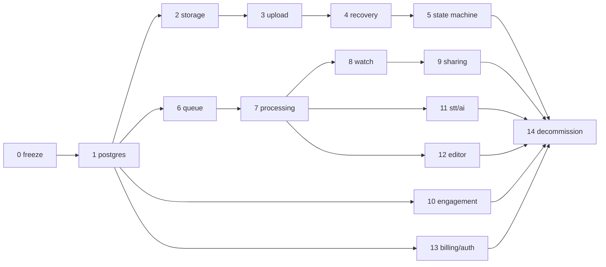

# 23 — Migration Plan

> Strangler-fig migration from the current system (`01`) to the target (`02`). **No uncontrolled rewrite**: every phase ships to production independently, is reversible, and leaves the product working. The repo remains one codebase; new code lives beside old until each phase's cutover.

Constraints that shape sequencing: the extension fleet updates slowly (Chrome review + user update lag) → API changes are additive with legacy aliases; production data lives in Cloudinary context + JSON files → import must be repeatable; one developer → phases are small.

---

## Phase 0 — Freeze & baseline
- **Goal:** stop architectural drift; capture reality.
- **Scope:** feature freeze on editor/AI/billing/admin (bugfixes only); tag `legacy-final`; repo hygiene (T-001 verified: pem/crx never committed; stale zips untracked); stand up error tracking + basic request logging on the current server (thin pino wrapper — safe, additive); record baseline KPIs (upload success rate, watch failures) for comparison.
- **Risks:** none material. **Acceptance:** docs merged; baseline dashboard exists; freeze communicated in `26`.

## Phase 1 — PostgreSQL beside the legacy stores
- **Goal:** Postgres running with the full `07` schema; data imported; **dual-write** started.
- **Files:** new `db/` (drizzle schema+migrations), `apps/api/src/repos/*`; `server/index.js` gains repo calls next to existing JSON/Cloudinary writes (users, meta-equivalents, subscriptions, usage, folders, contacts).
- **Migration mechanics:** idempotent importer (`07` §13) run repeatedly; nightly reconciliation report (row counts, spot diffs) until cutover.
- **Reads stay legacy** in this phase (except new admin read endpoints used to verify parity).
- **Risks:** dual-write divergence → mitigated by importer re-runs + report. **Acceptance:** importer idempotent (test), 0 diffs across 7 days of dual-write on users/subscriptions/meta.

## Phase 2 — Storage abstraction + R2
- **Goal:** `StorageProvider` interface; R2 buckets provisioned; MinIO in dev; **new uploads mirrored to R2** while Cloudinary continues serving.
- **Files:** `apps/api/src/storage/*`; upload handler additionally streams the temp file to `sources/{id}` in R2 (server-side copy — temporary, removed in Phase 3).
- **Backfill:** background copier moves existing Cloudinary originals → R2 `sources/` (throttled; tracked in a `migration_assets` checklist table).
- **Acceptance:** every new recording has an R2 source object with matching size; backfill ≥ 95% then 100%.

## Phase 3 — New upload system (the big reliability win)
- **Goal:** direct-to-R2 multipart uploads per `06`; recordings/upload_sessions rows become the write path of record.
- **Files:** API upload routes (`08` §5); extension: `uploader.ts` in the recorder (can ship **before** the state machine — it hooks `dataavailable` alongside the existing chunks array); web editor "upload clip" switched.
- **Compat:** legacy `POST /api/upload` remains for old extension versions, now writing recordings rows + R2 via the server path; removed in Phase 14 after fleet telemetry shows < 1% legacy uploads.
- **Cutover:** extension release N+1 uses the new protocol behind a remote-config flag; flag flipped gradually.
- **Risks:** the riskiest phase (client+server+storage). Mitigations: R13/R15 tests green pre-release; per-part telemetry; instant flag rollback to legacy path.
- **Acceptance:** upload success ≥ 99% on new path over 2 weeks; server video-byte throughput → ~0 for flagged clients; resume verified in production (forced-kill canary).

## Phase 4 — Local recovery (IndexedDB)
- **Goal:** `05` fully: chunk persistence, sessions, recovery UI.
- **Files:** extension `store/recorderStore.ts`, recovery card in recorder + popup badge.
- **Depends:** Phase 3 (recovery resumes multipart sessions).
- **Acceptance:** R12/R13/R22 green; recovery effectiveness KPI live.

## Phase 5 — Recorder state machine
- **Goal:** `03` machine owns lifecycle; legacy booleans become dual-written projections.
- **Files:** extension `machine.ts`, `capture.ts`, refactored `recorder.js` (UI only); overlay/popup consume `recSession` (legacy keys still mirrored).
- **Depends:** 3, 4 (machine orchestrates uploader + durability).
- **Risks:** recorder regressions → full matrix (`20` §9) is the release gate; ship as extension beta channel first.
- **Acceptance:** matrix green; no state-stuck reports for 2 weeks; mic-denied flow live.

## Phase 6 — Redis + BullMQ + processing_jobs
- **Goal:** queue infra + outbox; migrate the cron trio (usage_sync, subscription_sync, storage_verification) and upload-expiry as first jobs; transcription enqueued as a job (worker process runs the existing `transcription.js` logic).
- **Files:** `apps/worker/*`, `processing_jobs` wiring, admin `/admin/jobs`.
- **Acceptance:** server restart mid-transcription → job completes on worker restart (test); cron.js deleted.

## Phase 7 — Media processing pipeline
- **Goal:** probe/transcode/thumbnail/hls/audio jobs (`09`); `recordings.status` lifecycle live; new uploads become `ready` via FFmpeg, not Cloudinary.
- **Backfill:** re-process legacy recordings from R2 sources (throttled queue fill), producing MP4+poster for all; Cloudinary URLs remain a read fallback until each recording has assets.
- **Acceptance:** time-to-ready p95 < 5 min for 10-min recordings; 100% of active recordings have MP4+poster assets; probe rejects the corrupt-fixture canary.

## Phase 8 — Watch page on the new stack
- **Goal:** `11`: watch/media endpoints, signed URLs, explicit processing states; retry-loop and readyState-timeout hacks deleted; Watch.jsx decomposition.
- **Depends:** 7. **Compat:** old clients keep hitting legacy watch endpoints (aliased to new handlers).
- **Acceptance:** zero Cloudinary reads on watch path; player error rate < 0.5%; Safari playback verified.

## Phase 9 — Sharing & privacy
- **Goal:** `12`: privacy enforcement incl. media-level, share_links, signed download; unlisted default for new recordings.
- **Acceptance:** leaked-URL test (old URL dies after TTL); share-link expiry/revocation E2E green.

## Phase 10 — Comments / reactions / analytics / folders / notifications on Postgres
- **Goal:** engagement reads+writes fully on Postgres (`13`); meta.json becomes read-only legacy; notifications feed via queries.
- **Acceptance:** parity checks (counts match dual-write) then legacy reads off; O(all-meta) endpoints gone.

## Phase 11 — Transcription/AI productized
- **Goal:** `15`: statuses, caching, captions VTT, auto-chain as jobs; watch transcript tab shows queued/running/failed.
- **Acceptance:** STT restart-safety test; translation cache hit on second request; AI failure isolation test (kill Groq key → videos still ready).

## Phase 12 — Editor on edit sessions + renders
- **Goal:** `14`: edit_sessions/ops/render jobs; FFmpeg renders replace Cloudinary trim/compose/stitch; memory-multer `replace` deleted.
- **Compat:** legacy trim/compose endpoints internally create edit sessions (202 + polling shim for old clients).
- **Acceptance:** render progress real; overwrite reversible (old derived kept 7d); >1080p compose no longer times out (was `index.js:1219`).

## Phase 13 — Billing hardening
- **Goal:** `16`: billing_events ledger, out-of-order guard, 500-on-failure, subscriptions on Postgres only; sessions-based auth (`17` §2) also lands here (auth tables shipped in Phase 1).
- **Acceptance:** webhook duplicate/ordering/failure tests green in sandbox; zero unprocessed failed events after soak.

## Phase 14 — Decommission legacy
- **Goal:** delete: Cloudinary read/write paths + SDK, JSON store modules (`store.js`, `db.js`, `meta.js` persistence, `users.json` et al — files archived), legacy upload route (fleet < 1% and forced-update notice shipped), legacy storage keys in chrome.storage, dead client hacks (retry loops, Infinity-duration), Render config.
- **Mechanics:** final importer run → freeze JSON files read-only → 30-day observation → delete code → cancel Cloudinary plan after export retention window.
- **Acceptance:** grep-clean: no `cloudinary`, no `readFileSync(.*json)` persistence in server code; all KPIs ≥ baseline; docs updated to remove "migration" notes.

---

## Cross-phase rules

- Every phase: feature-flagged where user-facing; dashboards compare before/after; rollback = flag off (code stays).
- Dual-write windows always end with a **reconciliation report at zero diffs for 7 days** before legacy reads are removed.
- The extension may lag the server by one protocol version at all times — server removes nothing until fleet telemetry clears it.
- Any bug found during migration is fixed in the **new** path unless it's actively burning users on the legacy path.

## Dependency graph

