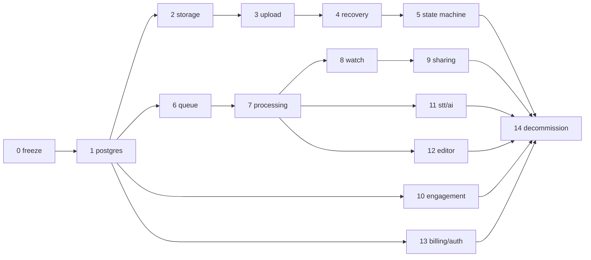

# 23 — Migration Plan

> Strangler-fig migration from the current system (`01`) to the target (`02`). **No uncontrolled rewrite**: every phase ships to production independently, is reversible, and leaves the product working. The repo remains one codebase; new code lives beside old until each phase's cutover.

Constraints that shape sequencing: the extension fleet updates slowly (Chrome review + user update lag) → API changes are additive with legacy aliases; production data lives in Cloudinary context + JSON files → import must be repeatable; one developer → phases are small.

---

## Phase 0 — Freeze & baseline
- **Goal:** stop architectural drift; capture reality.
- **Scope:** feature freeze on editor/AI/billing/admin (bugfixes only); tag `legacy-final`; repo hygiene (T-001 verified: pem/crx never committed; stale zips untracked); stand up error tracking + basic request logging on the current server (thin pino wrapper — safe, additive); record baseline KPIs (upload success rate, watch failures) for comparison.
- **Risks:** none material. **Acceptance:** docs merged; baseline dashboard exists; freeze communicated in `26`.

## Phase 1 — PostgreSQL beside the legacy stores
- **Goal:** Postgres running with the full `07` schema; data imported; **dual-write** started.
- **Files:** new `db/` (drizzle schema+migrations), `apps/api/src/repos/*`; `server/index.js` gains repo calls next to existing JSON/Cloudinary writes (users, meta-equivalents, subscriptions, usage, folders, contacts).
- **Migration mechanics:** idempotent importer (`07` §13) run repeatedly; nightly reconciliation report (row counts, spot diffs) until cutover.
- **Reads stay legacy** in this phase (except new admin read endpoints used to verify parity).
- **Risks:** dual-write divergence → mitigated by importer re-runs + report. **Acceptance:** importer idempotent (test), 0 diffs across 7 days of dual-write on users/subscriptions/meta.

## Phase 2 — Storage abstraction + R2
- **Goal:** `StorageProvider` interface; R2 buckets provisioned; MinIO in dev; **new uploads mirrored to R2** while Cloudinary continues serving.
- **Files:** `apps/api/src/storage/*`; upload handler additionally streams the temp file to `sources/{id}` in R2 (server-side copy — temporary, removed in Phase 3).
- **Backfill:** background copier moves existing Cloudinary originals → R2 `sources/` (throttled; tracked per recording on `legacy.media_map`, which T-104 already created for exactly this — see `07` §13. An earlier draft of this line called it a `migration_assets` table; a second table tracking the same recording would have been a second source of truth about the same fact, so T-204 extended the existing row with the checklist columns instead).
- **Acceptance:** every new recording has an R2 source object with matching size; backfill ≥ 95% then 100%.

## Phase 3 — New upload system (the big reliability win)
- **Goal:** direct-to-R2 multipart uploads per `06`; recordings/upload_sessions rows become the write path of record.
- **Files:** API upload routes (`08` §5); extension: `uploader.ts` in the recorder (can ship **before** the state machine — it hooks `dataavailable` alongside the existing chunks array); web editor "upload clip" switched.
- **Compat:** legacy `POST /api/upload` remains for old extension versions, now writing recordings rows + R2 via the server path; removed in Phase 14 after fleet telemetry shows < 1% legacy uploads.
- **Cutover:** extension release N+1 uses the new protocol behind a remote-config flag; flag flipped gradually.
- **New free-plan quotas activate with this phase** (50 active videos / 5 GB retained — `16` §1.1), because the atomic reservation mechanism ships with upload-session creation. Includes the quota ledger columns + `storage_reservations` (schema already in Phase 1) and the dual-meter `/me/usage`.
- **Grandfathering policy (existing free users vs the new limits):** 30→50 videos is a strict increase — no one is harmed. 20 GB→5 GB is a decrease: users already **over 5 GB are never trimmed and nothing is deleted** — they are marked over-quota, blocked from creating new recordings (standard `storage_limit` message + banner) until they delete videos or upgrade. Announce with ≥14 days notice in-app before enforcement flips on. The importer computes each user's retained bytes during backfill so day-one ledgers are accurate.
- **Quota activation (T-306, implemented):** the ledger, the atomic reservation and the dual meters are live for every v1 upload regardless of the switch; **which limits apply** is `QUOTA_ENFORCEMENT_V2` (exact `true`, default OFF — `16` §4.7). OFF: the legacy limits (30 videos / 20 GB) everywhere, byte-identical to today. ON: the `16` §1.1 integers for both the v1 gate and the legacy `canUploadVideo`/`canCreateVideo`. **Procedure:** ship with it OFF → announce in-app for ≥14 days → set it to `true` and restart → users already over 5 GiB are blocked from new recordings by the ordinary guard and nothing of theirs is trimmed. Rollback is unsetting it. There is no per-user grandfathering column: "over-quota" is derived from the rows.
- **Risks:** the riskiest phase (client+server+storage). Mitigations: R13/R15 tests green pre-release; per-part telemetry; instant flag rollback to legacy path.
- **Acceptance:** upload success ≥ 99% on new path over 2 weeks; server video-byte throughput → ~0 for flagged clients; resume verified in production (forced-kill canary).

### Phase 3 cutover control (T-304)

**Who decides.** The server, per user, at `GET /api/client-config` (`08` §14a). The
client obeys the answer; a client claiming membership is never believed.

**Bucketing.** `bucket = sha256("veorec-upload-cutover-v1:" + userId)` → first 4 bytes as
uint32 → `% 100`. Selected iff `bucket < V1_UPLOAD_ROLLOUT_PERCENT`.

- **Deterministic** — no randomness, no clock, no per-process counter. All three would
  let a user flip path between requests, and a recorder that opened a v1 session and
  then resumed onto legacy would lose the upload it had already started.
- **Monotonic** — because selection is `<` against a *fixed* bucket, the 10% population
  is a strict subset of 50%, which is a strict subset of 100%. Raising the percentage
  only ever adds users; lowering it removes them in the exact reverse order. This is
  what makes a partial rollback predictable rather than a fresh random draw.
- The salt is a **fixed constant**. Changing it re-buckets everyone, so it must never be
  made configurable or derived from anything that varies.

**Fail-safe.** Absent, malformed, out-of-range or non-plain-integer configuration all
resolve to 0% — legacy. `V1_UPLOAD_API` must be exactly `true` or the rollout is off
regardless of the percentage. A configuration mistake must never be the thing that
switches everyone onto the new path.

**Staged rollout procedure.** `V1_UPLOAD_ROLLOUT_PERCENT`: `0 → 10 → 50 → 100`, one step
at a time, restarting the API. Before each step, read `kpi_snapshot.cutover` (`19` §8)
and require **all four** gates: `v1SuccessRatePct ≥ 99`; no worsening `v1Fallbacks`
trend; `accountNotMigrated` **at zero** (a non-zero value means the importer has not
finished — fix that first rather than rolling forward over it); and no material
unexplained v1 failure pattern. A pattern nobody can explain is a reason to stop even
when the three numeric gates pass. Hold each step long enough to cover a
representative traffic day; the final step must hold for **two full weeks** before the
acceptance criterion is met.

**Rollback procedure.** Set `V1_UPLOAD_ROLLOUT_PERCENT=0` and restart. That is the whole
procedure:

- It is **configuration only** — no code change, no client release, no database
  migration, nothing deleted. Clients pick it up on their next recording (the extension
  re-fetches the config per take and caches nothing between takes).
- In-flight v1 sessions are unaffected; new takes go to legacy. The legacy path was
  never removed and needs no re-enabling.
- Setting `V1_UPLOAD_API=false` is the harder rollback: the v1 routers are not mounted at
  all and the process is byte-identical to the pre-T-301 server.
- **Drilled deliberately** (T-304): a user selected for v1 at 100% resolved to `legacy`
  after the percentage was set to 0, with `decision:"legacy_disabled"` recorded, and zero
  rows or files changed by the rollback.

**Acceptance.** ≥99% v1 upload success over two weeks of **production** traffic, read off
`kpi_snapshot.cutover`. Local and staging verification does not satisfy this (`19` §8.2).

### Phase 3 web upload path (T-305)

**Architecture.** browser/editor → `POST /api/v1/recordings` → `POST /api/v1/uploads`
(`mode:'single'`, exact `sizeBytes`) → presigned single PUT → **browser → object
storage** → `POST /api/v1/uploads/:id/complete` (`parts:[]`, server HEADs) → recording
persisted through the repositories → signed `playbackUrl` from `GET /api/v1/recordings/:id`.
The application server never receives the bytes; no multer, no memory buffering, no
storage SDK or credential in the browser. Files > 32 MiB, or with a container outside
`webm/mp4/mov`, do not use single mode and take the legacy path — decided before
anything is created.

**Gate.** `V1_WEB_UPLOAD` — a plain on/off switch, separate from the extension rollout.
Enabled only by the exact string `true` and only while `V1_UPLOAD_API` is `true`
(neither flag implies the other). Default OFF. No percentage, no bucket: enabling it
moves no extension user, and the extension percentage cannot enable it. Surfaced as
`webUpload` on `GET /api/client-config`; the client obeys and never decides for itself.

**Fallback boundary — exactly session creation.** The editor may use the legacy
`POST /api/upload` only while nothing exists on the v1 side: a failed config fetch, a
pre-flight refusal, a failed recording create, or a failed session create (the recording
row created for it is deleted first, so no empty duplicate is left behind). Once a v1
session exists there is **no** fallback — a storage PUT or completion failure is shown
to the user, because a second upload onto the legacy path would duplicate the file and
the recording. A rescue that does happen is recorded as `fallback_from:"v1"` and counts
as a v1 failure (`19` §8.3).

**Rollback.** Unset `V1_WEB_UPLOAD` and restart. Configuration only; the extension
rollout percentage is untouched; the next editor upload takes the legacy path. Drilled
on a live server: the same account answered `webUpload:"v1"` then `webUpload:"legacy"`
with `web_legacy_disabled` recorded, extension decision unchanged.

**Composition of a v1 clip is deferred.** The editor's save for a multi-clip timeline
(`POST /api/recordings/:id/compose`) is a Cloudinary-only splice; a clip uploaded through
this path exists in PostgreSQL + R2 and cannot be spliced by it, and making it so would
require either writing into Cloudinary (never) or the Phase 7 / Phase 12 processing and
render pipeline. So: upload and playback are supported; **composing/saving a timeline
that contains a v1 clip is not**, until that pipeline exists. The route answers a
specific `409 clip_not_composable` for such a clip (never a generic 404) and the editor
explains it in plain words before sending anything. Nothing is copied into Cloudinary,
nothing is rendered. **The production gate stays OFF until Phase 7/12 delivers that
capability.**

**Memory-multer `replace` path.** Deprecated and measured in T-305 (`06` §12,
`19` §8.3); removed in Phase 14 once `deprecations.legacyReplaceUsed` stays at zero
over a full observation window. It currently has no caller in the client or the
extension — the counter is what turns that observation into evidence.

## Phase 4 — Local recovery (IndexedDB)
- **Goal:** `05` fully: chunk persistence, sessions, recovery UI.
- **Files:** extension `store/recorderStore.ts`, recovery card in recorder + popup badge.
- **Depends:** Phase 3 (recovery resumes multipart sessions).
- **Acceptance:** R12/R13/R22 green; recovery effectiveness KPI live.

## Phase 5 — Recorder state machine
- **Goal:** `03` machine owns lifecycle; legacy booleans become dual-written projections.
- **Files:** extension `machine.ts`, `capture.ts`, refactored `recorder.js` (UI only); overlay/popup consume `recSession` (legacy keys still mirrored).
- **Depends:** 3, 4 (machine orchestrates uploader + durability).
- **Risks:** recorder regressions → full matrix (`20` §9) is the release gate; ship as extension beta channel first.
- **Acceptance:** matrix green; no state-stuck reports for 2 weeks; mic-denied flow live.

## Phase 6 — Redis + BullMQ + processing_jobs
- **Goal:** queue infra + outbox; migrate the cron trio (usage_sync, subscription_sync, storage_verification) and upload-expiry as first jobs; transcription enqueued as a job (worker process runs the existing `transcription.js` logic).
- **Files:** `apps/worker/*`, `processing_jobs` wiring, admin `/admin/jobs`.
- **Acceptance:** server restart mid-transcription → job completes on worker restart (test); cron.js deleted. *(T-602: cron.js schedules nothing v1 any more — usage_sync/upload_expiry/cleanup/storage verification run in the worker as repeatables — but it is NOT deleted: `subscription_sync` and the legacy usage/storage jobs read and write the JSON stores that only the API process may write, so they stay there until Phase 9–13 move billing/usage into PostgreSQL; the file goes in Phase 14 with the stores. `10` §3.)*

## Phase 7 — Media processing pipeline
- **Goal:** probe/transcode/thumbnail/hls/audio jobs (`09`); `recordings.status` lifecycle live; new uploads become `ready` via FFmpeg, not Cloudinary.
- **Backfill:** re-process legacy recordings from R2 sources (throttled queue fill), producing MP4+poster for all; Cloudinary URLs remain a read fallback until each recording has assets.
- **Acceptance:** time-to-ready p95 < 5 min for 10-min recordings; 100% of active recordings have MP4+poster assets; probe rejects the corrupt-fixture canary.

## Phase 8 — Watch page on the new stack
- **Goal:** `11`: watch/media endpoints, signed URLs, explicit processing states; retry-loop and readyState-timeout hacks deleted; Watch.jsx decomposition.
- **Depends:** 7. **Compat:** old clients keep hitting legacy watch endpoints (aliased to new handlers).
- **Acceptance:** zero Cloudinary reads on watch path; player error rate < 0.5%; Safari playback verified.

## Phase 9 — Sharing & privacy
- **Goal:** `12`: privacy enforcement incl. media-level, share_links, signed download; unlisted default for new recordings.
- **Acceptance:** leaked-URL test (old URL dies after TTL); share-link expiry/revocation E2E green.

## Phase 10 — Comments / reactions / analytics / folders / notifications on Postgres
- **Goal:** engagement reads+writes fully on Postgres (`13`); meta.json becomes read-only legacy; notifications feed via queries.
- **Acceptance:** parity checks (counts match dual-write) then legacy reads off; O(all-meta) endpoints gone.

## Phase 11 — Transcription/AI productized
- **Goal:** `15`: statuses, caching, captions VTT, auto-chain as jobs; watch transcript tab shows queued/running/failed.
- **Acceptance:** STT restart-safety test; translation cache hit on second request; AI failure isolation test (kill Groq key → videos still ready).

## Phase 12 — Editor on edit sessions + renders
- **Goal:** `14`: edit_sessions/ops/render jobs; FFmpeg renders replace Cloudinary trim/compose/stitch; memory-multer `replace` deleted.
- **Compat:** legacy trim/compose endpoints internally create edit sessions (202 + polling shim for old clients).
- **Acceptance:** render progress real; overwrite reversible (old derived kept 7d); >1080p compose no longer times out (was `index.js:1219`).

## Phase 13 — Billing hardening
- **Goal:** `16`: billing_events ledger, out-of-order guard, 500-on-failure, subscriptions on Postgres only; sessions-based auth (`17` §2) also lands here (auth tables shipped in Phase 1).
- **Acceptance:** webhook duplicate/ordering/failure tests green in sandbox; zero unprocessed failed events after soak.

## Phase 14 — Decommission legacy
- **Goal:** delete: Cloudinary read/write paths + SDK, JSON store modules (`store.js`, `db.js`, `meta.js` persistence, `users.json` et al — files archived), legacy upload route (fleet < 1% and forced-update notice shipped), legacy storage keys in chrome.storage, dead client hacks (retry loops, Infinity-duration), Render config.
- **Mechanics:** final importer run → freeze JSON files read-only → 30-day observation → delete code → cancel Cloudinary plan after export retention window.
- **Acceptance:** grep-clean: no `cloudinary`, no `readFileSync(.*json)` persistence in server code; all KPIs ≥ baseline; docs updated to remove "migration" notes.

---

## Cross-phase rules

- Every phase: feature-flagged where user-facing; dashboards compare before/after; rollback = flag off (code stays).
- Dual-write windows always end with a **reconciliation report at zero diffs for 7 days** before legacy reads are removed.
- The extension may lag the server by one protocol version at all times — server removes nothing until fleet telemetry clears it.
- Any bug found during migration is fixed in the **new** path unless it's actively burning users on the legacy path.

## Dependency graph

